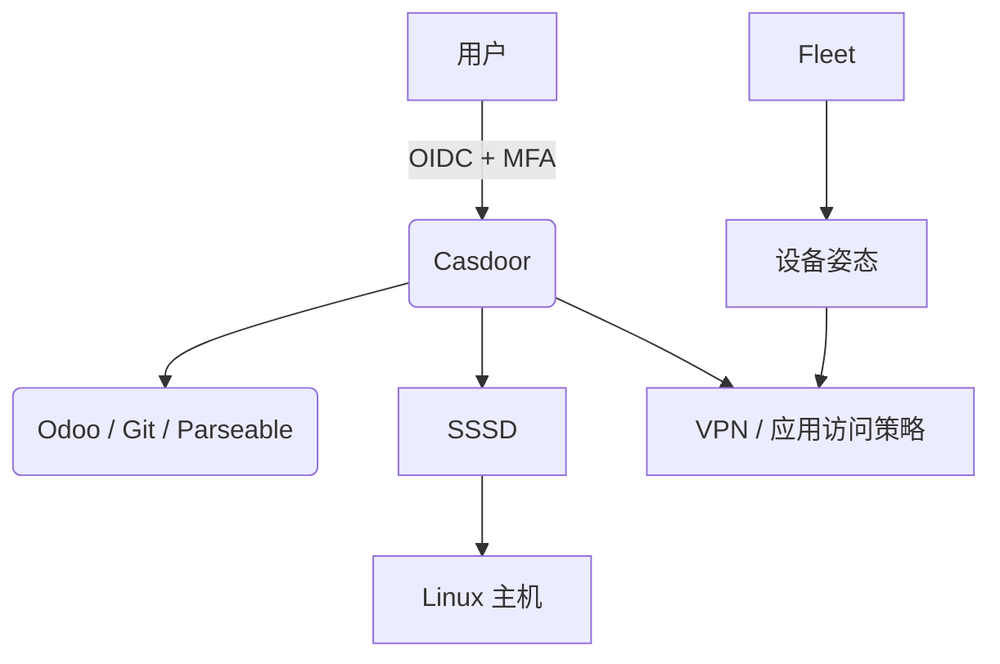

# IT 基础架构设计方案（2026）

## 架构概述

本方案采用以身份为边界、以设备姿态为信号、以自动化交付为默认的模块化 IT 基础架构。所有组件优先选择支持 OIDC、API、基础设施即代码和可观测性的方案。

- **身份认证（IdP）**：Casdoor 提供 OIDC/SAML/WebAuthn/TOTP/MFA；Linux 主机通过 SSSD IdP provider 使用统一身份登录。
- **设备与安全态势**：Fleet 负责 macOS、Windows、Linux 的资产、查询、合规、加密状态、补丁和远程处置；不把它当作目录服务。
- **远程访问**：使用 NetBird 构建基于 WireGuard 的私有 mesh；通过 OIDC、用户/组同步和策略实现最小权限访问。
- **自动化交付**：Terraform/OpenTofu 管理基础设施，Ansible 管理主机基线，GitHub Actions 或 GitLab CI 管理变更和发布。
- **企业资源管理（ERP）**：Odoo 通过 OIDC 集成 Casdoor；财务、HR 和采购数据按职责隔离并纳入备份和审计。
- **监控与日志**：以 Parseable 作为统一日志分析与监控入口；主机、容器和应用日志通过 OpenTelemetry Collector 或 Fluent Bit 汇聚到 Parseable，指标按需由 Prometheus 采集。

## 组件说明

### 1. Casdoor + SSSD（身份认证）
- Casdoor 是统一 OIDC IdP；应用使用 Authorization Code + PKCE。
- SSSD 负责 Linux 的 NSS/PAM、缓存、sudo 与主机访问控制。
- Fleet 提供设备姿态，不能替代身份认证或目录服务。

### 2. Fleet（设备管理与合规）
- 资产管理：自动发现与管理公司所有终端设备。
- 合规检查：定期检测设备安全与合规状态。
- 合规：检查 CIS、磁盘加密、补丁和自定义基线。
- 远程处置：按平台支持锁定、擦除和修复动作。
- 访问决策：将设备健康状态提供给访问策略，不直接承担用户目录功能。

### 3. Odoo（ERP）
- 支持财务、人力、采购、库存、项目等模块。
- 可扩展性强，支持自定义开发与第三方集成。
- 与 Casdoor 集成，实现统一身份认证。

> **提示**：除了上述核心业务系统外，完整的企业 IT 架构还包括办公协作、DevOps、监控等多个板块。详细的软件选型请参考文档 **[开源软件栈选型](./oss-software-stack.md)**。

## 典型流程

1. 用户通过 Casdoor 完成 OIDC 登录和 MFA。
2. 应用根据 token 中的稳定 subject、组和本地 RBAC 授权。
3. Linux 主机由 SSSD 解析身份并执行 PAM、sudo 与访问控制。
4. Fleet 提供设备合规状态；VPN/网关根据身份组和设备状态放行。
5. 所有登录、授权、设备处置和管理变更进入集中审计。

## 架构图

## 安全与合规
- 所有系统均通过 HTTPS 加密通信。
- Casdoor 统一身份认证，管理员使用 WebAuthn/FIDO2，权限最小化。
- Fleet 定期检查加密、补丁和基线；修复动作必须可审计、可回滚。
- 身份、设备、网络和应用授权分层，任何单一系统故障都不能直接扩大权限。
- Odoo 业务数据定期备份与权限分级管理。

## 部署建议
- 小规模环境使用 rootless Podman Compose 或 Docker Compose；生产集群使用 Kubernetes/K3s 时必须配合 GitOps。
- 状态组件使用 PostgreSQL、对象存储和加密备份；禁止把生产数据放在临时容器卷。
- 依赖和镜像固定版本、签名验证、定期升级，并为 Casdoor、SSSD、Fleet 和网关保留回退方案。

---

如需详细实施方案或集成代码示例，请联系IT部门。