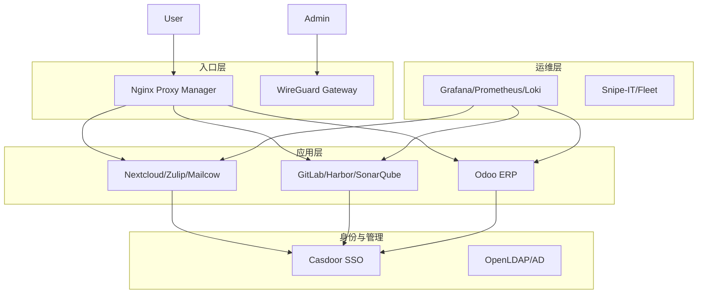

# 开源软件栈选型

本文档详细列出了构建完整企业IT架构所需的开源软件栈。除核心的身份认证和ERP外，涵盖了办公协作、研发运维、监控及基础服务等关键领域。

## 1. 核心业务与身份 (Core)

| 类别 | 推荐方案 | 替代方案 | 选型理由 |
| :--- | :--- | :--- | :--- |
| **身份认证 (IAM)** | **Casdoor** | Keycloak | 界面更现代，Go语言编写资源占用低，对前后端分离架构支持好。 |
| **ERP/CRM** | **Odoo** | ERPNext | 模块生态最丰富，涵盖进销存、财务、HR全流程。 |
| **终端管理 (MDM)** | **Fleet** (osquery) | Wazuh | 专注于以查询的方式管理设备状态，轻量且现代化。 |

## 2. 办公与协作 (Collaboration)

| 类别 | 推荐方案 | 替代方案 | 选型理由 |
| :--- | :--- | :--- | :--- |
| **企业网盘/文档** | **Nextcloud** | Seafile | 功能最全，支持多人在线协同编辑 (配合 OnlyOffice)，插件生态丰富。 |
| **即时通讯 (IM)** | **Zulip** | Mattermost | 话题(thread)式架构天然适合AI总结，24.4K Stars，异步讨论模式更适合知识沉淀。 |
| **视频会议** | **Jitsi Meet** | BigBlueButton | 架构简单，无需客户端，浏览器即用，WebRTC技术成熟。 |
| **企业邮箱** | **Mailcow** | iRedMail | 基于 Docker 的完整邮件套件，部署维护最简单，自带反垃圾/杀毒。 |
| **知识库/Wiki** | **AppFlowy** | Outline, BookStack | AI原生工作区，67.9K Stars，原生集成AI写作/协作，支持本地LLM (Ollama)，Flutter+Rust架构体验优异。 |

## 3. 研发与交付 (DevOps)

| 类别 | 推荐方案 | 替代方案 | 选型理由 |
| :--- | :--- | :--- | :--- |
| **代码托管** | **GitLab CE** | Gitea | 行业标准，内置 CI/CD 极其强大，虽然较重但功能最完整。 |
| **镜像仓库** | **Harbor** | Nexus | CNCF 毕业项目，企业级镜像扫描、签名、复制功能完善。 |
| **代码质量** | **SonarQube** | - | 静态代码分析的标准工具，支持多种语言，保障代码质量网关。 |
| **API 管理** | **Postcat** | YApi | 国产开源，轻量级，支持 API 文档管理与测试。 |

## 4. 监控与运维 (Observability & ITSM)

| 类别 | 推荐方案 | 替代方案 | 选型理由 |
| :--- | :--- | :--- | :--- |
| **监控面板** | **Grafana** | - | 可视化标准，支持多种数据源。 |
| **指标采集** | **Prometheus** | VictoriaMetrics | 云原生监控事实标准。 |
| **日志系统** | **Loki** | ELK Stack | 与 Grafana/Prometheus 结合紧密 (PLG栈)，比 ELK 轻量且成本低。 |
| **服务拨测** | **Uptime Kuma** | Blackbox Exp | 界面美观，配置简单，适合展示对外的 Status Page。 |
| **资产管理 (ITAM)**| **Snipe-IT** | GLPI | 专注于资产全生命周期管理，界面现代，API 完善。 |
| **工单系统 (Helpdesk)**| **Zammad** | OTRS | 支持多渠道 (邮件/Web/Chat) 接入，界面交互体验极佳。 |
| **AI原生统一监控** | **SigNoz** | Grafana+Prometheus | OpenTelemetry原生，内置AI异常检测、智能告警根因分析，日志/指标/追踪一站式。 |

## 5. 基础架构服务 (Infrastructure)

| 类别 | 推荐方案 | 替代方案 | 选型理由 |
| :--- | :--- | :--- | :--- |
| **虚拟化平台** | **Proxmox VE** | XCP-ng | 基于 Debian/KVM，Web管理界面强大，社区活跃，不仅是虚拟机也是容器平台 (LXC)。 |
| **容器编排** | **K3s** | Docker Swarm | 轻量级 Kubernetes 发行版，适合中小规模集群，运维成本低于标准 K8s。 |
| **反向代理/网关** | **Nginx Proxy Manager**| Traefik | 提供可视化 Web 界面管理 Nginx 配置和 SSL 证书，极易上手。 |
| **VPN/内网穿透** | **WireGuard** (+Headscale)| OpenVPN | 协议更现代高效。Headscale 是 Tailscale 控制平面的开源实现，方便组建 Mesh 网络。 |
| **DNS/广告过滤** | **AdGuard Home** | Pi-hole | 支持 DoH/DoT，界面美观，不仅是 DNS 更是全网广告拦截器。 |

## 架构集成图

