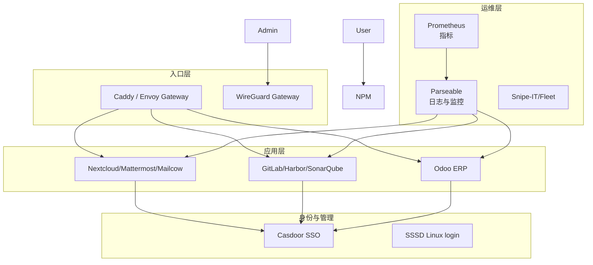

# 开源软件栈选型

本文档给出截至 2026 年的默认选型。选型标准是：协议开放、支持 OIDC/API、可自动化交付、可观测、社区活跃，并且能明确说明运维边界。不要为了“全开源”引入无人维护的单点组件。

## 1. 核心业务与身份 (Core)

| 类别 | 推荐方案 | 替代方案 | 选型理由 |
| :--- | :--- | :--- | :--- |
| **身份认证 (IAM/IdP)** | **Casdoor** | Keycloak / Authentik | OIDC、SAML、WebAuthn、TOTP、MFA、LDAP/SCIM 能力完整，适合统一登录；Linux 登录另由 SSSD IdP provider 负责。 |
| **Linux 身份客户端** | **SSSD** | FreeIPA + SSSD | 提供 NSS/PAM、缓存、sudo 和主机访问控制；不把 IdP 直接当 LDAP 目录。 |
| **ERP/CRM** | **Odoo** | ERPNext | 模块生态最丰富，涵盖进销存、财务、HR全流程。 |
| **终端管理与合规** | **Fleet** (osquery/MDM) | Kandji / Intune | 支持 macOS、Windows、Linux 的资产、查询、基线、加密、补丁和远程处置；不替代 EDR。 |

## 2. 办公与协作 (Collaboration)

| 类别 | 推荐方案 | 替代方案 | 选型理由 |
| :--- | :--- | :--- | :--- |
| **企业网盘/文档** | **Nextcloud** | Seafile | 功能最全，支持多人在线协同编辑 (配合 OnlyOffice)，插件生态丰富。 |
| **即时通讯 (IM)** | **Mattermost** | Zulip, Matrix | 体验最接近Slack，21K Stars，**官方提供AI插件**，移动推送可自建免费（仅需Apple年费$99）。 |
| **视频会议** | **Jitsi Meet** | BigBlueButton | 架构简单，无需客户端，浏览器即用，WebRTC技术成熟。 |
| **企业邮箱** | **Mailcow** | iRedMail | 基于 Docker 的完整邮件套件，部署维护最简单，自带反垃圾/杀毒。 |
| **知识库/Wiki** | **Outline** | BookStack / AppFlowy | 面向团队知识库，OIDC 集成清晰、界面简洁；AI 功能必须经过数据分级和隐私评估。 |

### IM方案详细对比

| 方案 | AI总结能力 | 移动推送 | 成本说明 | 适用场景 |
| :--- | :--- | :--- | :--- | :--- |
| **Zulip** | ⭐⭐⭐ 话题式结构AI易总结 | **官方不支持自建**，只能付费使用Zulip Cloud推送服务 | 强制商业服务，按活跃用户收费，无免费自建方案 | 深度讨论、能接受付费服务 |
| **Mattermost** | ⭐⭐⭐ 官方AI插件，支持频道聊天总结 | 可自建推送网关（开源）或付费企业版 | 自建：完全免费 + Apple开发者账号$99/年；云服务：付费 | 企业级、要官方AI支持、零推送成本 |
| **Matrix/Element** | ⭐⭐ 需自建AI Bot | 完全自托管开源（Sygnal推送网关） | 零商业成本 + Apple开发者账号$99/年 | 隐私优先、零成本、技术能力强 |
| **Rocket.Chat** | ⭐⭐ 社区AI插件 | 可自建或付费 | 社区版免费，企业功能付费 | 功能全面、生态丰富 |

**选型建议：**
- **要AI总结+零推送成本**：**Mattermost**（官方AI插件 + 自建免费推送）
- **要零成本+隐私优先**：**Matrix**（自建AI Bot + Sygnal推送网关，技术门槛高）
- **要话题式+接受付费**：**Zulip**（AI友好，但移动推送强制收费，无自建方案）

**重要提醒：** iOS推送无论选哪个方案都需Apple开发者账号$99/年（Apple强制收费，与IM软件无关）。Android推送所有方案均免费。

## 3. 研发与交付 (DevOps)

| 类别 | 推荐方案 | 替代方案 | 选型理由 |
| :--- | :--- | :--- | :--- |
| **代码托管** | **GitLab CE** | Forgejo | 内置 CI/CD、OIDC、审计和权限模型完整；小团队可用 Forgejo + Woodpecker/Actions 降低资源消耗。 |
| **镜像仓库** | **Harbor** | Nexus | CNCF 毕业项目，企业级镜像扫描、签名、复制功能完善。 |
| **代码质量** | **SonarQube** | - | 静态代码分析的标准工具，支持多种语言，保障代码质量网关。 |
| **API 管理** | **Kong Gateway** | Traefik Hub / Envoy Gateway | 支持 OIDC、限流、审计和声明式配置；内部 API 文档使用 OpenAPI。 |

## 4. 监控与运维 (Observability & ITSM)

| 类别 | 推荐方案 | 替代方案 | 选型理由 |
| :--- | :--- | :--- | :--- |
| **监控与日志平台** | **Parseable** | OpenObserve / OpenSearch | 作为统一日志分析和监控入口，支持结构化日志、SQL 查询、告警和对象存储后端。 |
| **指标采集** | **Prometheus** | VictoriaMetrics | 采集主机、容器和服务指标；日志和事件统一关联到 Parseable。 |
| **日志采集** | **OpenTelemetry Collector / Fluent Bit** | Vector | 将应用、主机和容器日志以结构化格式写入 Parseable，采集层与存储层解耦。 |
| **服务拨测** | **Uptime Kuma** | Blackbox Exp | 界面美观，配置简单，适合展示对外的 Status Page。 |
| **资产管理 (ITAM)**| **Snipe-IT** | GLPI | 专注于资产全生命周期管理，界面现代，API 完善。 |
| **工单系统 (Helpdesk)**| **Zammad** | OTRS | 支持多渠道 (邮件/Web/Chat) 接入，界面交互体验极佳。 |
| **统一可观测性** | **Parseable + Prometheus** | OpenObserve | Parseable 负责日志、事件和 SQL 分析，Prometheus 负责时序指标；统一通过告警规则和事件字段关联排障。 |

## 5. 基础架构服务 (Infrastructure)

| 类别 | 推荐方案 | 替代方案 | 选型理由 |
| :--- | :--- | :--- | :--- |
| **虚拟化平台** | **Proxmox VE** | Harvester / XCP-ng | KVM、ZFS/Ceph、API 和集群能力完整；生产变更用 IaC 管理。 |
| **容器编排** | **K3s** | Talos Linux + Kubernetes | 适合中小规模边缘和机房集群；控制面、备份和升级必须自动化。 |
| **反向代理/网关** | **Caddy / Envoy Gateway** | Traefik | Caddy 适合简单 HTTPS；Kubernetes 场景优先 Gateway API，不用 GUI 生成不可审计配置。 |
| **VPN/内网访问** | **NetBird** | Tailscale / WireGuard | 基于 WireGuard，支持自托管管理面、OIDC、用户/组同步、策略和路由；将网络访问策略纳入 GitOps 与审计。 |
| **DNS/广告过滤** | **AdGuard Home** | Pi-hole | 支持 DoH/DoT，界面美观，不仅是 DNS 更是全网广告拦截器。 |

## 架构集成图

```mermaid
graph TD
    subgraph "入口层"
        Gateway[Caddy / Envoy Gateway]
        VPN[WireGuard Gateway]
    end

    subgraph "身份与管理"
        SSO[Casdoor SSO]
        Linux[SSSD Linux login]
    end

    subgraph "应用层"
        Office[Nextcloud/Mattermost/Mailcow]
        DevOps[GitLab/Harbor/SonarQube]
        Biz[Odoo ERP]
    end

    subgraph "运维层"
        Monitor[Parseable<br/>日志与监控]
        Metrics[Prometheus<br/>指标]
        Asset[Snipe-IT/Fleet]
    end

    User --> NPM
    Admin --> VPN
    Gateway --> Office
    Gateway --> DevOps
    Gateway --> Biz
    
    Office --> SSO
    DevOps --> SSO
    Biz --> SSO
    
    Monitor --> Office
    Monitor --> DevOps
    Monitor --> Biz
    Metrics --> Monitor
```
