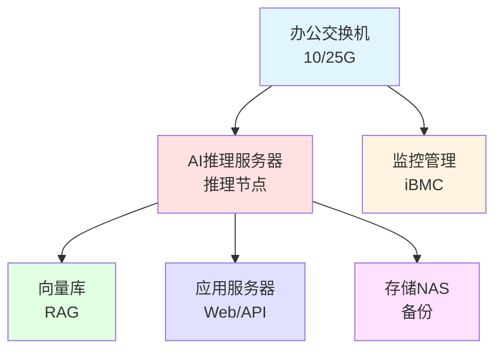
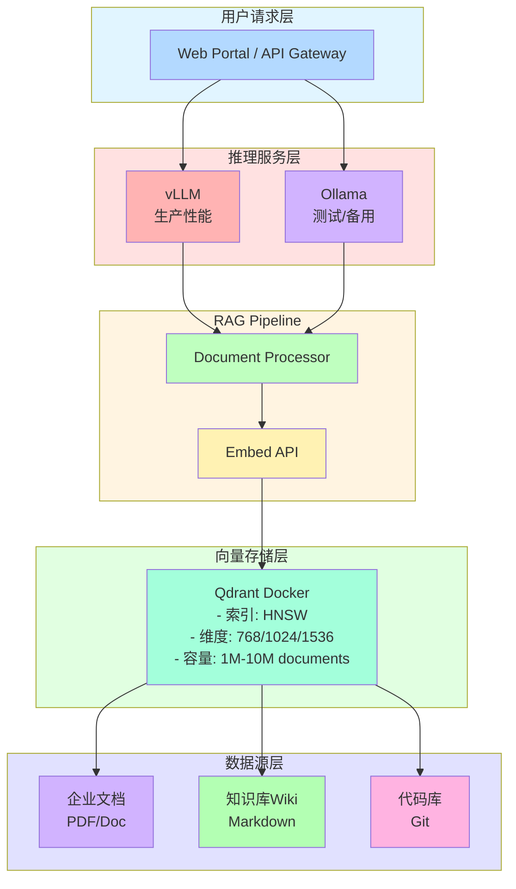

# 大模型推理集群选型方案

## 选型原则

- **业务需求驱动**：根据并发用户量和模型规模选择合适配置
- **性价比优先**：在满足性能需求前提下选择最优价格比
- **扩展性考虑**：预留扩展空间，支持GPU热插拔和在线扩容
- **生态兼容性**：选择硬件平台兼容主流推理框架和模型
- **环境适应性**：办公室部署需考虑噪音、散热、电力容量

## 硬件选型方案

### GPU选型对比

### 主流模型上下文大小与显存需求

Hugging Face 热门完整模型的最大上下文窗口及在不同 GPU 配置下的支持情况：

| 模型名称 | 参数量 | 最大上下文 | 单卡80GB | 2×80GB | 4×80GB | 8×80GB | HF热度 |
|---------|--------|-----------|---------|---------|---------|---------|--------|
| **DeepSeek-V3** | 671B/MoE | 128K | ❌ | ⚠️ 4K | ⚠️ 16K | ✅ 32K-64K | 🔥🔥 |
| **DeepSeek-R1** | 671B/MoE | 64K | ❌ | ⚠️ 4K | ⚠️ 16K | ✅ 32K-64K | 🔥🔥 |
| **Llama-3.1-405B-Instruct** | 405B | 128K | ❌ | ⚠️ 8K | ✅ 32K | ✅ 64K-128K | 🔥🔥 |
| **Qwen2.5-72B-Instruct** | 72B | 32K | ✅ 8K | ✅ 32K | ✅ 32K | ✅ 32K | 🔥 |
| **MiniMax M2.1** | 230B/MoE | 200K | ❌ | ⚠️ 8K | ⚠️ 32K | ✅ 64K-128K | 🔥🔥 |
| **GLM-4.7** | 400B/MoE | 200K | ❌ | ⚠️ 8K | ⚠️ 32K | ✅ 64K-128K | 🔥🔥 |
| **Mixtral-8x22B-Instruct** | 141B | 32K | ❌ | ⚠️ 4K | ✅ 16K | ✅ 32K | 🔥 |
| **Cohere-Command-R-Plus** | 104B | 128K | ❌ | ⚠️ 8K | ✅ 32K | ✅ 64K | 🔥 |
| **Falcon-180B** | 180B | 2048 | ❌ | ⚠️ 2K | ✅ 2K | ✅ 2K | 🔥 |
| **Yi-1.5-34B-Chat** | 34B | 200K | ✅ 16K | ✅ 64K | ✅ 128K | ✅ 200K | 🔥 |
| **Phi-3-Medium-128K** | 14B | 128K | ✅ 64K | ✅ 128K | ✅ 128K | ✅ 128K | 🔥 |

**补充说明**：
- DeepSeek-V3/R1 采用 MoE（混合专家）架构，671B总参数但每次只激活约37B参数
- MiniMax M2.1 采用 MoE架构，230B总参数、激活约10B，专为编程和Agent场景优化
- GLM-4.7 采用 MoE架构，400B总参数、激活约32B，支持200K上下文
- **显存需求计算**：
  - 非MoE模型：`显存 ≈ 参数量 × 2字节(FP16) + KV Cache + 激活值`
  - MoE模型：`显存 ≈ 激活参数量 × 2字节 + 全部参数×1字节(INT8卸载)`
- ✅ 完整支持模型最大上下文
- ⚠️ 部分支持，需 KV Cache 卸载到内存或 INT8 量化
- ❌ 无法加载完整模型
- HF热度：🔥🔥 Top 10，🔥 Top 30
- 实际支持上下文受批大小、量化方式影响

**开源版本参考**（适合较小配置）：

| 开源模型 | 参数量 | 最大上下文 | 单卡24GB | 2×24GB | 4×24GB | HF热度 |
|---------|--------|-----------|---------|---------|---------|--------|
| **GLM-4-9B-Chat** | 9B | 128K | ✅ 32K | ✅ 128K | ✅ 128K | 🔥🔥 |
| **GLM-4-9B-Chat-1M** | 9B | 1M | ✅ 8K | ✅ 32K | ✅ 128K | 🔥 |
| **MiniMax-M2** | 230B/MoE | 200K | ❌ | ⚠️ 8K | ⚠️ 32K | ✅ 64K | 🔥🔥 |
| **Llama-3.1-70B-Instruct** | 70B | 128K | ❌ | ⚠️ 16K | ✅ 64K | ✅ 128K | 🔥 |
| **Qwen2.5-32B-Instruct** | 32B | 32K | ✅ 8K | ✅ 32K | ✅ 32K | 🔥🔥 |
| **DeepSeek-V3-Lite-16B** | 16B | 32K | ✅ 8K | ✅ 32K | ✅ 32K | 🔥🔥 |

### 服务器配置方案

| GPU型号 | 显存 | 功耗 | 显存带宽 | 推理性能(FP16) | 适用场景 | 参考价格(单卡) |
|---------|------|------|----------|---------------|----------|--------------|
| NVIDIA RTX 4090 | 24GB | 450W | 1008 GB/s | 83 TFLOPS | 中小规模推理、性价比首选 | ¥13,000-15,000 |
| NVIDIA A100 80GB | 80GB | 300W | 1935 GB/s | 312 TFLOPS | 企业级推理、大模型部署 | ¥60,000-80,000 |
| NVIDIA H100 80GB | 80GB | 350W | 3350 GB/s | 990 TFLOPS | 高性能推理、大规模并发 | ¥200,000-250,000 |
| 华为昇腾910B | 64GB | 310W | 1200 GB/s | 320 TFLOPS | 国产化替代、信创场景 | ¥120,000-150,000 |
| NVIDIA L40S | 48GB | 350W | 864 GB/s | 363 TFLOPS | 企业级推理、性价比优 | ¥50,000-60,000 |

**选型建议**：
- **50人团队（轻度使用）**：2× RTX 4090 或 1× A100 40GB
- **50人团队（中度使用）**：4× RTX 4090 或 2× A100 40GB
- **50人团队（重度使用）**：8× RTX 4090 或 4× A100 80GB

### 推荐服务器配置

| 配置级 | 入门级 | 标准级 | 高性能级 |
|--------|--------|--------|---------|
| **适用场景** | 10-30人团队 | 50人团队推荐 | 100+人团队 |
| **GPU数量** | 2× RTX 4090 | 4× RTX 4090 | 8× RTX 4090 |
| **总显存** | 48GB | 96GB | 192GB |
| **CPU** | 1× Xeon Gold 6430 (32核) | 2× Xeon Gold 6430 (64核) | 2× Xeon Platinum 8480+ (112核) |
| **内存** | 256GB DDR5 ECC | 512GB DDR5 ECC | 1TB DDR5 ECC |
| **系统盘** | 2× 2TB NVMe SSD | 2× 960GB NVMe SSD | 4× 3.84TB NVMe SSD |
| **数据盘** | 4× 4TB HDD | 3× 4TB HDD | 12× 16TB HDD |
| **电源** | 1600W 钛金级冗余 | 4× 2000W 铂金级冗余 | 4× 2000W 钛金级冗余 |
| **网络** | 2× 10GbE SFP+ | 2× 25GbE SFP28 | 4× 25GbE HDR |
| **散热** | 冗余风扇 | 冗余风扇 | 液冷（可选） |
| **机箱** | 超微4029GP塔式 | 浪潮 NF5468M6 4U | 浪潮 NF5468M7 4U |
| **价格估算** | ¥74,000 | ¥172,900 | ¥487,000 |
| **推荐模型** | Llama-3-8B, Qwen-14B, DeepSeek-16B | Llama-70B, Qwen-72B, DeepSeek-R1 | Llama-70B-128K, DeepSeek-V3, 多模型并发 |

### 国产化方案（华为昇腾）

| 配置方案 | 组件 | 价格估算 |
|---------|------|---------|
| 基础型 | 2× 昇腾910B + 256GB内存 + 服务器机箱 | ¥300,000-350,000 |
| 标准型 | 4× 昇腾910B + 512GB内存 + 服务器机箱 | ¥600,000-700,000 |
| 高配型 | 8× 昇腾910B + 1TB内存 + 服务器机箱 | ¥1,200,000-1,400,000 |

**注意**：昇腾平台软件生态（CANN、MindSpore）支持模型有限，需提前确认所用模型是否支持。

## 办公室部署考虑

### 电力需求与UPS

**单机功率计算公式**：
```
总功率 = CPU功耗 + GPU功耗 + 内存功耗 + 存储功耗 + 散热功耗 + 冗余(20%)
        = 300W + (N×450W) + 100W + 50W + 150W + 20%
```

| 配置 | 理论功耗 | 峰值功耗 | 月耗电量 | 月电费(1.2/kWh) | UPS容量 | UPS价格 |
|------|----------|---------|---------|-----------------|---------|---------|
| 2× RTX 4090 | 1.85kW | 2.22kW | 1,600 kWh | ¥1,920 | 3-5kVA | ¥15,000-25,000 |
| 4× RTX 4090 | 3.25kW | 3.90kW | 2,808 kWh | ¥3,370 | 6-10kVA | ¥40,000-60,000 |
| 8× RTX 4090 | 6.05kW | 7.26kW | 5,227 kWh | ¥6,270 | 10-15kVA | ¥80,000-120,000 |

**UPS选型建议**：
- 优先选择在线双变换式UPS（如伊顿9PX/9395XR、华为UPS5000-E）
- 电池选型：磷酸铁锂电池（8-10年）优于铅酸电池（3-5年）
- 模块化设计支持N+1冗余，可在线热插拔维护

### 机柜、散热与环境

| 组件 | 入门级(2×GPU) | 标准级(4×GPU) | 高配级(8×GPU) |
|------|--------------|----------------|---------------|
| **机柜** | 4U塔式/桌面 | 42U标准机柜 | 42U标准机柜 |
| **占地面积** | 1.5m² | 2m² (+1m²维护) | 3m² (+2m²维护) |
| **PDU配电** | - | 16A工业级 | 32A工业级 |
| **精密空调** | 可选 | 7-10kW | 7-10kW |
| **隔音箱** | 可选 | 推荐 | 必选 |
| **价格估算** | ¥3,000 | ¥8,000-12,000 | ¥15,000-25,000 |

**环境要求**：
- 环境温度：18-27°C（推荐22°C）
- 相对湿度：40-60%
- 进风量：每kW热负荷需150-200 CFM风量
- 噪音控制：4U服务器满载约70-75dB，建议使用专用机房或隔音措施

**参考价格**：
- 42U标准机柜：¥3,000-5,000
- 工业级PDU（带监控）：¥2,000-3,000
- 精密空调：¥25,000-40,000
- 隔音箱：¥15,000-25,000

### 网络架构



## 软件栈推荐

### 推理框架对比

| 框架 | 优势 | 劣势 | 适用场景 |
|------|------|------|---------|
| **vLLM** | 显存利用率高（PagedAttention）、吞吐量大 | 支持模型略受限 | 高并发企业级推理 |
| **TensorRT-LLM** | 性能最优、延迟最低 | 仅支持NVIDIA GPU、部署复杂 | 深度NVIDIA生态 |
| **HuggingFace TGI** | 易用性强、模型支持广 | 性能略逊 | 快速原型开发 |
| **Ollama** | 部署极简、跨平台 | 性能一般、功能有限 | 个人开发者测试 |
| **LocalAI** | 兼容OpenAI API | 性能一般 | 快速迁移现有应用 |

**推荐组合**：vLLM + Ollama（双模式：生产用vLLM，测试用Ollama）

### 向量数据库选型

| 数据库 | 推荐规模 | 部署复杂度 | 性能(P99) | 推荐场景 |
|-------|---------|-----------|----------|---------|
| **Qdrant** | 百万级向量 | 低（单文件运行） | &lt;30ms | 实时RAG、快速部署 |
| **Chroma** | 百万级向量 | 极低（Python库） | ~100ms | 原型验证、教学使用 |
| **Milvus** | 亿级向量 | 中高（需Kubernetes） | ~100ms | 大规模企业知识库 |
| **pgvector** | 百万级向量 | 低（PostgreSQL插件） | ~200ms | 已有PostgreSQL环境 |

**50人团队推荐**：Qdrant（单机Docker部署，性能与易用性平衡）

### RAG架构推荐



### 推荐技术栈

**生产环境**：
```yaml
推理引擎: vLLM 0.6.x
模型存储: HuggingFace Hub / ModelScope
向量库: Qdrant 1.12.x (Docker)
文档处理: LangChain + Unstructured
API服务: FastAPI + Uvicorn
负载均衡: Nginx 1.24
监控: Prometheus + Grafana
```

**开发测试**：
```yaml
推理引擎: Ollama 0.5.x
向量库: Chroma 0.5.x
开发框架: Streamlit / Gradio
调试工具: LLM Studio
```

## 品牌供应商对比

### 国外品牌

| 品牌 | 优势 | 劣势 | 代表产品 | 价格范围 |
|------|------|------|---------|---------|
| **NVIDIA DGX** | 性能强、生态完善、服务好 | 价格极高、定制化难 | DGX H100 系统 | ¥2,000,000+ |
| **Dell EMC** | 企业级品质、全球服务 | 价格较高 | PowerEdge R760xa | ¥500,000-1,000,000 |
| **HPE ProLiant** | 管理软件优秀、品质稳定 | 价格中等 | DL380 Gen11 Plus | ¥400,000-800,000 |
| **Supermicro** | 性价比高、可定制性强 | 售后服务弱 | 4029GP-TRT (8GPU) | ¥200,000-400,000 |

### 国产品牌

| 品牌 | 优势 | 劣势 | 代表产品 | 价格范围 |
|------|------|------|---------|---------|
| **浪潮(Inspur)** | 价格优、国内服务好、AI优化 | 品牌溢价略低 | NF5468M7 (8GPU) | ¥160,000-200,000 |
| **华为** | 全栈自主可控昇腾生态 | 生态成熟度低 | TaiShan 200 (昇腾) | ¥300,000+ |
| **曙光(Sugon)** | HPC背景深厚、性价比优 | 市场份额偏小 | A620r-G | ¥150,000-250,000 |
| **Lenovo ThinkSystem** | 设计创新、品质稳定 | 价格中等 | SR675 V3 | ¥300,000-600,000 |
| **宁畅(Xinchuang)** | 深度定制、灵活配置 | 品牌认知度低 | R5280 G3 | ¥120,000-200,000 |

**50人团队推荐**：
- 性价比优先：浪潮 NF5468M7 或 Supermicro 4029GP
- 稳定性优先：Dell PowerEdge 或 HPE ProLiant
- 国产化要求：华为 TaiShan / 昇腾方案

## 快速选型指南

### 按预算与团队规模

| 预算范围 | 团队规模 | 推荐配置 | 价格 | 适用场景 |
|---------|---------|---------|------|---------|
| **&lt; 10万** | 10人以下 | 桌面机 + 1× RTX 4090 | ¥50,000 | 个人开发、测试验证 |
| | | 塔式服务器 + 2× RTX 4090 | ¥80,000 | 5-10人团队轻度使用 |
| **10-25万** | 30人以下 | 浪潮 NF5468M6 + 4× RTX 4090 | ¥175,000 | **50人团队推荐配置** |
| | | Dell PowerEdge + 2× A100 40GB | ¥200,000 | 品牌偏好、稳定要求高 |
| **25-50万** | 50-100人 | 浪潮 NF5468M7 + 8× RTX 4090 | ¥500,000 | 50人团队重度使用 |
| | | HPE ProLiant + 4× A100 80GB | ¥450,000 | 企业级应用、大模型 |
| **&gt; 50万** | 大型企业/政府 | NVIDIA DGX H100 系统 | ¥2,000,000+ | 顶尖研究、金融 |
| | | 昇腾集群（8× 910B） | ¥1,400,000 | 政府信创、国产化 |

### 选型决策流程

```
你的团队规模是多少？
├─ < 10人
│  ├─ 预算 < 8万 → 桌面机 + 1× RTX 4090
│  └─ 预算 8-10万 → 塔式服务器 + 2× RTX 4090
├─ 10-50人（推荐区间）
│  ├─ 首次部署、预算有限 → 浪潮 NF5468M6 + 4× RTX 4090（¥175,000）
│  ├─ 品牌偏好、要求稳定 → Dell/HPE + 2× A100 40GB（¥200,000）
│  └─ 预期增长、预留扩展 → 浪潮 NF5468M7 (预留GPU槽位)
├─ 50-100人
│  ├─ 性能优先 → 浪潮 NF5468M7 + 8× RTX 4090（¥500,000）
│  └─ 管理便利 → HPE ProLiant + 4× A100 80GB（¥450,000）
└─ > 100人 / 政府/信创
   ├─ 无预算限制 → NVIDIA DGX H100
   └─ 国产化要求 → 华为昇腾集群
```

## 采购清单与验收

### 入门级方案采购清单（2× GPU）

| 项目 | 具体规格 | 数量 | 预算 |
|------|---------|------|------|
| 服务器主机 | 4U AI服务器（含CPU/主板/机箱） | 1 | ¥45,900 |
| GPU | NVIDIA RTX 4090 24GB | 2 | ¥28,000 |
| 内存 | DDR5 ECC REGDIMM 32GB×8 | 1 | ¥8,000 |
| 系统盘 | NVMe SSD 2TB | 2 | ¥3,000 |
| 数据盘 | SATA HDD 4TB 企业级 | 2 | ¥2,000 |
| 网卡 | 25GbE SFP28 双口 | 1 | ¥2,000 |
| UPS | 5kVA在线式UPS | 1 | ¥18,000 |
| 机柜（可选） | 42U标准机柜 | 1 | ¥4,000 |
| **合计** | | | **¥110,900** |

### 验收测试清单

**硬件检测**：
- [ ] CPU压力测试（Prime95，满载运行4小时）
- [ ] 内存检测（memtest86通过）
- [ ] 磁盘健康检测（SMART状态正常，坏块检测）
- [ ] GPU压力测试（FurMark/CUDA-Z，满载运行2小时）
- [ ] 电源冗余测试（单电源故障切换）
- [ ] 散热测试（满载温度监控）
- [ ] 噪音测试（满载噪音&lt;75dB）

**软件环境检测**：
- [ ] 操作系统安装（Ubuntu 22.04 LTS / CentOS 8）
- [ ] GPU驱动安装（NVIDIA Driver 535+）
- [ ] CUDA环境（CUDA 12.1 / cuDNN 8.9）
- [ ] Docker环境（Docker 24.x + Docker Compose）
- [ ] 推理框架部署（vLLM测试模型加载）
- [ ] 向量数据库部署（Qdrant健康检查）
- [ ] 监控部署（Prometheus + Grafana）

**性能基准测试**：
- [ ] 单GPU推理吞吐（DeepSeek-7B，tokens/sec&gt;50）
- [ ] 多GPU扩展效率（4× GPU &gt; 3× 单GPU性能）
- [ ] RAG检索延迟（P99 &lt; 500ms）
- [ ] 并发测试（50并发，成功率&gt;95%）
- [ ] 功耗监控（满载功耗符合标称）

## 成本分析

### 一次性投入成本（入门级方案4× RTX 4090）

| 类别 | 项目 | 金额 |
|------|------|------|
| **硬件成本** | 服务器+GPU+存储 | ¥175,000 |
| **基础设施** | 机柜+UPS+网络设备 | ¥30,000 |
| **软件** | 可选商业软件（若需） | ¥0-50,000 |
| **部署服务** | 供应商上门部署（可选） | ¥10,000-20,000 |
| **一次性总计** | | **¥215,000-275,000** |

### 成本分析汇总（4× RTX 4090 配置）

| 类别 | 一次性投入 | 月度费用 | 3年成本 |
|------|-----------|---------|---------|
| **硬件成本** | ¥175,000 | - | ¥175,000 |
| **基础设施** | ¥30,000 | - | ¥30,000 |
| **软件许可** | ¥0-50,000 | ¥500-2,000 | ¥6,000-122,000 |
| **电费** | - | ¥3,370 | ¥121,320 |
| **维护成本** | ¥10,000-20,000 | ¥1,500 | ¥64,000 |
| **人员成本** | - | ¥16,667 | ¥600,000 |
| **TCO总计** | **¥215,000-275,000** | **¥21,537-23,537** | **¥996,320-1,112,320** |

**TCO计算公式**：
```
TCO = 一次性投入 + 年度运营×3年
    = ¥275,000 + ¥278,773×3
    = ¥1,111,319

人均年成本 = ¥1,111,319 ÷ (50人×3年) = ¥7,409/人/年
```

**自建 vs 云服务对比**：
- **云租赁**4× 4090：约¥7,000/月 × 36月 = ¥252,000/3年
- **硬件采购**3年TCO：¥1,111,319（但含30%折旧残值 ≈ ¥830,000）
- **盈亏平衡点**：约18-24个月，18个月后硬件采购更经济

## 风险与注意事项

| 风险类型 | 风险项 | 影响 | 缓解措施 |
|---------|--------|------|---------|
| **办公室部署** | 噪音问题 | 影响员工工作 | 隔音箱、独立机房 |
| | 散热不足 | 硬件过热降频 | 空调容量充足、风道优化 |
| | 电力容量 | 跳闸、设备损坏 | 预留30%冗余、配置UPS |
| | 网络带宽 | 推理延迟高 | 内网访问、外网限速 |
| | 维护困难 | 故障响应慢 | 维保合同、内部培训 |
| **技术风险** | 模型兼容性 | 无法运行选定模型 | 预先验证、保留备选 |
| | 扩展性限制 | 无法支撑业务增长 | 热插拔平台、预留GPU |
| | 数据安全 | 知识库泄露 | 网络隔离、权限控制 |
| | 软件生态 | 框架停止维护 | 主流框架、关注升级 |
| | 供应商风险 | 供应商倒闭服务差 | 大品牌、多供应商 |
| **合规性** | 电力安全 | - | GB 50016-2014防火规范 |
| | 数据存储 | - | 《网络安全法》《数据安全法》 |
| | 环保要求 | - | 《固废法》回收处理 |
| | 能耗双控 | - | 关注当地电力政策限制 |


## 附录：快速部署参考

### Docker Compose 完整配置

```yaml
version: '3.8'

services:
  # vLLM推理服务
  vllm:
    image: vllm/vllm-openai:latest
    container_name: vllm-inference
    ports: ["8000:8000"]
    volumes:
      - ./models:/models
      - ./data:/data
    command: >
      --model deepseek-ai/deepseek-coder-6.7b-instruct
      --tensor-parallel-size 4
      --gpu-memory-utilization 0.9
      --max-model-len 8192
    deploy:
      resources:
        reservations:
          devices:
            - driver: nvidia
              device_ids: ['0', '1', '2', '3']
              capabilities: [gpu]

  # Qdrant向量数据库
  qdrant:
    image: qdrant/qdrant:latest
    container_name: qdrant
    ports: ["6333:6333", "6334:6334"]
    volumes:
      - ./qdrant/storage:/qdrant/storage
    command: ./qdrant --grpc-port 6334 --port 6333

  # Nginx反向代理
  nginx:
    image: nginx:1.24-alpine
    container_name: nginx-proxy
    ports: ["80:80", "443:443"]
    volumes:
      - ./nginx/nginx.conf:/etc/nginx/nginx.conf:ro
      - ./nginx/ssl:/etc/nginx/ssl:ro
    depends_on: [vllm, qdrant]

  # Prometheus监控
  prometheus:
    image: prom/prometheus:latest
    container_name: prometheus
    ports: ["9090:9090"]
    volumes:
      - ./prometheus/prometheus.yml:/etc/prometheus/prometheus.yml:ro
      - ./prometheus/data:/prometheus
    command: ['--config.file=/etc/prometheus/prometheus.yml', '--storage.tsdb.path=/prometheus']

  # Grafana可视化
  grafana:
    image: grafana/grafana:latest
    container_name: grafana
    ports: ["3000:3000"]
    volumes:
      - ./grafana/data:/var/lib/grafana
      - ./grafana/provisioning:/etc/grafana/provisioning
    environment:
      - GF_SECURITY_ADMIN_PASSWORD=admin
    depends_on: [prometheus]
```

### 常用运维命令

```bash
# GPU状态监控（每秒刷新）
nvidia-smi -l 1

# 查看CUDA版本
nvcc --version

# 测试vLLM服务
curl http://localhost:8000/v1/models

# Qdrant备份
docker exec qdrant qdrant-backup create

# 系统负载监控
htop

# 网络带宽测试
iperf3 -s  # 服务端
iperf3 -c <服务器IP>  # 客户端

# 磁盘IO测试
fio --name=randread --ioengine=libaio --iodepth=1 \
    --rw=randread --bs=4k --direct=1 --size=1G \
    --numjobs=1 --runtime=60 --time_based \
    --group_reporting --filename=/data/test

# Docker日志查看
docker logs -f vllm-inference --tail 100

# 重启所有服务
docker-compose restart
```

---

**参考资料**：
- vLLM官方文档: https://docs.vllm.ai/
- Qdrant官方文档: https://qdrant.tech/documentation/
- 浪潮AI服务器产品手册
- NVIDIA GPU技术博客
