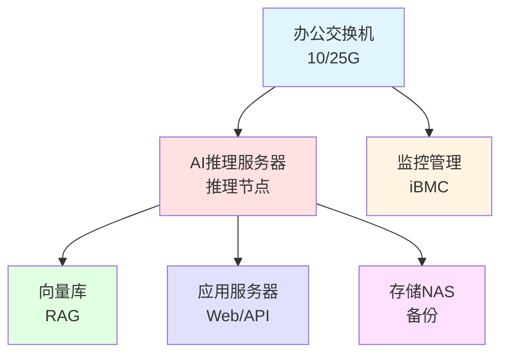

# 办公室部署环境

AI推理服务器在办公室部署需要特别关注电力供应、散热环境、噪音控制等因素。本文档提供办公室部署的完整指南。

## 电力需求与UPS

### 功率计算

**单机功率计算公式**:
```
总功率 = CPU功耗 + GPU功耗 + 内存功耗 + 存储功耗 + 散热功耗 + 冗余(20%)
        = 300W + (N×450W) + 100W + 50W + 150W + 20%
```

### 配置功耗对比

| 配置 | 理论功耗 | 峰值功耗 | 月耗电量 | 月电费(1.2元/kWh) | UPS容量 | UPS价格 |
|------|----------|---------|---------|-----------------|---------|---------|
| 2× RTX 4090 | 1.85kW | 2.22kW | 1,600 kWh | ¥1,920 | 3-5kVA | ¥15,000-25,000 |
| 4× RTX 4090 | 3.25kW | 3.90kW | 2,808 kWh | ¥3,370 | 6-10kVA | ¥40,000-60,000 |
| 8× RTX 4090 | 6.05kW | 7.26kW | 5,227 kWh | ¥6,270 | 10-15kVA | ¥80,000-120,000 |

### UPS选型建议

- **优先选择**在线双变换式UPS(如伊顿9PX/9395XR、华为UPS5000-E)
- **电池选型**: 磷酸铁锂电池(8-10年)优于铅酸电池(3-5年)
- **模块化设计**: 支持N+1冗余,可在线热插拔维护
- **容量要求**: 至少支持服务器满载运行15-30分钟(用于安全关机)

## 机柜、散热与环境

### 基础设施配置

| 组件 | 入门级(2×GPU) | 标准级(4×GPU) | 高配级(8×GPU) |
|------|--------------|----------------|---------------|
| **机柜** | 4U塔式/桌面 | 42U标准机柜 | 42U标准机柜 |
| **占地面积** | 1.5m² | 2m² (+1m²维护) | 3m² (+2m²维护) |
| **PDU配电** | - | 16A工业级 | 32A工业级 |
| **精密空调** | 可选 | 7-10kW | 7-10kW |
| **隔音箱** | 可选 | 推荐 | 必选 |
| **价格估算** | ¥3,000 | ¥8,000-12,000 | ¥15,000-25,000 |

### 环境要求

- **环境温度**: 18-27°C(推荐22°C)
- **相对湿度**: 40-60%
- **进风量**: 每kW热负荷需150-200 CFM风量
- **噪音控制**: 4U服务器满载约70-75dB,建议使用专用机房或隔音措施

### 硬件参考价格

- **42U标准机柜**: ¥3,000-5,000
- **工业级PDU**(带监控): ¥2,000-3,000
- **精密空调**: ¥25,000-40,000
- **隔音箱**: ¥15,000-25,000

## 网络架构设计

### 推荐网络拓扑



### 网络配置建议

| 配置 | 推荐规格 |
|------|---------|
| **上行带宽** | 1-10Gbps (根据并发用户数调整) |
| **内网交换** | 25G SFP28 (标准级) / 100G (高性能级) |
| **网络隔离** | 管理网与业务网物理隔离 |
| **监控网络** | 独立1Gbps管理网段 |

### 办公室部署注意事项

#### 电力安全
- 确认办公室电力容量是否足够(建议预留30%以上冗余)
- 使用独立的供电线路,避免与其他办公设备共用
- 配备UPS不间断电源,确保电源故障时安全关机

#### 散热与通风
- 机房需配备独立空调系统,确保持续供冷
- 避免将服务器放置在密闭空间或靠墙位置
- 定期清洁灰尘,检查风扇运行状态

#### 噪音控制
- 4U服务器满载噪音可达70-75dB,接近重型机械噪音
- 建议将服务器放置在独立机房或使用隔音箱
- 考虑员工工作区域与服务器区域的距离安排

#### 网络准备
- 独立的LAN端口连接AI服务器
- 配置固定IP地址便于管理
- 考虑VPN访问需求(如需远程运维)

#### 维护空间
- 4U服务器需要至少1.5-2米的维护空间
- 机柜后方需预留至少0.8米空间便于布线和维护
- 考虑服务器搬运和更换的实际需求

## 相关文档

- [GPU对比与服务器配置](./gpu-comparison) - 服务器功率信息
- [采购清单与验收](./procurement) - 机柜和UPS采购清单
- [风险分析](./risk-analysis) - 办公室部署风险与缓解措施
