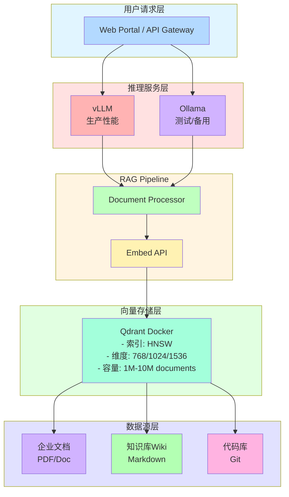

# 软件栈推荐

本文档介绍大模型推理集群的软件栈选型,包括推理框架、向量数据库和RAG架构设计。

## 推理框架对比

### 主流推理框架对比

| 框架 | 优势 | 劣势 | 适用场景 |
|------|------|------|---------|
| **vLLM** | 显存利用率高(PagedAttention)、吞吐量大 | 支持模型略受限 | 高并发企业级推理 |
| **TensorRT-LLM** | 性能最优、延迟最低 | 仅支持NVIDIA GPU、部署复杂 | 深度NVIDIA生态 |
| **HuggingFace TGI** | 易用性强、模型支持广 | 性能略逊 | 快速原型开发 |
| **Ollama** | 部署极简、跨平台 | 性能一般、功能有限 | 个人开发者测试 |
| **LocalAI** | 兼容OpenAI API | 性能一般 | 快速迁移现有应用 |

### 推荐组合

**生产环境**: vLLM
- 显存效率高,性价比最优
- 支持主流开源模型
- 社区活跃,文档完善

**开发/测试**: Ollama
- 部署简单,快速验证
- 适合本地开发测试
- 可作为生产环境的备用方案

## 向量数据库选型

### 向量数据库对比

| 数据库 | 推荐规模 | 部署复杂度 | 性能(P99) | 推荐场景 |
|-------|---------|-----------|----------|---------|
| **Qdrant** | 百万级向量 | 低(单文件运行) | &lt;30ms | 实时RAG、快速部署 |
| **Chroma** | 百万级向量 | 极低(Python库) | ~100ms | 原型验证、教学使用 |
| **Milvus** | 亿级向量 | 中高(需Kubernetes) | ~100ms | 大规模企业知识库 |
| **pgvector** | 百万级向量 | 低(PostgreSQL插件) | ~200ms | 已有PostgreSQL环境 |

### 推荐选择

**50人团队推荐**: Qdrant
- 单机Docker部署,运维简单
- 性能与易用性平衡
- 支持HNSW索引,检索速度快
- 支持过滤和加权搜索

## RAG架构推荐

### 推荐RAG架构



### RAG组件说明

#### 1. 数据源层
- **企业文档**: PDF、Word、PPT等企业内部文档
- **知识库Wiki**: Markdown格式的内部知识库
- **代码库**: Git仓库中的代码和文档

#### 2. 向量存储层
- **向量库**: Qdrant,采用HNSW索引算法
- **嵌入维度**: 768/1024/1536(根据embedding模型选择)
- **容量**: 支持1M-10M文档规模

#### 3. RAG Pipeline
- **Document Processor**: 文档解析、分块、清洗
- **Embed API**: 文本向量生成

#### 4. 推理服务层
- **vLLM**: 生产环境主要推理引擎
- **Ollama**: 测试和备用推理引擎

#### 5. 用户请求层
- **Web Portal**: 面向用户的Web界面
- **API Gateway**: RESTful API接口

## 推荐技术栈

### 生产环境

```yaml
推理引擎: vLLM 0.6.x
模型存储: HuggingFace Hub / ModelScope
向量库: Qdrant 1.12.x (Docker)
文档处理: LangChain + Unstructured
API服务: FastAPI + Uvicorn
负载均衡: Nginx 1.24
监控: Prometheus + Grafana
```

### 开发测试

```yaml
推理引擎: Ollama 0.5.x
向量库: Chroma 0.5.x
开发框架: Streamlit / Gradio
调试工具: LLM Studio
```

## 技术栈选型建议

### 按团队规模选型

| 团队规模 | 推理引擎 | 向量库 | 文档处理 |
|---------|---------|--------|---------|
| &lt; 10人 | Ollama | Chroma | LangChain |
| 10-50人 | vLLM | Qdrant | LangChain + Unstructured |
| &gt; 50人 | vLLM | Milvus/Qdrant集群 | LangChain企业版 |

### 按应用场景选型

| 场景 | 推理引擎 | 向量库 | 说明 |
|------|---------|--------|------|
| 快速原型 | Ollama | Chroma | 最快速上手的组合 |
| 生产环境 | vLLM | Qdrant | 性能与运维成本平衡 |
| 超大规模 | TensorRT-LLM | Milvus | 极致性能要求 |
| 已有PG环境 | vLLM | pgvector | 利用现有PostgreSQL基础设施 |

## 相关文档

- [快速部署指南](./deployment-guide) - Docker Compose完整配置示例
- [办公室部署环境](./deployment-environment) - 网络架构设计
