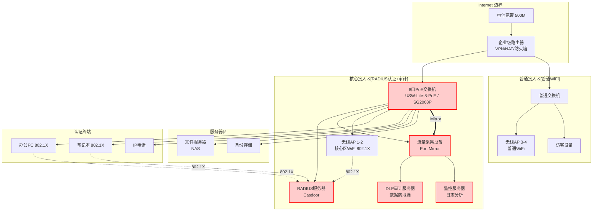

# 网络架构概览

## 设计原则

- **分区管理**：核心区（认证+审计）与普通区（普通WiFi）分离
- **RADIUS认证**：核心区802.1X统一认证
- **安全审计**：核心区Port Mirror + DLP流量审计
- **简洁实用**：50人规模，适度简化
- **访客隔离**：访客网络与办公网络完全隔离

## 网络架构总览（50人规模）

## IP地址规划

| 网段 | 用途 | 容量 | 网关 |
|------|------|------|------|
| 192.168.1.0/24 | 核心区（认证+审计） | 200+ | 192.168.1.1 |
| 192.168.2.0/24 | 服务器区 | 50 | 192.168.2.1 |
| 192.168.3.0/24 | 普通区（访客） | 50 | 192.168.3.1 |

## 设备选型（50人规模）

### 核心设备清单

| 设备 | 型号 | 数量 | 单价 | 小计 | 用途 |
|------|------|------|------|------|------|
| 企业级路由器 | UniFi Dream Machine | 1 | ¥2000 | ¥2000 | VPN/NAT/防火墙 |
| 核心PoE交换机 | USW-Lite-8-PoE / SG2008P | 1 | ¥1000 | ¥1000 | 核心区PoE供电 |
| 普通交换机 | TL-SG1005D | 1 | ¥300 | ¥300 | 普通区接入 |
| 核心区AP | UniFi U6-LR | 2 | ¥1500 | ¥3000 | 核心区802.1X WiFi |
| 普通区AP | UniFi U6-Lite | 2 | ¥800 | ¥1600 | 普通WiFi |
| RADIUS服务器 | 虚拟机 | 1 | - | - | 统一认证 |
| DLP服务器 | 虚拟机 | 1 | - | - | 流量审计 |
| NAS存储 | 群晖DS220+ | 1 | ¥3000 | ¥3000 | 文件共享 |

### 预算参考

| 类别 | 预算范围 |
|------|----------|
| 网络设备（核心+普通） | ¥8,000-12,000 |
| 无线覆盖（4 AP） | ¥5,000-7,000 |
| 服务器（虚拟机） | ¥0（已有） |
| NAS存储 | ¥3,000-5,000 |
| **总计** | **¥16,000-24,000** |
