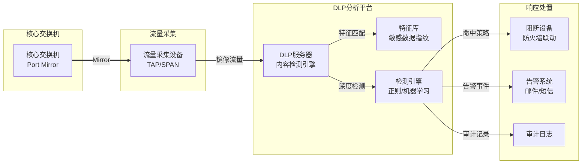
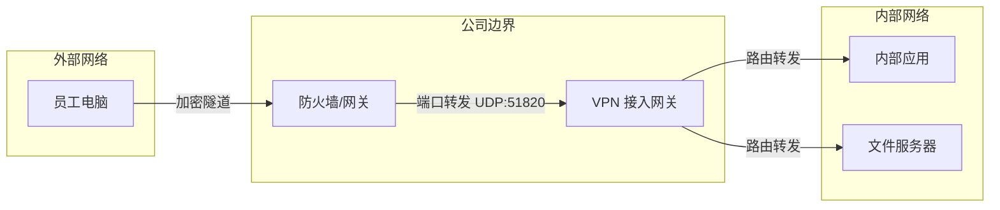

# 网络安全与审计

## DLP数据防泄漏设计

### DLP部署架构



### DLP检测规则

| 规则类型 | 检测内容 | 动作 |
|----------|----------|------|
| **敏感信息** | 身份证号、银行卡号、手机号 | 阻断+告警 |
| **代码泄露** | Git地址、API Key、Token | 阻断+告警 |
| **设计图纸** | CAD文件、DWG格式 | 阻断+审计 |
| **商业机密** | 合同、财务数据 | 阻断+告警+日志 |
| **病毒文件** | 可执行文件、恶意脚本 | 阻断 |

### DLP服务器配置

```bash
# DLP服务器网络配置
IP: 192.168.1.200/24
Gateway: 192.168.1.1
Management: 192.168.1.200:8443

# 监控网卡（只读）
Interface: eth1 (连接TAP设备)
Mode: Passive (不转发流量)

# 联动配置
Firewall: 192.168.1.1
API Key: dlp_api_key_xxxxx
Block Mode: 自动阻断
```

## VPN 与远程访问设计

为支持 WFH (居家办公) 和移动办公，设计基于 **WireGuard** 的高性能 VPN 接入方案。

### 架构拓扑



### 选型与配置

| 组件 | 选型 | 说明 |
| :--- | :--- | :--- |
| **协议** | **WireGuard** | 相比 OpenVPN 性能提升 4 倍，连接速度快，代码库小。 |
| **管理面板** | **Headscale** / **Firezone** | 提供 Web UI 管理用户 Key 和 ACL (访问控制)。 |
| **客户端** | 官方客户端 | Windows / macOS / iOS / Android 全平台支持。 |
| **认证集成** | OIDC (Casdoor) | 登录 VPN 需通过公司统一身份认证。 |

### 访问控制策略 (ACL)

*   **默认策略**: `Deny All` (拒绝所有)。
*   **研发组**: 允许访问 GitLab, Jenkins, Dev 环境。
*   **职能组**: 允许访问 OA, ERP, 文件服务器 (公共区)。
*   **运维组**: 允许访问所有网段 (需 MFA 二次验证)。
