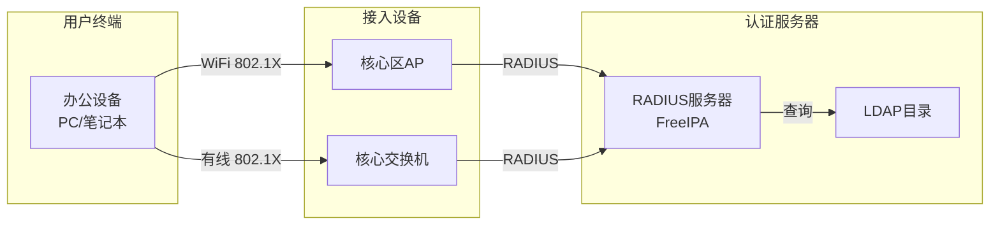

# 无线网络与认证

## RADIUS认证设计

### 认证架构



### FreeIPA RADIUS配置

```bash
# 安装FreeIPA
ipa-server-install --hostname=auth.example.com \
  --realm=EXAMPLE.COM \
  --domain=example.com

# 配置RADIUS客户端
ipa-client-install --enable-dns

# 配置RADIUS策略
ipa radiusproxy-add freeipa-proxy --server=auth.example.com --secret=your_secret

# 添加认证策略
ipa hostgroup-add --desc="核心区设备" core-devices
ipa hostgroup-add-member core-devices --hosts=ap1.example.com
ipa netgroup-add core-network --desc="核心网络"
```

## 无线网络设计

### WiFi覆盖规划

| 区域 | AP数量 | SSID | 认证方式 | 审计 |
|------|--------|------|----------|------|
| 核心办公区 | 2 | StarsLabs-Secure | 802.1X/RADIUS | Port Mirror → DLP |
| 会议室 | 1 | StarsLabs-Secure | 802.1X/RADIUS | Port Mirror → DLP |
| 公共区域 | 2 | StarsLabs-Guest | Portal认证 | 仅日志 |

### WiFi配置要点

```bash
# 核心区AP配置
SSID: StarsLabs-Secure
Security: WPA Enterprise (802.1X)
RADIUS: 192.168.1.100:1812
VLAN: 10

# 普通区AP配置
SSID: StarsLabs-Guest
Security: WPA2-PSK
Isolation: 启用
VLAN: 30
Captive Portal: 启用
```
