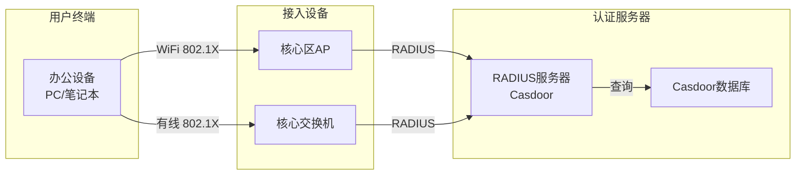

# 无线网络与认证

## RADIUS认证设计

### 认证架构



### Casdoor RADIUS配置

```bash
# 安装Casdoor
./deploy/docker-compose.yml

# 配置RADIUS认证
# 在Casdoor管理界面中:
# 1. 创建应用程序 (App)
#    - Name: starslabs-wifi
#    - Redirect URLs: http://auth.example.com/callback
#    - Client ID, Client Secret: 自动生成
# 2. 配置RADIUS服务器
#    - 使用第三方RADIUS服务器 (如FreeRADIUS)
#    - 配置FreeRADIUS连接Casdoor进行认证
#
# FreeRADIUS配置 (/etc/raddb/sites-available/default):
#
# authenticate {
#     Auth-Type CASDOOR {
#         perl
#     }
# }
#
# /etc/raddb/modules/perl:
#     perl_module = /etc/raddb/casdoor_auth.pl
#
# 3. 部署RADIUS客户端 (AP/交换机)
#    - RADIUS Server: 192.168.1.100
#    - Port: 1812 (认证), 1813 (记账)
#    - Shared Secret: your_shared_secret
```

## 无线网络设计

### WiFi覆盖规划

| 区域 | AP数量 | SSID | 认证方式 | 审计 |
|------|--------|------|----------|------|
| 核心办公区 | 2 | StarsLabs-Secure | 802.1X/RADIUS | Port Mirror → DLP |
| 会议室 | 1 | StarsLabs-Secure | 802.1X/RADIUS | Port Mirror → DLP |
| 公共区域 | 2 | StarsLabs-Guest | Portal认证 | 仅日志 |

### WiFi配置要点

```bash
# 核心区AP配置
SSID: StarsLabs-Secure
Security: WPA Enterprise (802.1X)
RADIUS: 192.168.1.100:1812
VLAN: 10

# 普通区AP配置
SSID: StarsLabs-Guest
Security: WPA2-PSK
Isolation: 启用
VLAN: 30
Captive Portal: 启用
```
