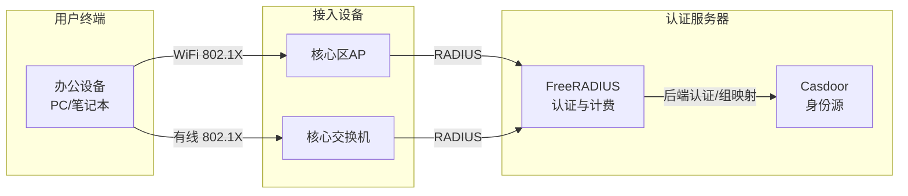

# 无线网络与认证

## RADIUS认证设计

### 认证架构


```mermaid
graph LR
    subgraph "用户终端"
        USER[办公设备<br/>PC/笔记本]
    end

    subgraph "接入设备"
        AP[核心区AP]
        SWITCH[核心交换机]
    end

    subgraph "认证服务器"
        RADIUS[FreeRADIUS<br/>认证与计费]
        IDP[Casdoor<br/>身份源]
    end

    USER -->|WiFi 802.1X| AP
    USER -->|有线 802.1X| SWITCH
    AP -->|RADIUS| RADIUS
    SWITCH -->|RADIUS| RADIUS
    RADIUS -->|后端认证/组映射| IDP
```

### FreeRADIUS + Casdoor 配置原则

```bash
# FreeRADIUS 是 Wi-Fi 和有线 802.1X 的唯一 RADIUS 服务端。
# AP、交换机只配置 FreeRADIUS，不直接连接 Casdoor。
#
# FreeRADIUS:
#   - Authentication: 1812/udp
#   - Accounting: 1813/udp
#   - EAP: 优先 EAP-TLS；无法部署客户端证书时使用 PEAP-MSCHAPv2
#   - Backend: 使用已验证的 Casdoor 对接方式（LDAP、REST 或本地受控目录）
#   - Group mapping: 将 Casdoor 组映射为 VLAN/ACL 属性
#
# /etc/raddb/clients.conf
# client office-ap {
#     ipaddr = 192.168.1.0/24
#     secret = <secret-manager 提供的共享密钥>
#     shortname = office-ap
# }
#
# AP/交换机必须启用证书校验、RADIUS accounting 和 fail-closed 策略。
```

## 无线网络设计

### WiFi覆盖规划

| 区域 | AP数量 | SSID | 认证方式 | 审计 |
|------|--------|------|----------|------|
| 核心办公区 | 2 | StarsLabs-Secure | WPA2/WPA3-Enterprise + FreeRADIUS | FreeRADIUS accounting |
| 会议室 | 1 | StarsLabs-Secure | WPA2/WPA3-Enterprise + FreeRADIUS | FreeRADIUS accounting |
| 公共区域 | 2 | StarsLabs-Guest | Portal认证 | 仅日志 |

### WiFi配置要点

```bash
# 核心区AP配置
SSID: StarsLabs-Secure
Security: WPA2/WPA3-Enterprise (802.1X)
RADIUS: 192.168.1.100:1812
Accounting: 192.168.1.100:1813
VLAN: 10

# 普通区AP配置
SSID: StarsLabs-Guest
Security: WPA3-Personal 或访客 Portal
Isolation: 启用
VLAN: 30
Captive Portal: 启用
```
