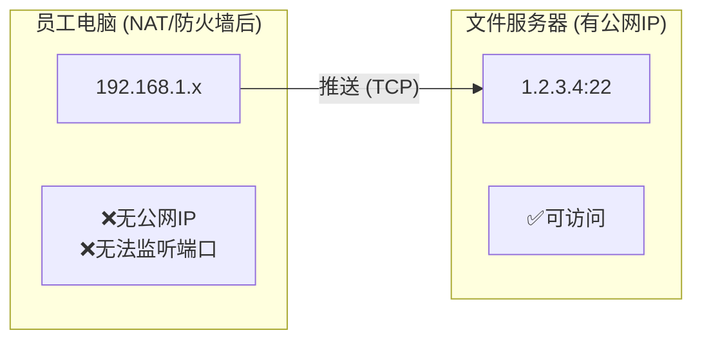

# 概述与选型指南

本文档详细分析了训练数据备份的传输技术选型，并针对不同场景（办公室内网、WFH远程办公）提供了最佳实践方案。

## 场景分析

### 两种工作模式

| 模式 | 说明 | 适用场景 |
|------|------|----------|
| **拉取 (Pull)** | 服务器监听，客户端连接下载 | 文件服务器有公网IP，客户端可主动连接 |
| **推送 (Push)** | 客户端主动发起上传 | 客户端在NAT后（WFH），无法接收连接 |

### WFH 场景的特殊性



**关键问题**：
- WFH员工电脑在家庭路由器NAT后，无法接收UDP/TCP连接。
- 只有**推送模式**可行（客户端主动连接服务器）。
- 传统 UDP 协议（Tsunami/Namida）默认需要客户端监听端口，不支持推送。

## 传输模式对比

### 完整对比表（按速度排序）

| 技术 | 协议 | 速度 | 推送 | 拉取 | WFH支持 | 局域网速度 |
|------|------|------|------|------|---------|------------|
| **[Tsunami UDP](./tsunami-udp)** | UDP | **极快** | ❌ | ✅ | ❌ | 10~12 GB/s |
| **[Namida](./namida)** | UDP | **极快** | ❌ | ✅ | ❌ | 10~12 GB/s |
| **[bbcp](./bbcp)** | TCP | **极高** | ✅ | ✅ | ✅ | 9~11 GB/s |
| **mbuffer+tar+ssh** | TCP | **高** | ✅ | ✅ | ✅ | 8~10 GB/s |
| UDT4 | UDP | 极快 | ❌ | ✅ | ❌ | 8~10 GB/s |
| GridFTP | TCP | 极高 | ✅ | ✅ | ✅ | 8~9 GB/s |
| rclone | HTTP/gRPC | 高 | ✅ | ✅ | ✅ | 5~7 GB/s |
| rsync | TCP | 中 | ✅ | ✅ | ✅ | 3~4 GB/s |

## 推荐方案决策树

```mermaid
graph TD
    Start[开始备份] --> CheckNet{是否在办公网络？}
    CheckNet --"是"--> CheckNamida{追求极致速度？}
    CheckNet --"否"--> UseBBCP[使用 bbcp 推送<br>(NAT穿透)]
    
    CheckNamida --"是"--> UseNamida[Namida / Tsunami UDP<br>(10+ GB/s)]
    CheckNamida --"否"--> UseBBCP2[bbcp 推送<br>(运维简单)]
```

### 快速推荐

1.  **场景 A：办公室有线网络（追求极致速度）**
    *   推荐：**[Namida](./namida)** 或 **[Tsunami UDP](./tsunami-udp)**
    *   理由：无 NAT 问题，UDP 协议可占满带宽，速度最快。

2.  **场景 B：WFH 远程办公（家庭宽带）**
    *   推荐：**[bbcp](./bbcp)** (推送模式)
    *   理由：客户端主动发起连接，天然穿透 NAT，无需复杂配置。

3.  **场景 C：混合环境（运维最简化）**
    *   推荐：**统一使用 bbcp**
    *   理由：同一套脚本适配所有场景，速度（9~11 GB/s）仅略低于 UDP，但稳定性更好。

## 详细技术文档

请根据您的选择阅读对应文档：

*   **[Namida (现代化 UDP 方案)](./namida)**: Rust 编写，现代化，支持加密。
*   **[Tsunami UDP (传统极速方案)](./tsunami-udp)**: 经典的 UDP 传输工具，适合纯内网。
*   **[bbcp (TCP 高速方案)](./bbcp)**: 基于 TCP 的高性能传输，防火墙友好，支持 NAT 穿透。
*   **[部署与调优指南](./deployment)**: 通用的环境准备、内核调优及 Systemd 配置。
