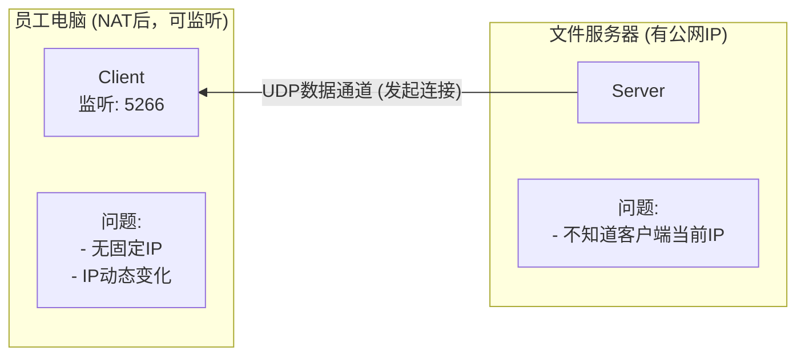

# Namida (UDP方案)

Namida 是 Tsunami UDP 的现代化 Rust 重写版本，专为高延迟或不可靠网络上的快速文件下载而设计。

## 核心优势

| 特性 | 说明 |
|------|------|
| **UDP裸传** | 无TCP拥塞控制，占满带宽 |
| **极低CPU占用** | &lt;5%，无加密开销 |
| **现代化实现** | Rust重写，活跃维护 |
| **默认加密** | 使用snow加密通信 |

## 安装与使用

### 安装

```bash
# 安装 Rust（如果未安装）
curl --proto '=https' --tlsv1.2 -sSf https://sh.rustup.rs | sh
source ~/.cargo/env

# 安装 namida
cargo install --git https://github.com/meew0/namida.git

# 或源码编译
git clone https://github.com/meew0/namida.git
cd namida
cargo build --release
```

### 基本用法

**服务端（文件服务器）**：
```bash
# 启动服务，监听指定目录
namida serve /data/training/
```

**客户端（员工电脑）**：
```bash
# 下载单个文件
namida get --server 192.168.1.100:5266 dataset.tar.gz

# 下载全部文件
namida get --server 192.168.1.100:5266 --all

# 限制速率
namida get --server 192.168.1.100:5266 --rate 100M dataset.tar.gz
```

## WFH 场景的服务发现问题

在 WFH (Work From Home) 场景下，客户端位于 NAT 后，无法直接接收来自服务器的 UDP 连接。



### 解决方案：客户端注册脚本

如果必须在 WFH 场景使用 Namida，可以通过“客户端注册”的方式解决。

```bash
#!/bin/bash
# ~/scripts/namida-register.sh
# 客户端注册脚本：告知服务器自己的位置

SERVER="file-server.company.com"
REG_PORT="5267"      # 注册端口
DATA_PORT="5266"     # Namida数据端口
CLIENT_IP=$(curl -s ifconfig.me || hostname -I | awk '{print $1}')
CLIENT_PORT=${1:-$DATA_PORT}

log() {
    echo "[$(date '+%Y-%m-%d %H:%M:%S')] [register] $*"
}

# 1. 启动Namida数据服务（监听数据端口）
namida serve /data/training/ --port ${DATA_PORT} &
NAMIDA_PID=$!
log "Namida服务启动 PID: $NAMIDA_PID, 端口: ${DATA_PORT}"

# 2. 向服务器注册自己的位置
log "向服务器注册: ${CLIENT_IP}:${CLIENT_PORT}"
echo "${CLIENT_IP}:${CLIENT_PORT}" | nc -w1 ${SERVER} ${REG_PORT}

# 3. 等待传输完成
log "等待传输请求..."
wait $NAMIDA_PID

log "完成"
```

> **注意**：这种方式增加了复杂度，WFH 场景通常建议直接使用 [bbcp](./bbcp)。

## 完整备份脚本 (办公室场景)

```bash
#!/bin/bash
# ~/scripts/backup-namida.sh
# Namida 现代化UDP备份脚本

set -euo pipefail

NAS_HOST="192.168.1.100"
NAS_PORT="5266"
NAS_PATH="/backup/${USER}"
SOURCE_PATHS=(
    "/data/training"
    "/data/models"
    "/data/experiments"
)
RATE_LIMIT="5G"  # 根据网络带宽调整
LOG_DIR="${HOME}/.local/share/backup/logs"

log() {
    echo "[$(date '+%Y-%m-%d %H:%M:%S')] [namida] $*" | tee -a "${LOG_DIR}/namida_$(date +%Y%m%d).log"
}

run_backup() {
    local src="$1"
    local filename=$(basename "${src}")
    
    if [ ! -d "${src}" ]; then
        log "跳过: ${src} 不存在"
        return 0
    fi
    
    log "备份: ${src} -> ${NAS_HOST}:${NAS_PATH}/${filename}"
    
    # Namida 传输（服务端需提前启动 namida serve）
    namida get \
        --server "${NAS_HOST}:${NAS_PORT}" \
        --rate "${RATE_LIMIT}" \
        --output "${NAS_PATH}/${filename}" \
        --verbose \
        "${filename}" 2>&1 | while read line; do
            log "  $line"
        done
    
    if [ ${PIPESTATUS[0]} -eq 0 ]; then
        log "完成: ${src}"
        # 删除源文件
        find "${src}" -type f -delete 2>/dev/null || true
    else
        log "错误: ${src}"
    fi
}

main() {
    mkdir -p "${LOG_DIR}"
    log "========== Namida备份开始 =========="
    log "目标: ${NAS_HOST}:${NAS_PORT}"
    log "速率限制: ${RATE_LIMIT}"
    
    for path in "${SOURCE_PATHS[@]}"; do
        run_backup "${path}"
    done
    
    log "========== Namida备份完成 =========="
}

main "$@"
```