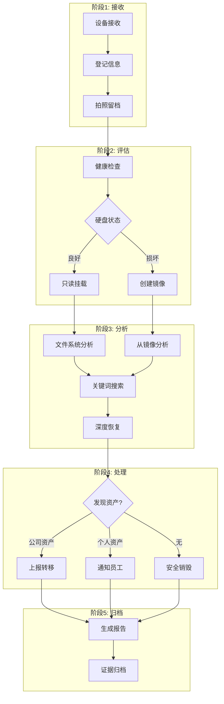

# 取证操作流程 (SOP)

本节提供从设备接收到最终销毁的完整标准操作流程。

## 流程概览



## 1. 设备接收与登记

### 1.1 接收检查清单

| 检查项 | 操作 | 备注 |
| :--- | :--- | :--- |
| 设备标签 | 核对资产编号 | 与资产管理系统比对 |
| 外观检查 | 拍照记录物理状态 | 包括屏幕、接口、外壳 |
| 硬盘信息 | 记录品牌、型号、容量 | 填写《取证接收单》 |
| 启动测试 | 尝试开机判断硬盘状态 | 如无法启动需备注 |
| 人员签字 | 双方签字确认 | 保留证据链完整性 |

### 1.2 登记信息模板

```
取证接收单
=====================================
案件编号: CASE-2024-001
接收日期: 2024-02-03
接收人员: [IT工程师姓名]
设备类型: [笔记本/台式机/移动硬盘]
设备型号: [品牌型号]
硬盘型号: [例如: Samsung 870 EVO 1TB]
硬盘序列号: [S/N]
硬盘容量: [GB/TB]
硬盘接口: [SATA/NVMe/USB]
设备状态: [正常/无法启动/物理损坏]
原使用人: [员工姓名/工号]
取证原因: [离职回收/故障抢救/审计需求]
预估价值: [如已知]
双人签字: [签字区]
=====================================
```

### 1.3 环境准备

```bash
# 创建案件目录结构
CASE_ID="CASE-$(date +%Y%m%d)-$(printf '%03d' $((RANDOM % 1000)))"
BASE_DIR="/forensics/cases/$CASE_ID"

sudo mkdir -p "$BASE_DIR"/{raw,images,recovered,logs,reports,evidence}
sudo chown -R $USER:$USER "$BASE_DIR"

# 目录说明
# raw/        - 原始证据文件
# images/     - 法证镜像文件
# recovered/  - 恢复的文件
# logs/       - 操作日志
# reports/    - 分析报告
# evidence/   - 发现的加密资产证据
```

## 2. 硬盘健康评估

### 2.1 S.M.A.R.T. 检测流程

```bash
# 1. 识别目标磁盘
lsblk -f
sudo fdisk -l

# 假设目标磁盘为 /dev/sdb
TARGET_DISK="/dev/sdb"

# 2. 运行 S.M.A.R.T. 全面检测
echo "=== 步骤 1: 基础信息 ===" > "$BASE_DIR/logs/smart_report.txt"
sudo smartctl -i "$TARGET_DISK" >> "$BASE_DIR/logs/smart_report.txt"

echo "" >> "$BASE_DIR/logs/smart_report.txt"
echo "=== 步骤 2: 完整报告 ===" >> "$BASE_DIR/logs/smart_report.txt"
sudo smartctl -a "$TARGET_DISK" >> "$BASE_DIR/logs/smart_report.txt"

echo "" >> "$BASE_DIR/logs/smart_report.txt"
echo "=== 步骤 3: 健康评估 ===" >> "$BASE_DIR/logs/smart_report.txt"
sudo smartctl -H "$TARGET_DISK" >> "$BASE_DIR/logs/smart_report.txt"

# 3. 运行短期自检 (可选)
sudo smartctl -t short "$TARGET_DISK"
echo "短期自检已启动，约 2 分钟完成..."
sleep 120
sudo smartctl -l selftest "$TARGET_DISK" >> "$BASE_DIR/logs/smart_report.txt"
```

### 2.2 评估决策树

```
S.M.A.R.T. 状态评估:
│
├─ PASSED (通过)
│  └─ 可尝试直接挂载只读分析
│     └─ 挂载成功 → 直接进入分析阶段
│     └─ 挂载失败 → 创建法证镜像
│
├─ WARNING (警告)
│  └─ 必须创建法证镜像，禁止直接挂载
│     └─ 镜像成功 → 分析镜像
│     └─ 镜像失败 → 专业数据恢复公司
│
└─ FAILED (失败)
   └─ 立即停止操作
      └─ 建议送专业数据恢复服务
```

### 2.3 健康指标决策表

| 指标 | 正常 | 警告 | 危险 |
| :--- | :--- | :--- | :--- |
| Reallocated_Sector_Ct | 0 | 1-10 | > 10 |
| Current_Pending_Sector | 0 | 1-5 | > 5 |
| Offline_Uncorrectable | 0 | 1-2 | > 2 |
| Temperature | < 45°C | 45-55°C | > 55°C |
| Power_On_Hours | < 30,000h | 30,000-50,000h | > 50,000h |
| Seek_Error_Rate | 0 | < 10 | > 10 |

**决策规则**:
- 所有指标正常 → 绿色，可直接操作
- 1-2 个警告 → 黄色，必须创建镜像
- 任何危险或多个警告 → 红色，停止操作送专业机构

## 3. 创建法证镜像

### 3.1 使用 ddrescue 创建镜像

**核心原则**: 对任何非全新硬盘，优先创建镜像再分析。

```bash
# 变量设置
SOURCE_DISK="/dev/sdb"
IMAGE_FILE="$BASE_DIR/images/disk.img"
MAP_FILE="$BASE_DIR/logs/ddrescue.map"
LOG_FILE="$BASE_DIR/logs/ddrescue.log"

# 步骤 1: 第一阶段 - 快速读取 (跳过损坏扇区)
echo "[$(date)] 开始第一阶段: 快速读取" >> "$LOG_FILE"
sudo ddrescue -n -v "$SOURCE_DISK" "$IMAGE_FILE" "$MAP_FILE" 2>&1 | tee -a "$LOG_FILE"

# 步骤 2: 第二阶段 - 深度恢复
echo "[$(date)] 开始第二阶段: 深度恢复" >> "$LOG_FILE"
sudo ddrescue -d -r3 -v "$SOURCE_DISK" "$IMAGE_FILE" "$MAP_FILE" 2>&1 | tee -a "$LOG_FILE"

# 步骤 3: 验证镜像完整性
echo "[$(date)] 计算校验和" >> "$LOG_FILE"
sha256sum "$IMAGE_FILE" > "$BASE_DIR/logs/disk.img.sha256"
md5sum "$IMAGE_FILE" > "$BASE_DIR/logs/disk.img.md5"

echo "[$(date)] 镜像创建完成" >> "$LOG_FILE"
ls -lh "$IMAGE_FILE" >> "$LOG_FILE"
```

### 3.2 ddrescue 进度监控

```bash
# 在另一个终端查看进度
watch -n 5 'cat /forensics/cases/*/logs/ddrescue.map | tail -20'

# 或使用 mapfile 查看状态
ddrescue -v /dev/null /dev/null /forensics/cases/*/logs/ddrescue.map
```

### 3.3 镜像验证

```bash
# 验证镜像文件系统
fsstat "$IMAGE_FILE"

# 对比原始磁盘和镜像的校验和 (前 1GB)
sha256sum <(sudo dd if="$SOURCE_DISK" bs=1M count=1024) \
          <(dd if="$IMAGE_FILE" bs=1M count=1024)
```

## 4. 挂载与初步分析

### 4.1 只读挂载操作

```bash
# 场景 1: 直接挂载物理磁盘 (仅当 S.M.A.R.T. 完全正常)
sudo mkdir -p /mnt/physical_evidence
sudo mount -o ro,noload "$SOURCE_DISK"1 /mnt/physical_evidence

# 场景 2: 挂载法证镜像
case_image="$BASE_DIR/images/disk.img"
sudo mkdir -p /mnt/image_evidence

# 识别分区偏移
sudo fdisk -l "$case_image"

# 计算偏移量 (假设从第 2048 扇区开始，每扇区 512 字节)
offset=$((512 * 2048))

# 挂载分区
sudo mount -o ro,loop,offset=$offset "$case_image" /mnt/image_evidence

# 或者使用 kpartx 自动识别分区
sudo apt install kpartx
sudo kpartx -v -a "$case_image"
# 会创建 /dev/mapper/loopXpY 设备
sudo mount -o ro /dev/mapper/loop0p1 /mnt/image_evidence
```

### 4.2 NTFS 特殊处理

```bash
# Windows 系统通常使用 NTFS
sudo mkdir -p /mnt/ntfs_evidence

# 只读挂载 NTFS
sudo mount -t ntfs-3g -o ro,remove_hiberfile,recover \
    /dev/sdb1 /mnt/ntfs_evidence

# 如果遇到休眠文件错误
sudo ntfsfix -n /dev/sdb1  # 检查 (dry-run)
```

### 4.3 卸载与清理

```bash
# 安全卸载
sudo umount /mnt/image_evidence

# 如果使用 kpartx，删除映射
sudo kpartx -d "$case_image"

# 验证卸载
mount | grep evidence  # 应该无输出
```

## 5. 深度文件系统分析

### 5.1 Sleuth Kit 分析流程

```bash
cd "$BASE_DIR"
image="images/disk.img"

# 步骤 1: 识别文件系统
echo "=== 文件系统信息 ==="
fsstat "$image" | tee reports/filesystem_info.txt

# 步骤 2: 列出分区结构
echo "=== 分区结构 ==="
fls "$image" | tee reports/partition_structure.txt

# 步骤 3: 递归列出所有文件 (包括已删除)
echo "=== 完整文件列表 ==="
fls -r -p "$image" | tee reports/all_files.txt

# 步骤 4: 搜索钱包相关文件
echo "=== 钱包文件搜索 ==="
fls -r "$image" | grep -iE "wallet|bitcoin|ethereum|keystore|mnemonic|seed" | \
    tee reports/wallet_files.txt

# 步骤 5: 恢复已删除文件
mkdir -p recovered
fls -r -d "$image"  # 列出已删除文件

# 步骤 6: 提取可疑文件 (根据 inode 号)
# 示例: icat image.img 12345 > recovered/file_from_inode_12345.bin
```

### 5.2 时间线分析

```bash
# 生成文件时间线
fls -r -m / "$image" > reports/timeline_bodyfile.txt

# 使用 mactime 分析 (需安装 sleuthkit 工具包)
mactime -b reports/timeline_bodyfile.txt -d > reports/timeline.csv

# 查看最近访问的文件
head -100 reports/timeline.csv
```

## 6. 关键词搜索与模式匹配

### 6.1 助记词搜索

```bash
# 定义 BIP-39 前 100 个高频词
BIP39_WORDS="abandon|ability|able|about|above|absent|absorb|abstract|absurd|abuse|access|accident|account|accuse|achieve|acid|acoustic|acquire|across|act|action|actor|actual|adapt|add|addict|address|adjust|admit|adult|advance|advice|aerobic|affair|afford|afraid|again|age|agent|agree|ahead|aim|air|airport|aisle|alarm|album|alcohol|alert|alien|all|alley|allow|almost|alone|alpha|already|also|alter|always|amateur|amazing|among|amount|amused|anchor|ancient|anger|angle|angry|animal|ankle|announce|annual|another|answer|antenna|antique|anxiety|any|apart|apology|appear|apple|approve|april|arch|arctic|area|arena|argue|armed|armor|army|around|arrange|arrest|arrive|arrow|art|artefact|artist|artwork"

# 搜索文本文件
echo "=== 搜索助记词模式 ==="
rg -i "\b($BIP39_WORDS)\b" /mnt/image_evidence/ \
    --type txt --type md --type json 2>/dev/null | \
    tee reports/mnemonic_matches.txt
```

### 6.2 私钥与密钥搜索

```bash
# 搜索十六进制私钥
echo "=== 搜索十六进制私钥 ==="
rg -i '\b[0-9a-fA-F]{64}\b' /mnt/image_evidence/ \
    --type txt 2>/dev/null | tee reports/hex_keys.txt

# 搜索 WIF 格式
echo "=== 搜索 WIF 格式 ==="
rg -i '\b[5KL][1-9A-HJ-NP-Za-km-z]{50,51}\b' /mnt/image_evidence/ \
    --type txt 2>/dev/null | tee reports/wif_keys.txt

# 搜索 Keystore JSON
echo "=== 搜索 Keystore 文件 ==="
rg -i '"crypto".*"ciphertext".*"kdf"' /mnt/image_evidence/ \
    --type json --type txt 2>/dev/null | tee reports/keystore_files.txt
```

### 6.3 压缩包处理

```bash
# 找到所有压缩包
find /mnt/image_evidence/ -type f \( \
    -name "*.zip" -o -name "*.7z" -o -name "*.rar" \
    -o -name "*.tar.gz" -o -name "*.tar.bz2" \
) 2>/dev/null | tee reports/archives.txt

# 解压并搜索 (创建临时目录)
mkdir -p temp_extract
while read -r archive; do
    echo "Processing: $archive"
    7z x "$archive" -o"temp_extract/$(basename "$archive")" -p"" 2>/dev/null || true
    # 注意: 加密压缩包会失败，需记录待后续处理
done < reports/archives.txt

# 在解压后的文件中搜索
rg -i "wallet|bitcoin|ethereum|crypto" temp_extract/ 2>/dev/null | \
    tee reports/archive_contents.txt

# 清理临时文件
rm -rf temp_extract
```

## 7. PhotoRec 深度恢复

### 7.1 文件雕刻恢复

当文件系统严重损坏或文件被删除时，使用 PhotoRec 进行块级恢复。

```bash
# 启动 PhotoRec 交互式界面
sudo photorec "$BASE_DIR/images/disk.img"

# PhotoRec 交互步骤:
# 1. 选择磁盘/镜像
# 2. 选择分区 (或选择 [Whole disk])
# 3. 选择文件系统类型 ([Other] 适用于通用扫描)
# 4. 选择恢复位置: "$BASE_DIR/recovered"
# 5. 选择文件类型 (按空格键选择):
#    - [X] txt (文本文件 - 可能包含助记词)
#    - [X] json (Keystore 文件)
#    - [X] docx/xlsx (Office 文档)
#    - [X] jpg/png (截图)
# 6. 按 [C] 开始恢复
```

### 7.2 批量整理恢复结果

```bash
# PhotoRec 恢复的文件按类型分类
# 整理到更清晰的目录结构

cd "$BASE_DIR/recovered"

# 按文件类型组织
mkdir -p {text,wallets,images,documents,other}

# 移动文本文件
find . -name "*.txt" -o -name "*.md" -o -name "*.json" 2>/dev/null | \
    head -1000 | xargs -I {} mv {} text/ 2>/dev/null || true

# 移动图片
find . -type f \( -name "*.jpg" -o -name "*.jpeg" -o -name "*.png" \) 2>/dev/null | \
    head -1000 | xargs -I {} mv {} images/ 2>/dev/null || true

# 移动文档
find . -type f \( -name "*.doc" -o -name "*.docx" -o -name "*.pdf" \) 2>/dev/null | \
    head -1000 | xargs -I {} mv {} documents/ 2>/dev/null || true

echo "恢复文件已整理完成"
tree -L 2 "$BASE_DIR/recovered" 2>/dev/null || ls -R "$BASE_DIR/recovered"
```

## 8. 结果整理与报告

### 8.1 发现的资产分类

```bash
# 创建最终报告
cat > "$BASE_DIR/reports/FINAL_REPORT.txt" << 'EOF'
=====================================
加密资产取证报告
=====================================
案件编号: $CASE_ID
取证日期: $(date)
取证人员: [姓名]

一、设备信息
------------
设备类型: [笔记本/台式机/硬盘]
硬盘型号: [型号]
硬盘容量: [容量]
硬盘健康: [SMART 结果]

二、取证方法
------------
镜像工具: ddrescue
分析工具: Sleuth Kit, ripgrep, PhotoRec
挂载方式: 只读挂载

三、发现结果
------------
EOF

# 汇总所有发现
echo "" >> "$BASE_DIR/reports/FINAL_REPORT.txt"
echo "发现的钱包文件:" >> "$BASE_DIR/reports/FINAL_REPORT.txt"
cat reports/wallet_files.txt 2>/dev/null >> "$BASE_DIR/reports/FINAL_REPORT.txt"

echo "" >> "$BASE_DIR/reports/FINAL_REPORT.txt"
echo "发现的助记词匹配:" >> "$BASE_DIR/reports/FINAL_REPORT.txt"
wc -l reports/mnemonic_matches.txt 2>/dev/null >> "$BASE_DIR/reports/FINAL_REPORT.txt"

echo "" >> "$BASE_DIR/reports/FINAL_REPORT.txt"
echo "恢复的已删除文件数:" >> "$BASE_DIR/reports/FINAL_REPORT.txt"
find recovered/ -type f 2>/dev/null | wc -l >> "$BASE_DIR/reports/FINAL_REPORT.txt"
```

### 8.2 证据打包

```bash
# 生成证据包哈希
cd "$BASE_DIR"
find evidence/ -type f -exec sha256sum {} \; > evidence/hashes.txt

# 打包整个案件
tar czf "../${CASE_ID}_evidence.tar.gz" .

# 计算包哈希
sha256sum "../${CASE_ID}_evidence.tar.gz" > "../${CASE_ID}_evidence.tar.gz.sha256"

echo "证据包已生成: ${CASE_ID}_evidence.tar.gz"
echo "校验和: $(cat ../${CASE_ID}_evidence.tar.gz.sha256)"
```

---

**下一步**: [安全与合规](./security-compliance) - 了解证据处理和合规要求
