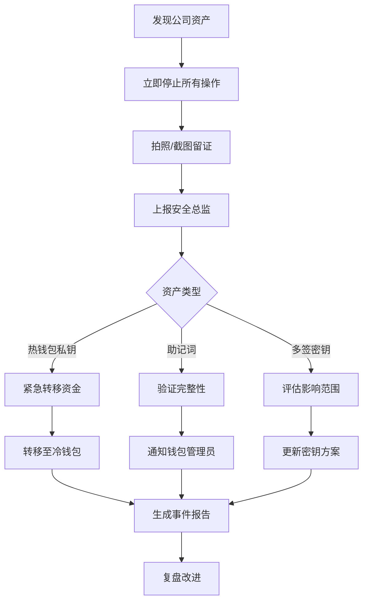

# 安全与合规要求

本节定义加密资产取证过程中的安全操作规范、证据链管理和合规处理流程。

## 1. 操作安全基线

### 1.1 物理安全

| 要求 | 实施措施 | 检查方法 |
| :--- | :--- | :--- |
| **专用工作区** | 取证工作站放置在受控区域，限制物理访问 | 门禁刷卡记录 |
| **监控覆盖** | 取证区域安装监控摄像头，保留录像 90 天 | 定期检查录像 |
| **双人操作** | P0/P1 级案件需两人在场，互相监督 | 操作日志签字 |
| **设备保管** | 证据设备存放在上锁机柜，专人管理 | 存取登记表 |

### 1.2 数字安全

| 要求 | 实施措施 | 技术验证 |
| :--- | :--- | :--- |
| **气隙隔离** | 取证工作站禁止连接互联网 | `ping 8.8.8.8` 应失败 |
| **写保护** | 使用硬件写保护器或软件只读挂载 | `mount \| grep ro` |
| **数据加密** | 所有证据文件加密存储 (LUKS) | `cryptsetup status` |
| **定期擦除** | 临时文件安全擦除 (shred) | 验证无残留 |

### 1.3 写保护实施

```bash
# 方法 1: 软件只读挂载 (最低要求)
sudo mount -o ro,noload /dev/sdb1 /mnt/evidence

# 方法 2: 使用 blockdev 设置只读
sudo blockdev --setro /dev/sdb
# 验证
blockdev --getro /dev/sdb  # 应输出 1

# 方法 3: hdparm 安全冻结 (ATA 硬盘)
sudo hdparm --security-freeze /dev/sdb

# 方法 4: 硬件写保护器 (推荐用于关键证据)
# 使用 Tableau 或 WiebeTech 写保护器连接硬盘
```

### 1.4 气隙环境配置

```bash
# 禁用网络接口
sudo ip link set eth0 down
sudo ip link set wlan0 down

# 验证网络隔离
ping -c 1 8.8.8.8  # 应失败
ip route show      # 应无默认路由

# 配置防火墙禁止所有出站连接
sudo iptables -P OUTPUT DROP
sudo iptables -P INPUT DROP
sudo iptables -P FORWARD DROP
```

## 2. 证据链管理

### 2.1 证据链完整性

证据链 (Chain of Custody) 必须记录每个接触证据的人员、时间、操作。

**记录要素**:
- 时间戳 (精确到秒)
- 操作人员姓名和工号
- 操作类型 (接收/镜像/分析/移交/销毁)
- 证据状态 (原始/镜像/提取文件)
- 校验和 (MD5/SHA256)
- 证人签字

### 2.2 操作日志记录

```bash
# 启用全程终端录制
CASE_ID="CASE-2024-001"
LOG_FILE="/forensics/cases/$CASE_ID/logs/terminal_session_$(date +%Y%m%d_%H%M%S).log"

# 开始录制
script -q -a "$LOG_FILE"

# 设置提示符显示时间
export PS1='[\t] [\u@\h \W]\$ '

# 所有操作命令...
# ... 取证操作 ...

# 结束录制
exit

# 为日志文件添加数字签名 (可选)
gpg --armor --detach-sign "$LOG_FILE"
```

### 2.3 校验和计算

```bash
#!/bin/bash
# calculate_hashes.sh - 计算证据文件校验和

EVIDENCE_DIR="/forensics/cases/$CASE_ID"
HASH_FILE="$EVIDENCE_DIR/logs/file_hashes.txt"

echo "=== 证据文件校验和 ===" > "$HASH_FILE"
echo "生成时间: $(date)" >> "$HASH_FILE"
echo "操作人员: $(whoami)" >> "$HASH_FILE"
echo "" >> "$HASH_FILE"

# 计算所有证据文件的校验和
echo "--- SHA256 校验和 ---" >> "$HASH_FILE"
find "$EVIDENCE_DIR/images" "$EVIDENCE_DIR/evidence" -type f 2>/dev/null | \
    while read -r file; do
        sha256sum "$file" >> "$HASH_FILE"
    done

echo "" >> "$HASH_FILE"
echo "--- MD5 校验和 ---" >> "$HASH_FILE"
find "$EVIDENCE_DIR/images" "$EVIDENCE_DIR/evidence" -type f 2>/dev/null | \
    while read -r file; do
        md5sum "$file" >> "$HASH_FILE"
    done

echo "校验和已保存到: $HASH_FILE"
```

### 2.4 证据移交程序

```
证据移交单
=====================================
移交日期: [YYYY-MM-DD HH:MM:SS]
移交人: [姓名] [工号] [签字]
接收人: [姓名] [工号] [签字]
见证人: [姓名] [工号] [签字]

证据编号: [CASE-ID]
证据类型: [磁盘镜像/提取文件/物理设备]
证据描述: [详细描述]

校验和信息:
  SHA256: [校验和值]
  MD5: [校验和值]

存储位置: [物理位置/服务器路径]
访问权限: [授权人员列表]

移交原因: [审计/法律要求/资产转移/销毁]
=====================================
```

## 3. 发现资产的合规处理

### 3.1 资产分类与处理

| 发现内容 | 资产类型 | 处理流程 | 时效要求 |
| :--- | :--- | :--- | :--- |
| **公司热钱包密钥** | 公司资产 | 立即上报安全团队 → 转移至冷钱包 | 1 小时内 |
| **公司多签密钥** | 公司资产 | 上报 → 安全审计 → 更新密钥管理 | 4 小时内 |
| **员工个人钱包** | 个人资产 | 通知员工本人领取 → 签署确认单 | 24 小时内 |
| **来源不明资产** | 待确认 | 保全证据 → 启动合规审查 → 上报法务 | 立即 |
| **加密容器/密码** | 未知 | 记录存档 → 按保留策略处理 | 按策略 |

### 3.2 公司资产处理流程



### 3.3 员工个人资产处理

**禁止行为**:
- ❌ 不得尝试打开或查看个人钱包
- ❌ 不得转移任何个人资产
- ❌ 不得泄露发现内容给无关人员
- ❌ 不得私自备份个人密钥

**正确流程**:
```bash
# 1. 记录发现 (不暴露具体内容)
echo "$(date): CASE-$CASE_ID 发现个人钱包文件" >> /forensics/personal_discovery.log

# 2. 安全打包证据
tar czf "personal_wallet_CASE-${CASE_ID}.tar.gz" -C "$EVIDENCE_DIR/evidence" .

# 3. 计算哈希
sha256sum "personal_wallet_CASE-${CASE_ID}.tar.gz" > "personal_wallet_CASE-${CASE_ID}.tar.gz.sha256"

# 4. 通知员工 (邮件模板)
# 主题: [重要] 您的设备中发现加密资产备份
# 内容: 
# "在回收您的工作设备过程中，我们发现可能包含您个人加密货币钱包备份的文件。
# 为保护您的资产安全，请您在 [日期] 前到 IT 部门领取。
# 我们将要求您出示身份证明并签署接收确认单。
# 如在 [日期+30天] 前未领取，将按照公司数据保留政策处理。"
```

### 3.4 接收确认单

```
个人资产接收确认单
=====================================
日期: [YYYY-MM-DD]
员工姓名: [姓名]
员工工号: [工号]
身份证号: [身份证后4位]

资产描述: [钱包文件/助记词/私钥等]
资产来源设备: [设备资产编号]
资产哈希: [SHA256]

确认事项:
□ 已接收个人加密资产备份
□ 确认资产完整性
□ 已转移/安全保存个人资产
□ 理解公司将删除相关备份

员工签字: ________________
IT人员签字: ________________
=====================================
```

## 4. 数据保留与销毁

### 4.1 数据保留策略

| 数据类型 | 保留期限 | 存储要求 |
| :--- | :--- | :--- |
| 法证镜像 | 案件结案后 90 天 | 加密存储，限制访问 |
| 操作日志 | 永久 | 防篡改存储 |
| 发现的个人资产 | 通知后 30 天 | 加密 + 访问审计 |
| 发现的公司资产 | 永久 | 纳入安全档案 |
| 最终报告 | 永久 | 归档存储 |

### 4.2 安全销毁程序

**销毁前检查清单**:
- [ ] 确认案件已正式结案
- [ ] 确认无未决法律程序
- [ ] 确认个人资产已移交或超期
- [ ] 获得部门主管书面批准
- [ ] 双人现场确认

**文件销毁**:
```bash
#!/bin/bash
# secure_destruction.sh

TARGET="$1"

# 验证目标
if [ ! -e "$TARGET" ]; then
    echo "Error: Target does not exist"
    exit 1
fi

# 生成销毁前校验和
BEFORE_HASH=$(sha256sum "$TARGET" | awk '{print $1}')
echo "销毁前哈希: $BEFORE_HASH"

# 记录销毁操作
echo "[$(date)] 开始销毁: $TARGET" >> /forensics/destruction_log.txt
echo "操作员: $(whoami)" >> /forensics/destruction_log.txt
echo "见证人: [需输入]" >> /forensics/destruction_log.txt

# 执行安全擦除 (文件)
if [ -f "$TARGET" ]; then
    shred -vfz -n 3 "$TARGET"
    rm -f "$TARGET"
fi

# 执行安全擦除 (目录)
if [ -d "$TARGET" ]; then
    find "$TARGET" -type f -exec shred -vfz -n 3 {} \;
    rm -rf "$TARGET"
fi

# 验证销毁
if [ -e "$TARGET" ]; then
    echo "ERROR: 销毁失败，目标仍然存在"
    exit 1
else
    echo "[$(date)] 销毁完成: $TARGET" >> /forensics/destruction_log.txt
fi

echo "销毁完成并已记录"
```

**磁盘销毁**:
```bash
# 方法 1: 全盘覆写 (7 次覆写 - DoD 5220.22-M 标准)
sudo shred -vfz -n 7 /dev/sdb

# 方法 2: 使用 badblocks (3 次覆写)
sudo badblocks -t random -v -w -s -p 3 /dev/sdb

# 方法 3: ATA Secure Erase (支持该功能的 SSD)
# 警告: 不可逆！
sudo hdparm --user-master u --security-set-pass p /dev/sdb
sudo hdparm --user-master u --security-erase-enhanced p /dev/sdb

# 方法 4: 物理销毁 (最高安全级别)
# 使用硬盘粉碎服务或消磁机
```

### 4.3 销毁证明

```
数据销毁证明书
=====================================
销毁日期: [YYYY-MM-DD HH:MM:SS]
销毁地点: [物理位置]

销毁内容:
- 案件编号: [CASE-ID]
- 数据类型: [镜像/提取文件/物理介质]
- 存储位置: [原存储路径]
- 数据描述: [简要描述]

销毁方法: [软件覆写/物理粉碎/消磁]
销毁标准: [NIST 800-88 / DoD 5220.22-M / 其他]

操作人员: [姓名] [签字]
见证人员: [姓名] [签字]
审批人员: [主管姓名] [签字]

销毁前校验和: [SHA256]
销毁后验证: [通过/不适用]

备注: [特殊情况说明]
=====================================
```

## 5. 法律与合规要求

### 5.1 隐私保护

**GDPR/CCPA 合规**:
- 个人数据处理需有合法依据
- 数据主体有权要求删除
- 数据处理活动需记录
- 数据泄露需在 72 小时内报告

**实施措施**:
```bash
# 1. 个人数据识别和标记
find /mnt/evidence -type f | while read f; do
    # 扫描个人身份信息 (PII)
    if rg -q '\b[A-Z]{2}[0-9]{6,12}\b' "$f"; then  # 护照/身份证模式
        echo "PII detected: $f" >> "$BASE_DIR/logs/pii_scan.txt"
        # 标记文件
        echo "CONTAINS_PII" >> "$f.metadata"
    fi
done

# 2. 数据最小化 - 仅保留必要数据
# 删除与案件无关的个人数据
```

### 5.2 证据合法性

确保取证过程满足法庭证据要求:

| 要求 | 实施方法 |
| :--- | :--- |
| **可重现性** | 详细记录每一步操作和参数 |
| **无篡改** | 计算并保存所有校验和 |
| **专业性** | 由认证人员操作 |
| **文档完整** | 保留所有日志和报告 |
| **时间准确** | 使用 NTP 同步时间戳 |

### 5.3 跨境数据传输

如涉及跨境数据传输:
- 遵守数据本地化要求
- 获得数据主体明确同意
- 使用标准合同条款 (SCC)
- 进行数据传输影响评估 (DPIA)

## 6. 应急响应

### 6.1 意外发现大额资产

```
应急响应流程 (发现 > $100,000 等值资产)

1. 立即停止 (0-5 分钟)
   - 断开所有网络连接
   - 物理隔离工作站
   - 不要触碰任何密钥文件

2. 紧急上报 (5-15 分钟)
   - 通知 IT 总监
   - 通知安全总监
   - 通知法务合规

3. 资产保全 (15-60 分钟)
   - 制作额外备份
   - 转移至离线存储
   - 启用多签保护

4. 调查启动 (1-4 小时)
   - 确定资产归属
   - 审查访问日志
   - 评估安全风险

5. 决策执行 (4-24 小时)
   - 资产转移或冻结
   - 通知相关方
   - 生成事件报告
```

### 6.2 数据泄露响应

如发生取证数据泄露:

| 时间 | 行动 |
| :--- | :--- |
| 0-1 小时 | 遏制泄露，隔离受影响系统 |
| 1-4 小时 | 评估泄露范围和影响 |
| 4-24 小时 | 通知受影响个人和监管机构 |
| 24-72 小时 | 提交正式事件报告 |
| 持续 | 修复漏洞，改进流程 |

## 7. 审计与检查

### 7.1 定期审计清单

```bash
#!/bin/bash
# compliance_audit.sh

echo "=== 取证合规审计 ==="
echo "审计日期: $(date)"
echo ""

# 1. 检查访问日志
echo "[1/5] 检查访问日志..."
last -n 20
lastb  # 失败登录

# 2. 验证文件权限
echo ""
echo "[2/5] 验证证据目录权限..."
ls -la /forensics/cases/ | head -20

# 3. 检查未销毁案件
echo ""
echo "[3/5] 检查案件保留期限..."
find /forensics/cases/ -maxdepth 1 -type d -mtime +90 \
    | while read dir; do
        echo "超期案件: $dir (建议评估销毁)"
    done

# 4. 校验证据完整性
echo ""
echo "[4/5] 校验证据完整性..."
find /forensics/cases/ -name "*.sha256" | while read hashfile; do
    cd "$(dirname "$hashfile")"
    sha256sum -c "$(basename "$hashfile")" 2>/dev/null || \
        echo "验证失败: $hashfile"
done

# 5. 检查网络隔离
echo ""
echo "[5/5] 验证网络隔离..."
if ping -c 1 8.8.8.8 >/dev/null 2>&1; then
    echo "WARNING: 工作站可访问互联网"
else
    echo "PASS: 网络隔离正常"
fi

echo ""
echo "=== 审计完成 ==="
```

### 7.2 合规培训要求

| 角色 | 培训内容 | 频率 |
| :--- | :--- | :--- |
| 取证人员 | 工具使用、证据链管理、隐私法规 | 年度 |
| IT 工程师 | 基础取证流程、安全操作 | 半年度 |
| 安全团队 | 应急响应、资产保护 | 季度演练 |
| 管理人员 | 法规更新、审计要求 | 年度 |

---

**参考**: 
- [NIST SP 800-86: Guide to Integrating Forensic Techniques into Incident Response](https://csrc.nist.gov/publications/detail/sp/800-86/final)
- [RFC 3227: Guidelines for Evidence Collection and Archiving](https://tools.ietf.org/html/rfc3227)
