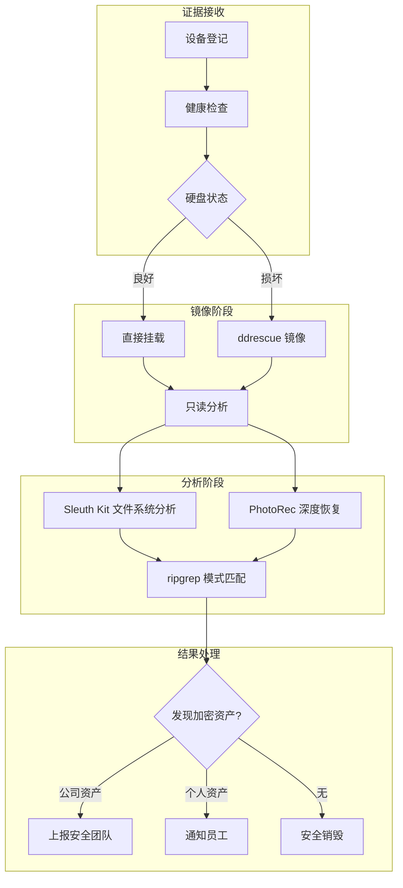

# 加密资产取证与数据恢复

作为加密货币公司，对员工设备进行数据恢复以检索遗失的助记词 (Seed Phrase)、钱包文件 (`wallet.dat`) 及其他加密资产相关数据是 IT 运维的关键能力。本文档定义了取证工作站的标准化工具栈与操作规范。

## 适用场景

| 场景 | 描述 | 优先级 |
| :--- | :--- | :--- |
| **员工离职设备回收** | 回收设备前检查是否有遗留的公司加密资产 | 高 |
| **硬盘故障抢救** | 员工报告硬盘损坏，需要恢复关键钱包文件 | 紧急 |
| **误删数据恢复** | 员工意外删除钱包备份或助记词文件 | 高 |
| **安全审计/取证** | 调查安全事件，追溯加密资产操作痕迹 | 按需 |
| **老旧存储介质归档** | 对退役设备进行深度扫描后安全销毁 | 中 |

## 文档导航

| 章节 | 内容 |
| :--- | :--- |
| [取证工具栈](./toolkit) | 详细的工具安装、配置与使用说明 |
| [目标文件与特征](./target-patterns) | 钱包文件位置、助记词搜索模式、私钥特征 |
| [取证操作流程](./forensics-sop) | 从接受到销毁的完整 SOP |
| [安全与合规](./security-compliance) | 写保护、证据链、数据销毁规范 |

## 快速开始

```bash
# 1. 搭建取证工作站 (Ubuntu 22.04 LTS 或 Tsurugi Linux)

# 2. 安装工具包
sudo apt update && sudo apt install -y \
  gddrescue smartmontools hdparm ntfs-3g \
  sleuthkit autopsy testdisk \
  ripgrep p7zip-full unzip libimage-exiftool-perl

# 3. 准备证据目录
sudo mkdir -p /forensics/case-$(date +%Y%m%d)

# 4. 开始操作 (详见后续章节)
```

## 架构概览



## 关键原则

1. **永不写入原始证据** - 只读挂载或先创建镜像
2. **完整证据链** - 所有操作记录日志，计算校验和
3. **双人操作** - 高价值资产场景需两人在场
4. **气隙隔离** - 取证工作站禁止联网
5. **合规处理** - 区分公司资产与个人资产，严格遵循数据保留策略
