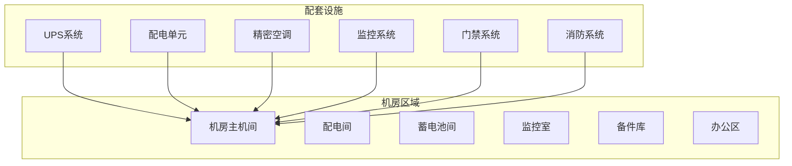
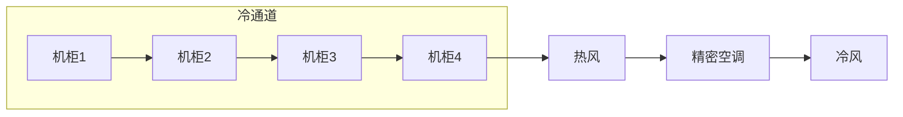
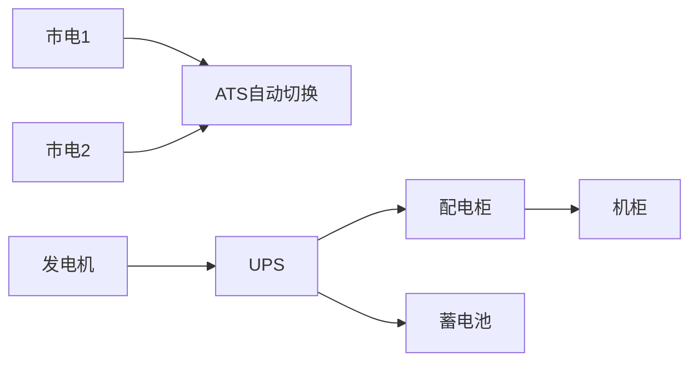
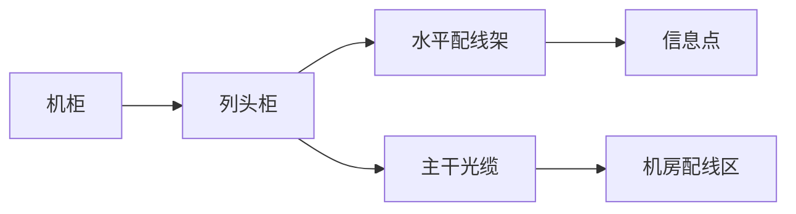

# 机房基础设施设计

## 设计原则

- **可靠性优先**：N加1或2N冗余设计
- **绿色节能**：PUE小于1.5
- **可维护性**：模块化设计，便于运维
- **可扩展性**：预留扩展空间
- **安全性**：物理安全与消防安全

## 机房布局规划

### 机房功能分区



### 机房面积规划

| 功能区 | 面积(m²) | 用途 |
|--------|----------|------|
| 主机间 | 80-100 | 服务器机柜 |
| 配电间 | 15-20 | 配电柜、UPS |
| 蓄电池间 | 20-30 | 电池组 |
| 监控室 | 15-20 | 监控、值班 |
| 备件库 | 10-15 | 备品备件 |
| 办公区 | 20-30 | 日常办公 |

## 机柜规划

### 机柜选型

| 参数 | 推荐规格 |
|------|----------|
| 高度 | 42U (2.2m) |
| 宽度 | 800mm |
| 深度 | 1000-1200mm |
| 承重 | ≥1500kg |
| 门板 | 前后网孔门 |
| PDU | 机柜PDU (18位，带监控) |
| 理线 | 侧理线架 |

### 机柜布局



### 机柜PDU配置

| 类型 | 规格 | 用途 |
|------|------|------|
| 输入PDU | 32A单相 | 主输入 |
| 输出PDU | C13×18, C19×6 | 设备供电 |
| PDU功能 | 电流监控、远程管理 | 电源管理 |

## 供电系统

### 供电架构



### UPS选型

| 参数 | 推荐配置 |
|------|----------|
| 类型 | 在线双变换UPS |
| 容量 | 100KVA (N加1配置) |
| 效率 | ≥95% |
| 输入 | 380V三相 |
| 输出 | 380V三相 |
| 旁路 | 静态旁路 |
| 电池 | 铅酸电池/锂电池 |

### 电池配置

| 配置项 | 规格 |
|--------|------|
| 后备时间 | 30分钟 (满载) |
| 电池类型 | 铅酸胶体 / 锂电池 |
| 电池寿命 | 8-10年 |
| 监控 | BMS电池管理系统 |

### 配电系统

```bash
# 配电规划
- 机房市电: 100KVA (两路)
- UPS输出: 100KVA
- 照明配电: 20KVA
- 空调配电: 60KVA
- 维修插座: 10KVA
- 备用回路: 20KVA
```

## 空调系统

### 精密空调选型

| 参数 | 推荐配置 |
|------|----------|
| 类型 | 水冷/风冷精密空调 |
| 制冷量 | 60KW (N加1配置) |
| 送风方式 | 下送风/上回风 |
| 温湿度 | 22±2°C, 45-65%RH |
| EER | ≥4.0 |

### 制冷量计算

```bash
IT设备发热量 = 设备总功率 × 0.8
制冷量需求 = IT设备发热量 × 1.2

例如: 100KW设备
IT设备发热量 = 100 × 0.8 = 80KW
制冷量需求 = 80 × 1.2 = 96KW
配置: 3×40KW (N加1)
```

### 空调监控系统

- 温度监测：机柜进/出口温度
- 湿度监测：机房环境湿度
- 漏水检测：空调及水管周边
- 能耗监测：空调运行能耗

## 消防系统

### 气体灭火系统

| 参数 | 推荐配置 |
|------|----------|
| 系统类型 | IG541 / FM200 |
| 药剂储瓶 | 按保护区容积计算 |
| 启动方式 | 自动/手动/应急机械 |
| 喷射时间 | ≤10秒 |

### 极早期烟雾探测

- **类型**：吸气式烟雾探测
- **灵敏度**：0.005%-0.02% obs/m
- **部署**：机柜顶部、吊顶下
- **联动**：与消防系统联动

### 消防管理

- [ ] 消防设施定期检测
- [ ] 消防通道畅通
- [ ] 消防设备巡检
- [ ] 消防演练（每半年）
- [ ] 消防档案管理

## 监控系统

### 环境监控

| 监控项 | 阈值 | 告警方式 |
|--------|------|----------|
| 温度 | 大于28°C 或 小于18°C | 短信/电话 |
| 湿度 | 大于70% 或 小于30% | 短信/电话 |
| 漏水 | 检测到水浸 | 立即告警 |
| 市电中断 | 立即检测 | 短信/电话 |
| UPS电池 | 电池低电量 | 短信/电话 |

### 视频监控

| 参数 | 配置 |
|------|------|
| 摄像机类型 | 网络高清半球 |
| 分辨率 | 4MP |
| 存储 | 90天 |
| 覆盖区域 | 入口、走廊、机柜区 |

### 门禁系统

- **认证方式**：刷卡和人脸
- **门禁区域**：机房入口、各功能区
- **记录保存**：180天
- **联动**：与视频监控联动

## 综合布线

### 布线系统架构



### 布线规范

| 类型 | 标准 |
|------|------|
| 网络布线 | Cat6A / 光纤 |
| 电源布线 | ZR-YJV / WDZA |
| 机柜PDU | 工业连接器 |
| 标签规范 | TIA-606标准 |

### 线缆管理

- 前后理线架
- 线缆管理槽
- 扎带固定
- 标签标识
- 余长管理

## PUE优化建议

| 措施 | 节能效果 |
|------|----------|
| 冷热通道封闭 | 15-20% |
| 变频空调 | 10-15% |
| UPS高效模式 | 3-5% |
| LED照明 | 50% |
| 气流优化 | 5-10% |
| 变频水泵 | 5-8% |

## 验收标准

### 电气系统

- [ ] 市电引入验收合格
- [ ] UPS测试通过（后备时间、切换时间）
- [ ] PDU安装规范、测试合格
- [ ] 接地电阻≤1Ω
- [ ] 等电位连接完成

### 空调系统

- [ ] 制冷量满足设计要求
- [ ] 温湿度在规定范围内
- [ ] 漏水检测正常
- [ ] 空调冗余切换正常
- [ ] 能耗数据采集正常

### 消防系统

- [ ] 气体灭火系统测试合格
- [ ] 极早期烟雾探测正常
- [ ] 消防联动测试合格
- [ ] 消防设施完备

### 监控系统

- [ ] 环境监控正常
- [ ] 视频监控覆盖完整
- [ ] 门禁系统正常
- [ ] 告警通知正常
