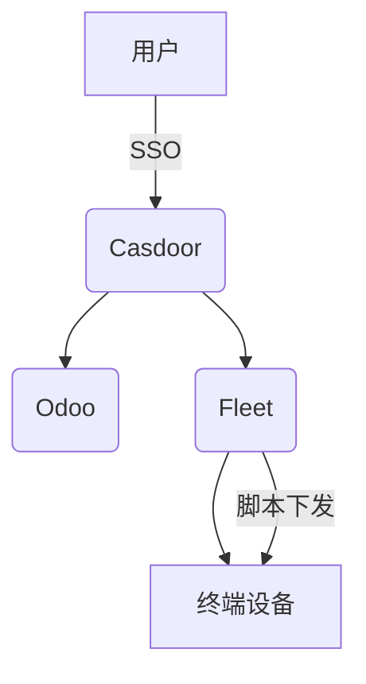

# IT 基础架构设计方案

## 架构概述

本方案采用现代化、模块化的IT基础架构，涵盖身份认证、设备管理、自动化运维与企业资源管理。

- **身份认证（IDP）**：采用 Casdoor 作为统一身份认证平台，支持多协议（OAuth2、OIDC、SAML等），实现单点登录与权限管理。
- **设备管理**：使用 Fleet 进行终端设备统一管理，支持资产盘点、合规检查、远程脚本执行（CSP/PowerShell/Shell）。
- **自动化运维**：通过 Fleet 平台批量下发和执行 CSP、PowerShell、Shell 脚本，实现自动化运维和合规。
- **企业资源管理（ERP）**：采用 Odoo 作为 ERP 系统，涵盖财务、人力、采购、库存等核心业务。

## 组件说明

### 1. Casdoor（身份认证）
- 统一用户身份认证与授权，支持多种登录方式（本地、LDAP、第三方OAuth等）。
- 提供单点登录（SSO）能力，简化用户体验。
- 与 Odoo、Fleet 等系统集成，实现统一账号体系。

### 2. Fleet（设备管理与自动化）
- 资产管理：自动发现与管理公司所有终端设备。
- 合规检查：定期检测设备安全与合规状态。
- 脚本执行：支持批量下发和执行 CSP、PowerShell、Shell 脚本，提升运维效率。
- 与 Casdoor 集成，实现基于身份的设备访问控制。

### 3. Odoo（ERP）
- 支持财务、人力、采购、库存、项目等模块。
- 可扩展性强，支持自定义开发与第三方集成。
- 与 Casdoor 集成，实现统一身份认证。

## 典型流程

1. 用户通过 Casdoor 登录，获得统一身份。
2. 登录后可访问 Odoo（ERP）进行业务操作，或访问 Fleet 进行设备管理。
3. 运维人员通过 Fleet 平台批量下发脚本，实现自动化运维。
4. 所有系统均通过 Casdoor 进行权限校验和审计。

## 架构图

## 安全与合规
- 所有系统均通过 HTTPS 加密通信。
- Casdoor 统一身份认证，权限最小化原则。
- Fleet 定期合规检查，自动修复安全隐患。
- Odoo 业务数据定期备份与权限分级管理。

## 部署建议
- 推荐使用容器化部署（如 Docker Compose/Kubernetes），便于扩展与维护。
- 各组件可独立扩展，支持高可用部署。
- 建议定期更新各组件，及时修复安全漏洞。

---

如需详细实施方案或集成代码示例，请联系IT部门。