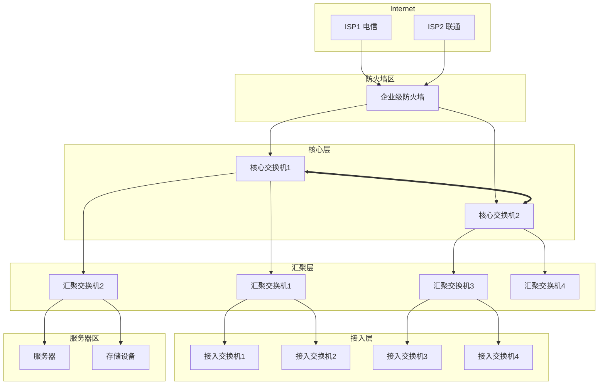

# 网络架构设计

## 设计原则

- **层次化**：采用三层网络架构（核心-汇聚-接入）
- **高可用**：关键链路冗余，消除单点故障
- **可扩展**：预留扩展空间，便于后期扩容
- **安全性**：分区隔离，访问控制
- **可管理**：统一管理，监控可视化

## 网络架构总览



## IP地址规划

### 地址段分配

| 网段 | 用途 | 掩码 | 网关 |
|------|------|------|------|
| 192.168.0.0/24 | 设备管理网 | 255.255.255.0 | 192.168.0.1 |
| 192.168.1.0/24 | 服务器区 | 255.255.255.0 | 192.168.1.1 |
| 192.168.10.0/22 | 办公用户区 | 255.255.252.0 | 192.168.10.1 |
| 192.168.20.0/22 | 研发用户区 | 255.255.252.0 | 192.168.20.1 |
| 192.168.30.0/22 | 访客无线区 | 255.255.252.0 | 192.168.30.1 |
| 192.168.100.0/24 | DMZ区域 | 255.255.255.0 | 192.168.100.1 |
| 10.0.0.0/16 | 业务系统 | 255.255.0.0 | 10.0.0.1 |

### VLAN划分

| VLAN ID | 名称 | 网段 | 用途 |
|---------|------|------|------|
| 1 | 默认VLAN | - | 禁止使用 |
| 10 | MGMT | 192.168.0.0/24 | 设备管理 |
| 20 | SERVERS | 192.168.1.0/24 | 服务器 |
| 30 | OFFICE | 192.168.10.0/22 | 办公用户 |
| 40 | R&D | 192.168.20.0/22 | 研发用户 |
| 50 | GUEST | 192.168.30.0/22 | 访客无线 |
| 100 | DMZ | 192.168.100.0/24 | 对外服务 |
| 200 | VOICE | 192.168.200.0/24 | IP电话 |
| 999 | ISOLATE | - | 隔离VLAN |

## 路由设计

### 静态路由配置

```bash
# 默认路由
ip route-static 0.0.0.0 0.0.0.0 192.168.100.254

# 办公网段路由
ip route-static 192.168.10.0 255.255.252.0 192.168.0.254
ip route-static 192.168.20.0 255.255.252.0 192.168.0.254

# 服务器区路由
ip route-static 192.168.1.0 255.255.255.0 192.168.0.254
```

### OSPF动态路由配置

```bash
ospf 1 router-id 192.168.0.1
 area 0.0.0.0
  network 192.168.0.0 0.0.255.255
 default-route-advertise
```

## 冗余设计

### MSTP配置

```bash
stp region-configuration
 region-name StarsLabs
 revision-level 1
 instance 1 vlan 10 20 100 200
 instance 2 vlan 30 40 50
 active region-configuration
#
stp instance 1 priority 4096
stp instance 2 priority 8192
```

### VRRP配置

```bash
interface Vlanif10
 ip address 192.168.0.1 255.255.255.0
 vrrp vrid 10 virtual-ip 192.168.0.254
 vrrp vrid 10 priority 120
 vrrp vrid 10 preempt-mode timer delay 30
 vrrp vrid 10 track interface GigabitEthernet0/0/1 reduced 30
```

## 访问控制策略

### 基础ACL配置

```bash
# 禁止访客访问服务器区
acl number 3001
 rule 10 deny ip source 192.168.30.0 0.0.3.255 destination 192.168.1.0 0.0.0.255
 rule 20 permit ip source any
 
# 禁止用户访问管理网
acl number 3002
 rule 10 deny ip source 192.168.10.0 0.0.3.255 destination 192.168.0.0 0.0.0.255
 rule 20 permit ip any
```

## 无线网络设计

### 无线覆盖规划

| 区域 | AP数量 | SSID | 认证方式 |
|------|--------|------|----------|
| 办公区 | 按需 | StarsLabs-Office | 802.1X |
| 会议室 | 2-4/间 | StarsLabs-Office | 802.1X |
| 公共区域 | 1-2/区域 | StarsLabs-Guest | Portal认证 |
| 仓库区 | 1-2/仓库 | StarsLabs-Device | WPA2-PSK |

### 无线控制器配置要点

- 配置AP组，统一管理
- 启用负载均衡
- 配置无线入侵检测
- 启用频谱分析
- 配置无线用户隔离（访客网络）

## 网络监控与运维

### 监控指标

- 端口流量（入/出）
- 端口错误包统计
- CPU/内存利用率
- 设备温度
- 电源状态
- 链路状态

### 告警配置

- 端口down：立即告警
- 流量超过80%阈值：预警
- 链路错误率>0.1%：告警
- 设备温度>50℃：预警
