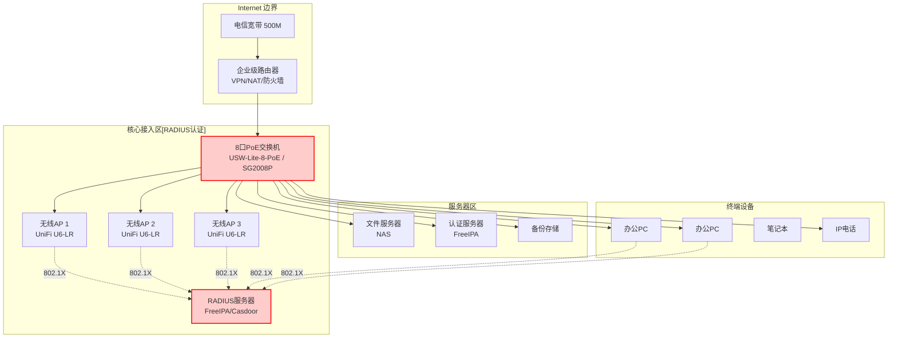
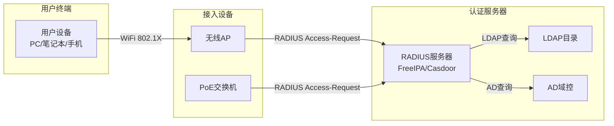
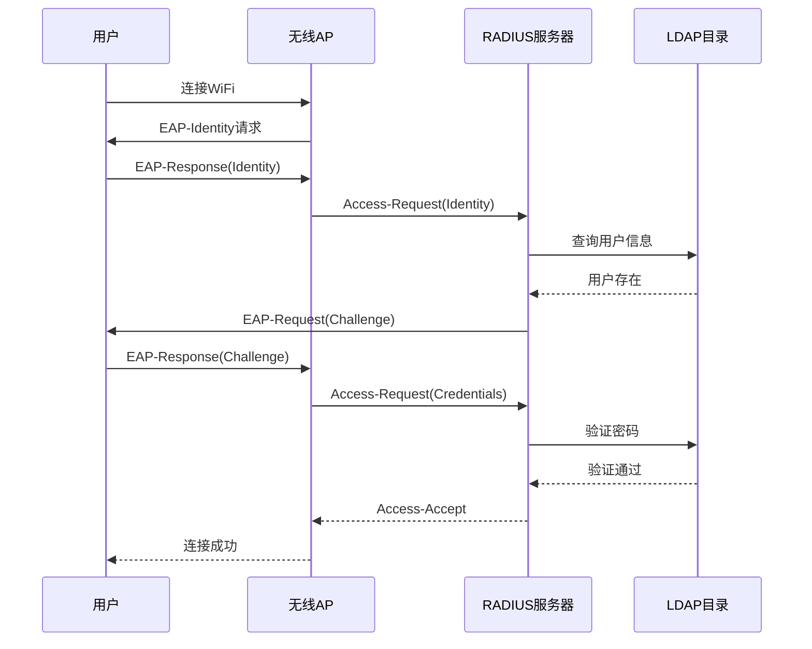

# 网络架构设计

## 设计原则

- **简洁实用**：50人规模，无需复杂三层架构
- **统一认证**：RADIUS集中认证，802.1X接入控制
- **无线优先**：以WiFi为主，有线为辅
- **安全可控**：访客隔离，访客网络与办公网络分离
- **易于管理**：统一管理平台，可视化运维

## 网络架构总览（50人规模）



## 设备选型（50人规模）

### 核心设备清单

| 设备 | 型号 | 数量 | 单价 | 小计 | 用途 |
|------|------|------|------|------|------|
| 企业级路由器 | UniFi Dream Machine / ER-X | 1 | ¥2000 | ¥2000 | VPN/NAT/防火墙 |
| PoE交换机 | USW-Lite-8-PoE / SG2008P | 1 | ¥1000 | ¥1000 | 8口PoE供电 |
| 无线AP | UniFi U6-LR | 3 | ¥1500 | ¥4500 | WiFi 6覆盖 |
| RADIUS服务器 | 虚拟机 | 1 | - | - | 统一认证 |
| NAS存储 | 群晖DS220+ | 1 | ¥3000 | ¥3000 | 文件共享 |

### 预算参考

| 类别 | 预算范围 |
|------|----------|
| 网络设备 | ¥10,000-15,000 |
| 无线覆盖 | ¥4,000-6,000 |
| 服务器/NAS | ¥3,000-5,000 |
| **总计** | **¥17,000-26,000** |

## RADIUS认证设计

### 认证架构



### FreeIPA RADIUS配置

```bash
# 安装FreeIPA
ipa-server-install --hostname=auth.example.com \
  --realm=EXAMPLE.COM \
  --domain=example.com \
  --ds-password=xxxxxx \
  --admin-password=xxxxxx

# 安装RADIUS组件
ipa-server-install --enable-dns
yum install -y freeipa-server-trust-ad

# 配置RADIUS客户端
ipa-client-install --enable-dns
```

### 交换机RADIUS配置（以TP-Link SG2008P为例）

```bash
# 配置RADIUS服务器
radius-server ip 192.168.1.100 port 1812 key your_shared_secret

# 启用802.1X认证
dot1x authentication-method eap

# 配置认证域
authentication dot1x domain example.com

# 端口认证配置
interface GigabitEthernet 1/0/1
  dot1x port-control auto
  dot1x re-authenticate
```

### 无线AP RADIUS配置（以UniFi为例）

```bash
# UniFi Controller中配置
# Settings -> WiFi -> Edit Wireless Network

# 无线网络设置
Name: StarsLabs-Office
Security: WPA Enterprise (802.1X)

# RADIUS服务器
RADIUS Server: 192.168.1.100
RADIUS Port: 1812
Shared Secret: your_shared_secret

# 认证服务器选择
Authentication Method: EAP-TTLS
Inner Auth: PAP
```

### 用户认证流程



## IP地址规划

### 地址段分配（50人规模）

| 网段 | 用途 | 容量 | 网关 |
|------|------|------|------|
| 192.168.1.0/24 | 办公网络 | 200+ | 192.168.1.1 |
| 192.168.2.0/24 | 服务器区 | 50 | 192.168.2.1 |
| 192.168.3.0/24 | 访客网络 | 50 | 192.168.3.1 |

### VLAN划分

| VLAN ID | 名称 | 网段 | 用途 |
|---------|------|------|------|
| 10 | OFFICE | 192.168.1.0/24 | 办公设备 |
| 20 | SERVERS | 192.168.2.0/24 | 服务器 |
| 30 | GUEST | 192.168.3.0/24 | 访客WiFi |

## 无线网络设计

### WiFi覆盖规划

| 区域 | AP数量 | SSID | 认证方式 | 备注 |
|------|--------|------|----------|------|
| 开放办公区 | 2 | StarsLabs-Office | 802.1X/RADIUS | 员工使用 |
| 会议室 | 1 | StarsLabs-Office | 802.1X/RADIUS | 员工使用 |
| 公共区域 | 1 | StarsLabs-Guest | Portal认证 | 访客隔离 |

### WiFi配置要点

```bash
# UniFi AP配置
# 2.4GHz用于IoT设备
# 5GHz用于办公设备
# 6GHz (WiFi 6E) 用于高性能需求

Radio Settings:
- 2.4GHz: Channel 1/6/11 (自动)
- 5GHz: Channel 36/40/44/48/149/153 (自动)
- 6GHz: Channel 1-93 (自动)

功率设置:
- 2.4GHz: 17 dBm
- 5GHz: 22 dBm
- 6GHz: 24 dBm
```

## 访客网络隔离

### 访客网络配置

```bash
# 创建访客VLAN
vlan 30
name GUEST

# 访客网络隔离
interface Vlanif30
 ip address 192.168.3.1 255.255.255.0
 ip address 192.168.3.254 255.255.255.0 secondary
 traffic-filter inbound ACL-GUEST-ISOLATE

# ACL配置
acl number 3001
 rule 10 deny ip source 192.168.3.0 0.0.0.255 destination 192.168.1.0 0.0.0.255
 rule 20 deny ip source 192.168.3.0 0.0.0.255 destination 192.168.2.0 0.0.0.255
 rule 30 permit ip source any
```

## 网络监控

### 监控指标

| 指标 | 阈值 | 告警方式 |
|------|------|----------|
| AP在线率 | 低于100% | 邮件 |
| 客户端连接数 | 超过30/AP | 通知 |
| 带宽利用率 | 超过80% | 通知 |
| 认证失败率 | 超过5% | 告警 |

### 推荐监控平台

| 方案 | 特点 | 成本 |
|------|------|------|
| UniFi Network | UniFi设备原生支持 | 免费 |
| Zabbix | 开源强大 | 免费 |
| PRTG | 简单易用 | 付费 |
