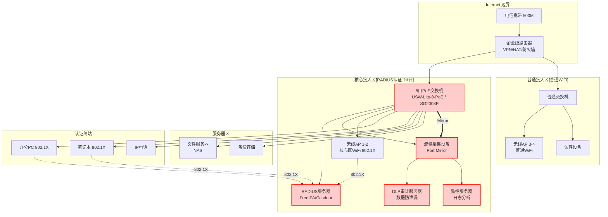
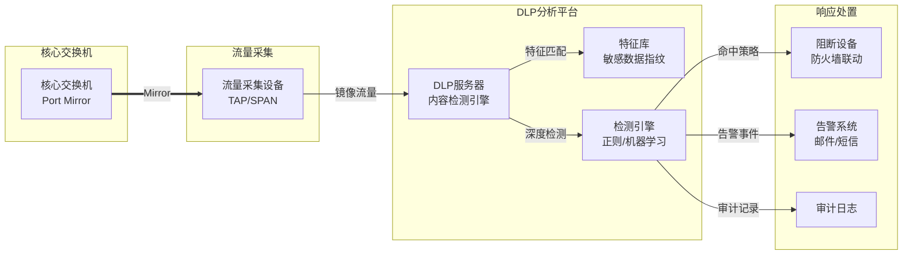
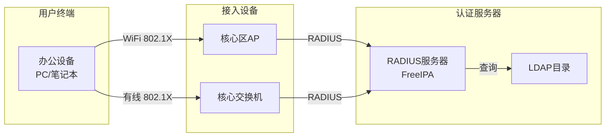

# 网络架构设计

## 设计原则

- **分区管理**：核心区（认证+审计）与普通区（普通WiFi）分离
- **RADIUS认证**：核心区802.1X统一认证
- **安全审计**：核心区Port Mirror + DLP流量审计
- **简洁实用**：50人规模，适度简化
- **访客隔离**：访客网络与办公网络完全隔离

## 网络架构总览（50人规模）



## 区域划分说明

### 核心接入区（审计区域）

| 设备 | 用途 | 认证方式 | 审计 |
|------|------|----------|------|
| PC/笔记本 | 员工办公设备 | 802.1X/RADIUS | Port Mirror → DLP |
| IP电话 | 语音通信 | 802.1X/RADIUS | 记录 |
| 核心区AP | 管理区域WiFi | 802.1X/RADIUS | Port Mirror → DLP |
| 文件服务器 | 敏感数据存储 | IP白名单 | 全流量审计 |

### 普通接入区（普通区域）

| 设备 | 用途 | 认证方式 | 审计 |
|------|------|----------|------|
| 访客AP | 来访人员 | Portal认证 | 仅日志 |
| 普通PC | 临时设备 | MAC认证 | 仅记录 |

## Port Mirror 流量审计设计

### 核心区流量镜像配置

```bash
# 核心交换机配置（以TP-Link SG2008P为例）

# 镜像所有核心区流量到TAP设备
observe-port 1 interface GigabitEthernet0/0/8

# 镜像办公PC上行流量
port-mirroring to observe-port 1 inbound GigabitEthernet0/0/1
port-mirroring to observe-port 1 outbound GigabitEthernet0/0/1

# 镜像服务器区流量
port-mirroring to observe-port 1 inbound GigabitEthernet0/0/6
port-mirroring to observe-port 1 outbound GigabitEthernet0/0/6

# 镜像核心WiFi流量
port-mirroring to observe-port 1 inbound GigabitEthernet0/0/3
port-mirroring to observe-port 1 outbound GigabitEthernet0/0/3
```

### 镜像策略表

| 镜像源端口 | 用途 | 审计内容 | 保留期限 |
|------------|------|----------|----------|
| GE0/0/1 | 办公PC 1 | 文件传输、网页 | 90天 |
| GE0/0/2 | 办公PC 2 | 文件传输、网页 | 90天 |
| GE0/0/3 | 核心AP | 无线流量 | 90天 |
| GE0/0/6 | 文件服务器 | SMB/NFS访问 | 180天 |
| GE0/0/7 | 认证服务器 | RADIUS认证日志 | 180天 |

## DLP数据防泄漏设计

### DLP部署架构



### DLP检测规则

| 规则类型 | 检测内容 | 动作 |
|----------|----------|------|
| **敏感信息** | 身份证号、银行卡号、手机号 | 阻断+告警 |
| **代码泄露** | Git地址、API Key、Token | 阻断+告警 |
| **设计图纸** | CAD文件、DWG格式 | 阻断+审计 |
| **商业机密** | 合同、财务数据 | 阻断+告警+日志 |
| **病毒文件** | 可执行文件、恶意脚本 | 阻断 |

### DLP服务器配置

```bash
# DLP服务器网络配置
IP: 192.168.1.200/24
Gateway: 192.168.1.1
Management: 192.168.1.200:8443

# 监控网卡（只读）
Interface: eth1 (连接TAP设备)
Mode: Passive (不转发流量)

# 联动配置
Firewall: 192.168.1.1
API Key: dlp_api_key_xxxxx
Block Mode: 自动阻断
```

## RADIUS认证设计

### 认证架构



### FreeIPA RADIUS配置

```bash
# 安装FreeIPA
ipa-server-install --hostname=auth.example.com \
  --realm=EXAMPLE.COM \
  --domain=example.com

# 配置RADIUS客户端
ipa-client-install --enable-dns

# 配置RADIUS策略
ipa radiusproxy-add freeipa-proxy --server=auth.example.com --secret=your_secret

# 添加认证策略
ipa hostgroup-add --desc="核心区设备" core-devices
ipa hostgroup-add-member core-devices --hosts=ap1.example.com
ipa netgroup-add core-network --desc="核心网络"
```

### 交换机RADIUS配置

```bash
# TP-Link SG2008P
radius-server ip 192.168.1.100 port 1812 key your_shared_secret
dot1x authentication-method eap
authentication dot1x domain example.com

# 核心区端口启用802.1X
interface GigabitEthernet 1/0/1
  dot1x port-control auto
  dot1x re-authenticate
  port-security max 1
```

## 设备选型（50人规模）

### 核心设备清单

| 设备 | 型号 | 数量 | 单价 | 小计 | 用途 |
|------|------|------|------|------|------|
| 企业级路由器 | UniFi Dream Machine | 1 | ¥2000 | ¥2000 | VPN/NAT/防火墙 |
| 核心PoE交换机 | USW-Lite-8-PoE / SG2008P | 1 | ¥1000 | ¥1000 | 核心区PoE供电 |
| 普通交换机 | TL-SG1005D | 1 | ¥300 | ¥300 | 普通区接入 |
| 核心区AP | UniFi U6-LR | 2 | ¥1500 | ¥3000 | 核心区802.1X WiFi |
| 普通区AP | UniFi U6-Lite | 2 | ¥800 | ¥1600 | 普通WiFi |
| RADIUS服务器 | 虚拟机 | 1 | - | - | 统一认证 |
| DLP服务器 | 虚拟机 | 1 | - | - | 流量审计 |
| NAS存储 | 群晖DS220+ | 1 | ¥3000 | ¥3000 | 文件共享 |

### 预算参考

| 类别 | 预算范围 |
|------|----------|
| 网络设备（核心+普通） | ¥8,000-12,000 |
| 无线覆盖（4 AP） | ¥5,000-7,000 |
| 服务器（虚拟机） | ¥0（已有） |
| NAS存储 | ¥3,000-5,000 |
| **总计** | **¥16,000-24,000** |

## IP地址规划

| 网段 | 用途 | 容量 | 网关 |
|------|------|------|------|
| 192.168.1.0/24 | 核心区（认证+审计） | 200+ | 192.168.1.1 |
| 192.168.2.0/24 | 服务器区 | 50 | 192.168.2.1 |
| 192.168.3.0/24 | 普通区（访客） | 50 | 192.168.3.1 |

## 无线网络设计

### WiFi覆盖规划

| 区域 | AP数量 | SSID | 认证方式 | 审计 |
|------|--------|------|----------|------|
| 核心办公区 | 2 | StarsLabs-Secure | 802.1X/RADIUS | Port Mirror → DLP |
| 会议室 | 1 | StarsLabs-Secure | 802.1X/RADIUS | Port Mirror → DLP |
| 公共区域 | 2 | StarsLabs-Guest | Portal认证 | 仅日志 |

### WiFi配置要点

```bash
# 核心区AP配置
SSID: StarsLabs-Secure
Security: WPA Enterprise (802.1X)
RADIUS: 192.168.1.100:1812
VLAN: 10

# 普通区AP配置
SSID: StarsLabs-Guest
Security: WPA2-PSK
Isolation: 启用
VLAN: 30
Captive Portal: 启用
```

## 网络监控

### 监控指标

| 指标 | 阈值 | 告警方式 |
|------|------|----------|
| 核心区AP在线 | 低于100% | 邮件 |
| DLP告警 | 任何命中 | 即时通知 |
| 认证失败率 | 超过5% | 告警 |
| 访客网络使用 | 异常流量 | 通知 |
