# 冷机房 NixOS 部署方案

## 设计原则

- **声明式基础设施**：所有配置以 Nix 代码描述，Git 版本控制，消除配置漂移
- **双人审批制**：任何变更必须经过双人审批（Four-Eyes Principle），从代码到物理访问
- **原生容器化**：使用 NixOS 原生 systemd-nspawn 容器，非 Docker，声明式管理
- **可复现部署**：Nix Flakes 锁定所有依赖，任意节点可从零重建至完全一致状态
- **最小攻击面**：硬化内核、最小包集合、LUKS 加密、Secure Boot、AppArmor
- **完整审计链**：所有变更通过 Git 签名提交，部署日志集中收集，物理访问双人登记

## 架构总览

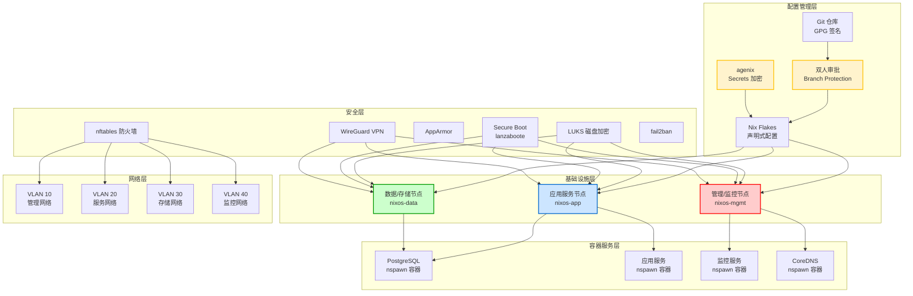

## 服务器角色规划

| 主机名 | 角色 | 硬件配置 | 运行服务 | VLAN |
|--------|------|----------|----------|------|
| nixos-mgmt | 管理/监控节点 | 16C/64GB/500GB NVMe | Prometheus、Grafana、Loki、Alertmanager、CoreDNS、跳板机 | MGMT(10), MON(40) |
| nixos-app | 应用服务节点 | 32C/128GB/1TB NVMe | 应用服务、反向代理、CI/CD Runner | SVC(20), MGMT(10) |
| nixos-data | 数据/存储节点 | 16C/128GB/2TB NVMe + 8TB HDD RAID | PostgreSQL、Restic 备份、对象存储 | STOR(30), SVC(20) |

## 服务器初始化部署

本章节覆盖从裸机到可运行 NixOS 系统的完整初始化过程。所有服务器统一采用 **GPT + ESP + LUKS2 + Btrfs** 方案，实现全盘加密与灵活快照回滚。

### 磁盘布局设计

每台服务器的 NVMe 系统盘采用以下分区方案：

| 分区 | 大小 | 类型 | 文件系统 | 用途 |
|------|------|------|----------|------|
| `/dev/nvme0n1p1` | 1 GB | EFI System Partition | FAT32 | Secure Boot + lanzaboote 引导 |
| `/dev/nvme0n1p2` | 剩余全部 | Linux filesystem | LUKS2 → Btrfs | 加密根卷（所有数据） |

nixos-data 节点额外挂载 HDD RAID 阵列用于数据存储：

| 分区 | 大小 | 类型 | 文件系统 | 用途 |
|------|------|------|----------|------|
| `/dev/md0` | 8 TB (RAID-1) | Linux RAID | LUKS2 → Btrfs | PostgreSQL 数据 + 备份 |

### Btrfs 子卷布局

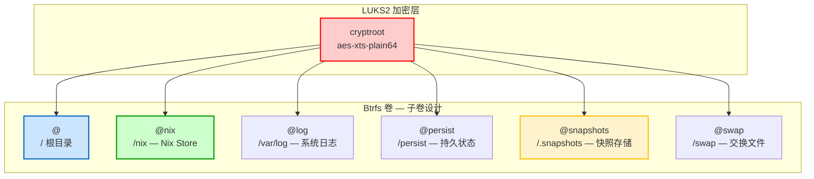

**子卷设计说明**：

| 子卷 | 挂载点 | 挂载选项 | CoW | 说明 |
|------|--------|----------|-----|------|
| `@` | `/` | `compress=zstd:3,noatime,ssd` | 是 | 根目录，每次部署前快照 |
| `@nix` | `/nix` | `compress=zstd:3,noatime,ssd` | 是 | Nix Store，压缩收益大 |
| `@log` | `/var/log` | `compress=zstd:1,noatime,ssd` | 是 | 日志独立，防止撑满根卷 |
| `@persist` | `/persist` | `compress=zstd:3,noatime,ssd` | 是 | 持久状态（SSH keys、agenix 等） |
| `@snapshots` | `/.snapshots` | `noatime,ssd` | 是 | 存放所有快照 |
| `@swap` | `/swap` | `noatime,ssd` | **否** | 交换文件必须禁用 CoW |

### 初始化完整流程（动画演示）

以下序列图展示从裸机上电到系统就绪的完整过程，双人协作执行：

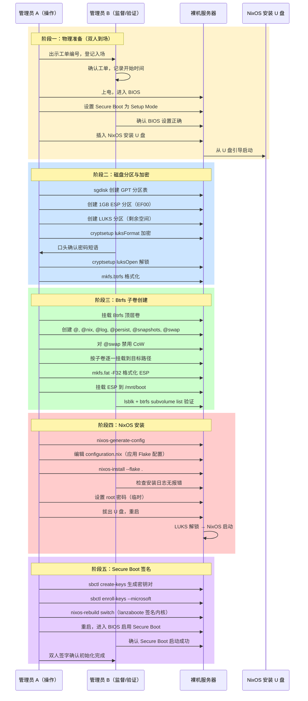

### 分区与加密操作详解

```bash
# ============================================================
# 步骤 1：磁盘分区（GPT）
# ============================================================

# 清除旧分区表
sgdisk --zap-all /dev/nvme0n1

# 创建 ESP 分区（1GB）
sgdisk -n 1:0:+1G -t 1:EF00 -c 1:"EFI System" /dev/nvme0n1

# 创建 LUKS 分区（剩余全部）
sgdisk -n 2:0:0 -t 2:8300 -c 2:"NixOS LUKS" /dev/nvme0n1

# 验证分区表
sgdisk -p /dev/nvme0n1

# ============================================================
# 步骤 2：LUKS2 加密
# ============================================================

# 使用 LUKS2 + argon2id KDF（抗 GPU 暴力破解）
cryptsetup luksFormat --type luks2 \
  --cipher aes-xts-plain64 \
  --key-size 512 \
  --hash sha512 \
  --pbkdf argon2id \
  --pbkdf-memory 1048576 \
  --pbkdf-parallel 4 \
  --label CRYPTROOT \
  /dev/nvme0n1p2

# 解锁加密卷
cryptsetup luksOpen /dev/nvme0n1p2 cryptroot

# ============================================================
# 步骤 3：Btrfs 格式化与子卷创建
# ============================================================

# 格式化为 Btrfs
mkfs.btrfs -L nixos /dev/mapper/cryptroot

# 挂载顶层卷
mount /dev/mapper/cryptroot /mnt

# 创建子卷
btrfs subvolume create /mnt/@
btrfs subvolume create /mnt/@nix
btrfs subvolume create /mnt/@log
btrfs subvolume create /mnt/@persist
btrfs subvolume create /mnt/@snapshots
btrfs subvolume create /mnt/@swap

# 对 swap 子卷禁用 CoW（交换文件必须）
chattr +C /mnt/@swap

# 卸载顶层卷
umount /mnt

# ============================================================
# 步骤 4：按子卷挂载
# ============================================================

# 通用挂载选项
OPTS="compress=zstd:3,noatime,ssd,discard=async"

mount -o subvol=@,$OPTS /dev/mapper/cryptroot /mnt
mkdir -p /mnt/{nix,var/log,persist,.snapshots,swap,boot}

mount -o subvol=@nix,$OPTS     /dev/mapper/cryptroot /mnt/nix
mount -o subvol=@log,$OPTS     /dev/mapper/cryptroot /mnt/var/log
mount -o subvol=@persist,$OPTS /dev/mapper/cryptroot /mnt/persist
mount -o subvol=@snapshots,noatime,ssd /dev/mapper/cryptroot /mnt/.snapshots
mount -o subvol=@swap,noatime,ssd      /dev/mapper/cryptroot /mnt/swap

# 格式化并挂载 ESP
mkfs.fat -F 32 -n BOOT /dev/nvme0n1p1
mount /dev/nvme0n1p1 /mnt/boot

# ============================================================
# 步骤 5：创建交换文件（Btrfs 5.0+ 原生支持）
# ============================================================

btrfs filesystem mkswapfile --size 16G /mnt/swap/swapfile
swapon /mnt/swap/swapfile
```

### NixOS 安装

```bash
# 生成硬件配置（自动检测磁盘、文件系统）
nixos-generate-config --root /mnt

# 将预备好的 Flake 配置复制到目标
git clone https://github.com/stars-labs/nixos-infra.git /mnt/etc/nixos

# 安装（使用 Flake，指定主机名）
nixos-install --flake /mnt/etc/nixos#nixos-mgmt --no-root-passwd

# 安装完成后重启
reboot
```

### Btrfs 快照与回滚（动画演示）

每次 `nixos-rebuild switch` 之前自动创建 Btrfs 快照，实现秒级回滚：

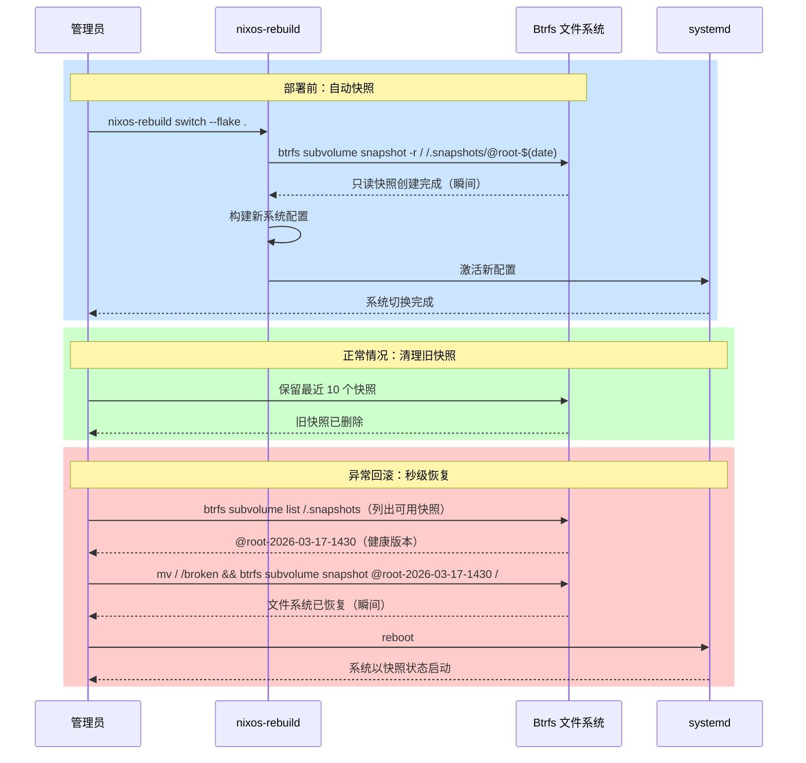

### 部署前自动快照脚本

在 NixOS 模块中集成自动快照，确保每次 rebuild 前都有可回滚点：

```nix
# modules/btrfs-snapshots.nix
{ config, pkgs, lib, ... }:

{
  # 部署前自动快照（作为 nixos-rebuild 的 pre-activation hook）
  system.activationScripts.btrfsSnapshot = lib.stringAfter [ "specialfs" ] ''
    if [ -d /.snapshots ]; then
      SNAP_NAME="@root-$(date +%Y%m%d-%H%M%S)-pre-switch"
      ${pkgs.btrfs-progs}/bin/btrfs subvolume snapshot -r / "/.snapshots/$SNAP_NAME" || true
      echo "Btrfs snapshot created: $SNAP_NAME"

      # 保留最近 10 个快照，清理旧快照
      ls -1d /.snapshots/@root-* 2>/dev/null | head -n -10 | while read snap; do
        ${pkgs.btrfs-progs}/bin/btrfs subvolume delete "$snap" || true
      done
    fi
  '';

  # 定期快照（每日一次，独立于部署）
  systemd.services.btrfs-daily-snapshot = {
    description = "Daily Btrfs root snapshot";
    serviceConfig = {
      Type = "oneshot";
      ExecStart = pkgs.writeShellScript "btrfs-snap" ''
        SNAP_NAME="@root-$(date +%Y%m%d)-daily"
        ${pkgs.btrfs-progs}/bin/btrfs subvolume snapshot -r / "/.snapshots/$SNAP_NAME"
      '';
    };
  };
  systemd.timers.btrfs-daily-snapshot = {
    wantedBy = [ "timers.target" ];
    timerConfig = {
      OnCalendar = "daily";
      Persistent = true;
    };
  };

  # 必要工具
  environment.systemPackages = [ pkgs.btrfs-progs ];
}
```

### Btrfs 维护策略

| 维护项 | 频率 | 命令 | 说明 |
|--------|------|------|------|
| 快照清理 | 每次部署 | 自动（保留最近 10 个） | activationScripts 中执行 |
| 文件系统 scrub | 每月 | `btrfs scrub start /` | 检测并修复数据校验和错误 |
| balance | 每月 | `btrfs balance start -dusage=50 /` | 重新平衡数据块分布 |
| 空间检查 | 每日 | `btrfs filesystem usage /` | Prometheus 监控告警 |
| 碎片整理 | 每季度 | `btrfs filesystem defragment -r /` | 仅对高碎片卷执行 |

```nix
# Btrfs 定期 scrub（NixOS 内置支持）
services.btrfs.autoScrub = {
  enable = true;
  interval = "monthly";
  fileSystems = [ "/" ];
};
```

### Secure Boot 初始化（动画演示）

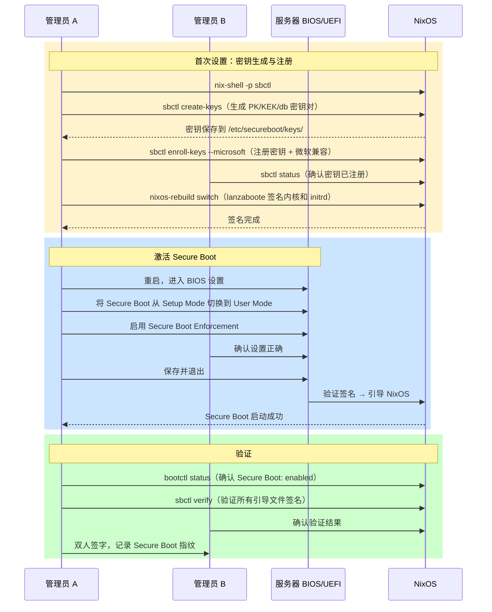

### nixos-data 数据盘初始化（RAID + LUKS + Btrfs）

nixos-data 节点的 HDD 数据盘使用 RAID-1 镜像确保数据冗余：

```bash
# ============================================================
# HDD RAID-1 + LUKS + Btrfs 初始化
# ============================================================

# 创建 RAID-1 镜像阵列（2 块 4TB HDD）
mdadm --create /dev/md0 --level=1 --raid-devices=2 \
  /dev/sda1 /dev/sdb1

# 等待初始同步（后台进行，可继续操作）
cat /proc/mdstat

# LUKS 加密 RAID 阵列
cryptsetup luksFormat --type luks2 \
  --cipher aes-xts-plain64 \
  --key-size 512 \
  --label CRYPTDATA \
  /dev/md0

cryptsetup luksOpen /dev/md0 cryptdata

# Btrfs 格式化 + 子卷
mkfs.btrfs -L data /dev/mapper/cryptdata
mount /dev/mapper/cryptdata /mnt/data

btrfs subvolume create /mnt/data/@pgdata       # PostgreSQL 数据
btrfs subvolume create /mnt/data/@backup        # 备份存储
btrfs subvolume create /mnt/data/@snapshots     # 数据快照

umount /mnt/data
```

对应的 NixOS 配置：

```nix
# hosts/nixos-data/configuration.nix 中的数据盘挂载
boot.initrd.luks.devices."cryptdata" = {
  device = "/dev/disk/by-label/CRYPTDATA";
  allowDiscards = false;   # HDD 不需要 TRIM
};

fileSystems."/data/postgresql" = {
  device = "/dev/mapper/cryptdata";
  fsType = "btrfs";
  options = [ "subvol=@pgdata" "compress=zstd:3" "noatime" ];
};
fileSystems."/data/backup" = {
  device = "/dev/mapper/cryptdata";
  fsType = "btrfs";
  options = [ "subvol=@backup" "compress=zstd:3" "noatime" ];
};
fileSystems."/data/snapshots" = {
  device = "/dev/mapper/cryptdata";
  fsType = "btrfs";
  options = [ "subvol=@snapshots" "noatime" ];
};
```

### LUKS 恢复密钥备份

初始化完成后，立即使用 Shamir 分割备份 LUKS 恢复密钥：

```bash
# 添加恢复密钥槽（使用随机生成的高强度密钥）
dd if=/dev/urandom bs=64 count=1 2>/dev/null | base64 -w 0 > /tmp/recovery.key
cryptsetup luksAddKey /dev/nvme0n1p2 /tmp/recovery.key

# 使用 Shamir 分割恢复密钥（2-of-3 方案）
cat /tmp/recovery.key | ssss-split -t 2 -n 3 -q
# Share 1 → 管理员 A（密封信封）
# Share 2 → 管理员 B（密封信封）
# Share 3 → 离线保险柜（双人钥匙）

# 安全销毁明文密钥
shred -u /tmp/recovery.key
```

### 初始化验收检查

完成初始化后，双人共同执行以下验证：

| 检查项 | 命令 | 预期结果 |
|--------|------|----------|
| LUKS 加密状态 | `cryptsetup luksDump /dev/nvme0n1p2` | LUKS2, aes-xts-plain64, argon2id |
| Btrfs 子卷列表 | `btrfs subvolume list /` | 6 个子卷全部存在 |
| Btrfs 压缩启用 | `btrfs property get / compression` | zstd |
| 挂载选项验证 | `findmnt -t btrfs` | compress=zstd:3,noatime,ssd |
| Secure Boot 状态 | `bootctl status` | Secure Boot: enabled |
| 签名验证 | `sbctl verify` | 所有引导文件签名有效 |
| 交换文件 | `swapon --show` | /swap/swapfile, 16GB |
| NixOS 系统启动 | `systemctl is-system-running` | running |

## NixOS 基础配置

### Flake 项目结构

```
nixos-infra/
├── flake.nix                 # 顶层 Flake 定义
├── flake.lock                # 依赖锁定文件
├── hosts/
│   ├── nixos-mgmt/
│   │   └── configuration.nix # 管理节点配置
│   ├── nixos-app/
│   │   └── configuration.nix # 应用节点配置
│   └── nixos-data/
│       └── configuration.nix # 数据节点配置
├── modules/
│   ├── base.nix              # 基础模块
│   ├── hardening.nix         # 安全加固（LUKS + Btrfs + Secure Boot）
│   ├── btrfs-snapshots.nix   # Btrfs 自动快照与回滚
│   ├── containers/           # 容器定义
│   │   ├── postgresql.nix
│   │   ├── monitoring.nix
│   │   └── coredns.nix
│   ├── networking.nix        # 网络与防火墙
│   └── monitoring.nix        # 监控配置
├── secrets/
│   ├── secrets.nix           # agenix 密钥声明
│   └── *.age                 # 加密后的 secrets
└── .github/
    └── workflows/
        └── deploy.yml        # CI/CD 流水线
```

### flake.nix 顶层配置

```nix
{
  description = "Stars Labs 冷机房 NixOS 基础设施";

  inputs = {
    nixpkgs.url = "github:NixOS/nixpkgs/nixos-24.11";
    agenix.url = "github:ryantm/agenix";
    lanzaboote.url = "github:nix-community/lanzaboote";
    microvm.url = "github:astro/microvm.nix";
  };

  outputs = { self, nixpkgs, agenix, lanzaboote, microvm, ... }: {
    nixosConfigurations = {
      nixos-mgmt = nixpkgs.lib.nixosSystem {
        system = "x86_64-linux";
        modules = [
          ./hosts/nixos-mgmt/configuration.nix
          ./modules/base.nix
          ./modules/hardening.nix
          ./modules/btrfs-snapshots.nix
          agenix.nixosModules.default
          lanzaboote.nixosModules.lanzaboote
        ];
      };

      nixos-app = nixpkgs.lib.nixosSystem {
        system = "x86_64-linux";
        modules = [
          ./hosts/nixos-app/configuration.nix
          ./modules/base.nix
          ./modules/hardening.nix
          ./modules/btrfs-snapshots.nix
          agenix.nixosModules.default
          lanzaboote.nixosModules.lanzaboote
        ];
      };

      nixos-data = nixpkgs.lib.nixosSystem {
        system = "x86_64-linux";
        modules = [
          ./hosts/nixos-data/configuration.nix
          ./modules/base.nix
          ./modules/hardening.nix
          ./modules/btrfs-snapshots.nix
          agenix.nixosModules.default
          lanzaboote.nixosModules.lanzaboote
        ];
      };
    };
  };
}
```

### modules/base.nix 基础模块

```nix
{ config, pkgs, ... }:

{
  # 硬化内核
  boot.kernelPackages = pkgs.linuxPackages_hardened;
  boot.kernel.sysctl = {
    "kernel.kptr_restrict" = 2;
    "kernel.dmesg_restrict" = 1;
    "net.ipv4.conf.all.rp_filter" = 1;
    "net.ipv4.conf.default.rp_filter" = 1;
    "net.ipv4.icmp_echo_ignore_broadcasts" = 1;
    "net.ipv4.conf.all.accept_redirects" = 0;
    "net.ipv4.conf.all.send_redirects" = 0;
    "net.ipv6.conf.all.accept_redirects" = 0;
  };

  # 最小包集合
  environment.systemPackages = with pkgs; [
    vim
    git
    htop
    tmux
    wireguard-tools
    nftables
  ];

  # 禁用不需要的服务
  services.xserver.enable = false;
  sound.enable = false;
  hardware.pulseaudio.enable = false;

  # 时间同步
  services.chrony.enable = true;

  # 自动垃圾回收
  nix.gc = {
    automatic = true;
    dates = "weekly";
    options = "--delete-older-than 30d";
  };

  # 启用 Flakes
  nix.settings.experimental-features = [ "nix-command" "flakes" ];

  # 系统版本
  system.stateVersion = "24.11";
}
```

### modules/hardening.nix 安全加固

```nix
{ config, pkgs, lib, ... }:

{
  # ============================================================
  # LUKS2 磁盘加密
  # ============================================================
  boot.initrd.luks.devices."cryptroot" = {
    device = "/dev/disk/by-label/CRYPTROOT";
    allowDiscards = true;           # 配合 SSD TRIM
    bypassWorkqueues = true;        # 提升 SSD 性能
  };

  # ============================================================
  # Btrfs 子卷挂载
  # ============================================================
  fileSystems."/" = {
    device = "/dev/mapper/cryptroot";
    fsType = "btrfs";
    options = [ "subvol=@" "compress=zstd:3" "noatime" "ssd" "discard=async" ];
  };
  fileSystems."/nix" = {
    device = "/dev/mapper/cryptroot";
    fsType = "btrfs";
    options = [ "subvol=@nix" "compress=zstd:3" "noatime" "ssd" "discard=async" ];
  };
  fileSystems."/var/log" = {
    device = "/dev/mapper/cryptroot";
    fsType = "btrfs";
    options = [ "subvol=@log" "compress=zstd:1" "noatime" "ssd" "discard=async" ];
    neededForBoot = true;
  };
  fileSystems."/persist" = {
    device = "/dev/mapper/cryptroot";
    fsType = "btrfs";
    options = [ "subvol=@persist" "compress=zstd:3" "noatime" "ssd" "discard=async" ];
    neededForBoot = true;
  };
  fileSystems."/.snapshots" = {
    device = "/dev/mapper/cryptroot";
    fsType = "btrfs";
    options = [ "subvol=@snapshots" "noatime" "ssd" ];
  };
  fileSystems."/swap" = {
    device = "/dev/mapper/cryptroot";
    fsType = "btrfs";
    options = [ "subvol=@swap" "noatime" "ssd" ];
  };
  fileSystems."/boot" = {
    device = "/dev/disk/by-label/BOOT";
    fsType = "vfat";
    options = [ "fmask=0077" "dmask=0077" ];
  };

  # 交换文件
  swapDevices = [{ device = "/swap/swapfile"; }];

  # Btrfs 自动 scrub
  services.btrfs.autoScrub = {
    enable = true;
    interval = "monthly";
    fileSystems = [ "/" ];
  };

  # ============================================================
  # Secure Boot (lanzaboote)
  # ============================================================
  boot.loader.systemd-boot.enable = lib.mkForce false;
  boot.lanzaboote = {
    enable = true;
    pkiBundle = "/etc/secureboot";
  };

  # ============================================================
  # SSH 加固
  # ============================================================
  services.openssh = {
    enable = true;
    settings = {
      PermitRootLogin = "no";
      PasswordAuthentication = false;
      KbdInteractiveAuthentication = false;
      X11Forwarding = false;
      MaxAuthTries = 3;
      LoginGraceTime = 30;
      AllowAgentForwarding = false;
      AllowTcpForwarding = false;
      ClientAliveInterval = 300;
      ClientAliveCountMax = 2;
    };
    extraConfig = ''
      AllowGroups ssh-users
      AuthenticationMethods publickey
    '';
  };

  # AppArmor
  security.apparmor = {
    enable = true;
    killUnconfinedConfinables = true;
  };

  # fail2ban
  services.fail2ban = {
    enable = true;
    maxretry = 3;
    bantime = "1h";
    bantime-increment = {
      enable = true;
      maxtime = "168h";
      factor = "4";
    };
    jails.sshd = {
      settings = {
        filter = "sshd[mode=aggressive]";
        maxretry = 3;
      };
    };
  };

  # 审计
  security.auditd.enable = true;
  security.audit = {
    enable = true;
    rules = [
      "-w /etc/nixos -p wa -k nixos-config"
      "-w /etc/ssh/sshd_config -p wa -k sshd-config"
      "-a always,exit -F arch=b64 -S execve -k exec"
    ];
  };
}
```

### SSH 跳板机架构

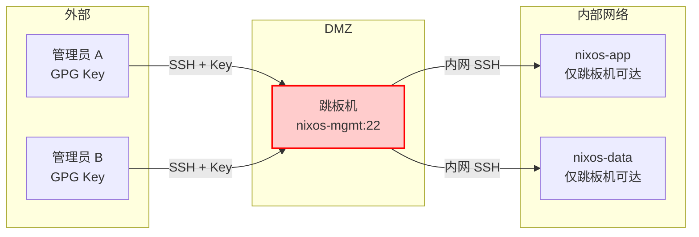

### SSH 访问策略

| 源 | 目标 | 端口 | 认证方式 | 附加条件 |
|-----|------|------|----------|----------|
| 管理员 | nixos-mgmt | 22 | SSH Key + IP 白名单 | 仅 VPN/办公网 |
| nixos-mgmt | nixos-app | 22 | SSH Key | 仅内网 |
| nixos-mgmt | nixos-data | 22 | SSH Key | 仅内网 |
| 其他 | 任意服务器 | 22 | 禁止 | — |

## 双人审批架构

### 审批流程

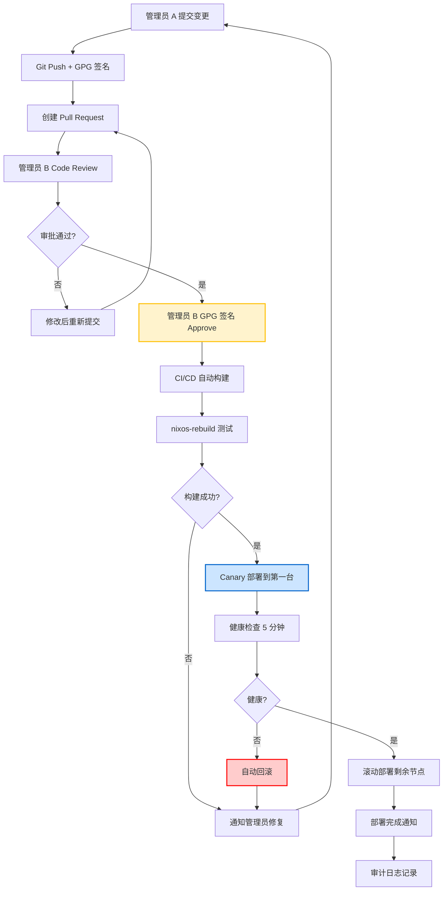

### Git Branch Protection 规则

| 规则 | 设置 | 说明 |
|------|------|------|
| Require pull request | 必须 | 禁止直接 push 到 main |
| Required approvals | 最少 1 人 | 至少一位其他管理员批准 |
| Require signed commits | 必须 | 所有提交需 GPG 签名 |
| Require status checks | 必须 | CI 构建和测试必须通过 |
| Require conversation resolution | 必须 | 所有 review 意见必须解决 |
| Restrict push access | 仅管理员组 | 限制谁可以 push |
| No force push | 禁止 | 禁止强制推送和历史篡改 |

### GPG 签名配置

```bash
# 管理员生成 GPG 密钥
gpg --full-generate-key  # 选择 RSA 4096, 有效期 2 年

# 配置 Git 使用 GPG 签名
git config --global user.signingkey <KEY_ID>
git config --global commit.gpgsign true
git config --global tag.gpgsign true

# 导出公钥上传至 Git 服务器
gpg --armor --export <KEY_ID> > admin-a.pub
```

### Shamir 分割密钥管理

关键密钥（如 LUKS 恢复密钥、根 CA 私钥）使用 Shamir 秘密共享方案分割，任何单人无法独立恢复：

```bash
# 将主密钥分割为 3 份，至少需要 2 份恢复（2-of-3 方案）
echo "MASTER-SECRET-KEY" | ssss-split -t 2 -n 3 -q

# 输出 3 个分片，分别交给 3 位管理员保管
# Share 1: 1-xxxxxxxxxxxxxxxxxxxx（管理员 A）
# Share 2: 2-xxxxxxxxxxxxxxxxxxxx（管理员 B）
# Share 3: 3-xxxxxxxxxxxxxxxxxxxx（离线保险柜）

# 恢复需要任意 2 份
ssss-combine -t 2 -q
# 输入任意 2 个分片即可恢复原始密钥
```

### 物理访问双人控制

| 场景 | 要求 | 记录 |
|------|------|------|
| 进入机房 | 双人刷卡 + 登记 | 门禁记录 + 视频 |
| 接触服务器 | 双人在场 + 工单编号 | 操作日志 + 视频 |
| BIOS/固件操作 | 双人确认 + LUKS 密钥分片 | 审计日志 + 签字确认 |
| 硬盘更换/报废 | 双人在场 + 数据擦除确认 | 资产记录 + 销毁证明 |
| 网络设备配置 | 双人审批 + 变更工单 | 配置备份 + 变更日志 |

### 四层审批设计总结

| 层级 | 机制 | 控制方式 | 审计 |
|------|------|----------|------|
| 代码变更 | Git Branch Protection | PR + GPG 签名 + Code Review | Git 日志 |
| 部署执行 | CI/CD Pipeline | 构建通过 + 双人 Approve | CI/CD 日志 |
| 密钥管理 | Shamir 分割密钥 | 2-of-3 恢复 | 密钥操作日志 |
| 物理访问 | 双人入场 | 刷卡 + 登记 + 视频 | 门禁 + 监控 |

## NixOS 容器部署

### 容器架构

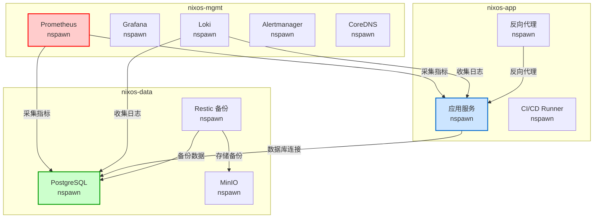

### 容器启动流程（动画演示）

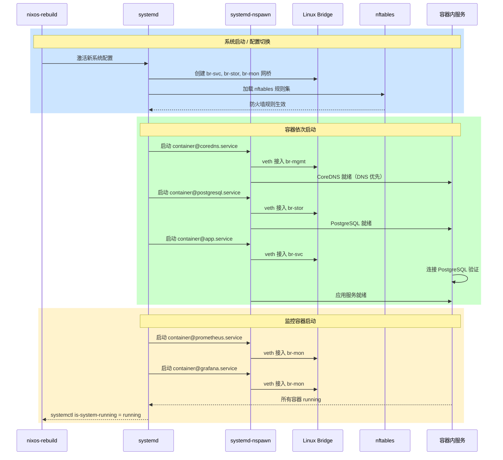

### 声明式容器配置（PostgreSQL 示例）

```nix
# modules/containers/postgresql.nix
{ config, pkgs, ... }:

{
  containers.postgresql = {
    autoStart = true;
    privateNetwork = true;
    hostBridge = "br-svc";
    localAddress = "10.20.0.10/24";

    config = { config, pkgs, ... }: {
      services.postgresql = {
        enable = true;
        package = pkgs.postgresql_16;
        settings = {
          listen_addresses = "*";
          max_connections = 200;
          shared_buffers = "4GB";
          effective_cache_size = "12GB";
          work_mem = "64MB";
          maintenance_work_mem = "1GB";
          wal_level = "replica";
          max_wal_senders = 3;
          archive_mode = "on";
          archive_command = "cp %p /var/lib/postgresql/wal-archive/%f";
          ssl = true;
          ssl_cert_file = "/var/lib/postgresql/server.crt";
          ssl_key_file = "/var/lib/postgresql/server.key";
        };
        authentication = ''
          local   all   all                 peer
          hostssl all   all   10.20.0.0/24  scram-sha-256
        '';
      };

      networking.firewall.allowedTCPPorts = [ 5432 ];

      system.stateVersion = "24.11";
    };
  };
}
```

### 容器资源限制

| 容器 | CPU 配额 | 内存上限 | 磁盘限制 | 网络 VLAN |
|------|----------|----------|----------|-----------|
| PostgreSQL | 4 核 | 16 GB | 500 GB | STOR(30) |
| 应用服务 | 8 核 | 32 GB | 100 GB | SVC(20) |
| Prometheus | 2 核 | 8 GB | 200 GB | MON(40) |
| Grafana | 1 核 | 2 GB | 10 GB | MON(40) |
| Loki | 2 核 | 8 GB | 500 GB | MON(40) |
| CoreDNS | 1 核 | 512 MB | 1 GB | MGMT(10) |
| 反向代理 | 2 核 | 4 GB | 10 GB | SVC(20) |
| Restic 备份 | 2 核 | 4 GB | 不限 | STOR(30) |

```nix
# systemd-nspawn 资源限制示例
containers.postgresql = {
  autoStart = true;
  privateNetwork = true;
  hostBridge = "br-stor";
  localAddress = "10.30.0.10/24";

  # 资源限制通过 extraFlags
  extraFlags = [
    "--property=CPUQuota=400%"          # 4 核
    "--property=MemoryMax=16G"          # 内存上限 16GB
    "--property=MemoryHigh=14G"         # 内存软限制 14GB
    "--property=IOWeight=200"           # IO 权重
  ];

  config = { ... }: { /* ... */ };
};
```

### 容器网络隔离

每个 VLAN 对应一个 Linux Bridge，容器通过 `hostBridge` 接入对应 VLAN，配合 nftables 实现容器间精细访问控制：

```nix
# 按 VLAN 创建 Bridge
networking.bridges = {
  "br-mgmt" = { interfaces = [ "eno1.10" ]; };  # VLAN 10 管理
  "br-svc"  = { interfaces = [ "eno1.20" ]; };  # VLAN 20 服务
  "br-stor" = { interfaces = [ "eno1.30" ]; };  # VLAN 30 存储
  "br-mon"  = { interfaces = [ "eno1.40" ]; };  # VLAN 40 监控
};

# 每容器 nftables 规则
networking.nftables = {
  enable = true;
  ruleset = ''
    table inet container-filter {
      chain forward {
        type filter hook forward priority 0; policy drop;

        # PostgreSQL: 仅允许应用服务网段访问 5432
        iifname "br-svc" oifname "br-stor" tcp dport 5432 accept

        # Prometheus: 允许从监控网段采集指标
        iifname "br-mon" oifname "br-svc" tcp dport { 9090, 9100 } accept
        iifname "br-mon" oifname "br-stor" tcp dport { 9090, 9187 } accept

        # DNS: 允许所有网段查询 CoreDNS
        oifname "br-mgmt" tcp dport 53 accept
        oifname "br-mgmt" udp dport 53 accept

        # 已建立连接放行
        ct state established,related accept
      }
    }
  '';
};
```

## 网络安全设计

### VLAN 规划

| VLAN ID | 名称 | 网段 | 用途 | 访问控制 |
|---------|------|------|------|----------|
| 10 | MGMT | 10.10.0.0/24 | 管理网络、SSH、DNS | 仅管理员 VPN 可达 |
| 20 | SVC | 10.20.0.0/24 | 应用服务、反向代理 | 对外暴露特定端口 |
| 30 | STOR | 10.30.0.0/24 | 数据库、存储、备份 | 仅 SVC 网段可达 |
| 40 | MON | 10.40.0.0/24 | 监控、日志、告警 | 可达所有网段（只读采集） |

### nftables 主机防火墙

```nix
# modules/networking.nix
{ config, pkgs, ... }:

{
  networking.nftables = {
    enable = true;
    ruleset = ''
      table inet firewall {
        chain input {
          type filter hook input priority 0; policy drop;

          # 本地回环
          iif lo accept

          # 已建立连接
          ct state established,related accept
          ct state invalid drop

          # ICMP（限速）
          ip protocol icmp limit rate 10/second accept
          ip6 nexthdr icmpv6 limit rate 10/second accept

          # SSH（仅管理 VLAN）
          iifname "br-mgmt" tcp dport 22 accept

          # WireGuard
          udp dport 51820 accept

          # 节点间通信（按角色开放）
          # nixos-mgmt: Prometheus, Grafana, Loki, Alertmanager
          iifname "br-mon" tcp dport { 9090, 3000, 3100, 9093 } accept

          # 日志
          log prefix "nftables-drop: " flags all counter drop
        }

        chain forward {
          type filter hook forward priority 0; policy drop;
          # 容器间转发规则（见容器网络隔离章节）
        }

        chain output {
          type filter hook output priority 0; policy accept;
        }
      }
    '';
  };
}
```

### WireGuard Mesh 网络

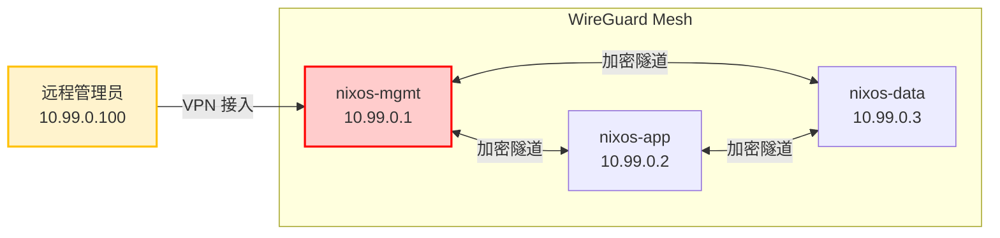

```nix
# WireGuard 配置（nixos-mgmt 示例）
networking.wireguard.interfaces.wg0 = {
  ips = [ "10.99.0.1/24" ];
  listenPort = 51820;
  privateKeyFile = config.age.secrets.wg-mgmt-key.path;

  peers = [
    {
      # nixos-app
      publicKey = "APP_PUBLIC_KEY_HERE";
      allowedIPs = [ "10.99.0.2/32" ];
      endpoint = "10.10.0.2:51820";
      persistentKeepalive = 25;
    }
    {
      # nixos-data
      publicKey = "DATA_PUBLIC_KEY_HERE";
      allowedIPs = [ "10.99.0.3/32" ];
      endpoint = "10.10.0.3:51820";
      persistentKeepalive = 25;
    }
    {
      # 远程管理员
      publicKey = "ADMIN_PUBLIC_KEY_HERE";
      allowedIPs = [ "10.99.0.100/32" ];
    }
  ];
};
```

### DNS 与 TLS 证书管理

**CoreDNS 配置**（运行在 nixos-mgmt 容器中）：

```nix
containers.coredns = {
  autoStart = true;
  privateNetwork = true;
  hostBridge = "br-mgmt";
  localAddress = "10.10.0.53/24";

  config = { config, pkgs, ... }: {
    services.coredns = {
      enable = true;
      config = ''
        dc.starslabs.internal {
          file /etc/coredns/zones/dc.starslabs.internal
          log
          errors
        }
        . {
          forward . 223.5.5.5 119.29.29.29
          cache 600
          log
        }
      '';
    };
    system.stateVersion = "24.11";
  };
};
```

**TLS 证书**：使用内部 CA 签发，通过 agenix 分发至各容器：

| 证书用途 | 有效期 | 签发方式 | 存储位置 |
|----------|--------|----------|----------|
| 内部服务 TLS | 1 年 | 内部 CA | agenix 加密 |
| PostgreSQL SSL | 1 年 | 内部 CA | agenix 加密 |
| Grafana HTTPS | 1 年 | 内部 CA | agenix 加密 |
| WireGuard 密钥 | 无过期 | 本地生成 | agenix 加密 |

## Secrets 管理

### agenix 工作流

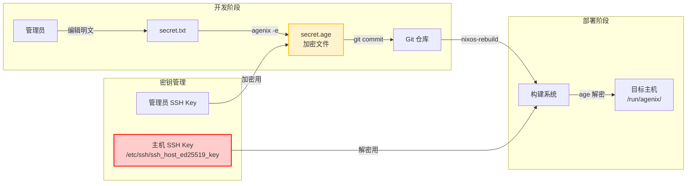

### agenix 加密与解密流程（动画演示）

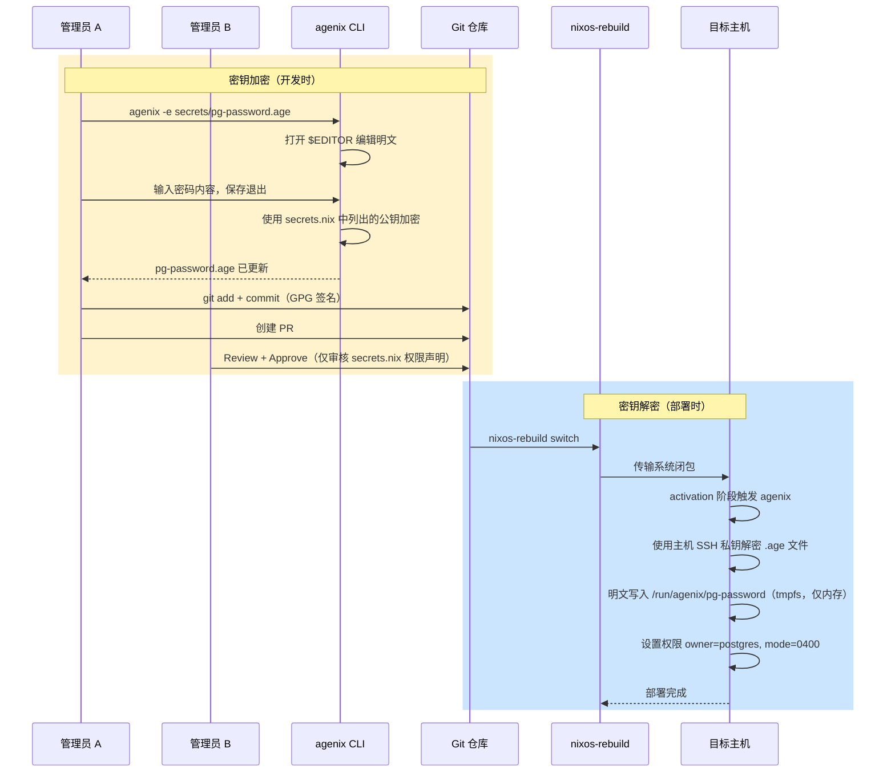

### agenix 配置

```nix
# secrets/secrets.nix
let
  # 管理员公钥
  admin-a = "ssh-ed25519 AAAAC3Nza...admin-a";
  admin-b = "ssh-ed25519 AAAAC3Nza...admin-b";

  # 主机公钥
  nixos-mgmt = "ssh-ed25519 AAAAC3Nza...mgmt";
  nixos-app  = "ssh-ed25519 AAAAC3Nza...app";
  nixos-data = "ssh-ed25519 AAAAC3Nza...data";

  allAdmins = [ admin-a admin-b ];
  allHosts  = [ nixos-mgmt nixos-app nixos-data ];
in
{
  # 数据库密码 — 管理员 + app/data 节点可解密
  "pg-password.age".publicKeys = allAdmins ++ [ nixos-app nixos-data ];

  # WireGuard 私钥 — 管理员 + 对应主机
  "wg-mgmt-key.age".publicKeys = allAdmins ++ [ nixos-mgmt ];
  "wg-app-key.age".publicKeys  = allAdmins ++ [ nixos-app ];
  "wg-data-key.age".publicKeys = allAdmins ++ [ nixos-data ];

  # TLS 证书私钥
  "tls-internal-key.age".publicKeys = allAdmins ++ allHosts;

  # Grafana admin 密码
  "grafana-admin.age".publicKeys = allAdmins ++ [ nixos-mgmt ];

  # Restic 备份密码
  "restic-password.age".publicKeys = allAdmins ++ [ nixos-data ];
}
```

```nix
# 在主机配置中引用 secret
age.secrets.pg-password = {
  file = ../../secrets/pg-password.age;
  owner = "postgres";
  group = "postgres";
  mode = "0400";
};
```

### 密钥轮转策略

| 密钥类型 | 轮转周期 | 操作方式 | 审批要求 |
|----------|----------|----------|----------|
| SSH Host Key | 1 年 | 重新生成 + 更新 secrets.nix | 双人审批 |
| SSH 用户密钥 | 1 年 | 管理员各自更新 | 各自负责 |
| WireGuard 密钥 | 6 个月 | 重新生成 + agenix 更新 | 双人审批 |
| TLS 证书 | 1 年 | 内部 CA 重签 + agenix 更新 | 双人审批 |
| PostgreSQL 密码 | 3 个月 | agenix 更新 + 滚动重启 | 双人审批 |
| Grafana 密码 | 6 个月 | agenix 更新 | 双人审批 |
| LUKS 恢复密钥 | 1 年 | Shamir 重新分割 | 三人到场 |

## 虚拟化扩展（microVM）

对于需要强隔离的场景（如运行不可信代码、合规隔离要求），使用 microvm.nix 提供轻量级虚拟机：

### 适用场景

| 场景 | 隔离方式 | 说明 |
|------|----------|------|
| CI/CD 构建环境 | microVM | 构建任务在独立 VM 中运行，防止供应链攻击 |
| 安全扫描/测试 | microVM | 运行漏洞扫描工具，与生产环境隔离 |
| 第三方服务 | microVM | 运行不完全信任的第三方软件 |
| 开发/测试环境 | microVM | 快速创建销毁的临时环境 |
| 普通应用服务 | nspawn 容器 | 信任的内部服务，使用容器即可 |

### microVM 配置示例

```nix
# 为 CI Runner 创建 microVM
microvm.vms.ci-runner = {
  config = { config, pkgs, ... }: {
    microvm = {
      vcpu = 4;
      mem = 8192;  # 8GB
      hypervisor = "cloud-hypervisor";

      volumes = [{
        mountPoint = "/var/lib/runner";
        image = "runner-data.img";
        size = 50 * 1024;  # 50GB
      }];

      interfaces = [{
        type = "tap";
        id = "vm-ci-runner";
        mac = "02:00:00:00:00:01";
      }];

      shares = [{
        source = "/nix/store";
        mountPoint = "/nix/.ro-store";
        tag = "ro-store";
        proto = "virtiofs";
      }];
    };

    # CI Runner 服务配置
    services.github-runners.ci = {
      enable = true;
      url = "https://github.com/stars-labs";
      tokenFile = config.age.secrets.github-runner-token.path;
    };

    system.stateVersion = "24.11";
  };
};
```

## 监控与审计

### 监控架构

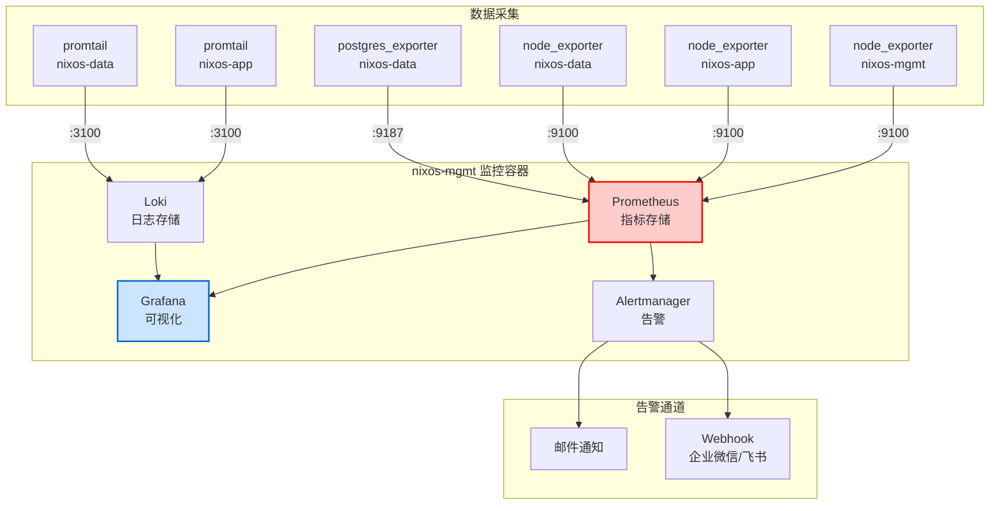

### 监控指标阈值

| 指标 | 告警阈值 | 严重级别 | 处理方式 |
|------|----------|----------|----------|
| CPU 使用率 | > 85% 持续 5 分钟 | Warning | 通知 |
| CPU 使用率 | > 95% 持续 2 分钟 | Critical | 通知 + 工单 |
| 内存使用率 | > 80% | Warning | 通知 |
| 内存使用率 | > 95% | Critical | 通知 + 工单 |
| 磁盘使用率 | > 80% | Warning | 通知 |
| 磁盘使用率 | > 90% | Critical | 通知 + 工单 |
| 磁盘 IO 延迟 | > 50ms 持续 5 分钟 | Warning | 通知 |
| 容器状态 | 非 running | Critical | 自动重启 + 通知 |
| PostgreSQL 连接数 | > 160 (80%) | Warning | 通知 |
| PostgreSQL 复制延迟 | > 10 秒 | Critical | 通知 + 工单 |
| WireGuard 隧道 | peer 断开 > 2 分钟 | Critical | 通知 |
| SSL 证书过期 | < 30 天 | Warning | 通知 |
| SSL 证书过期 | < 7 天 | Critical | 通知 + 工单 |
| NixOS 构建失败 | 任何失败 | Critical | 通知 |

### 变更审计日志

所有系统变更通过以下方式记录：

| 审计源 | 收集方式 | 存储位置 | 保留期限 |
|--------|----------|----------|----------|
| Git 提交日志 | GitHub API | Loki | 永久 |
| nixos-rebuild 日志 | systemd journal | Loki | 1 年 |
| SSH 登录日志 | auditd + journal | Loki | 1 年 |
| nftables 防火墙日志 | journal | Loki | 6 个月 |
| 容器生命周期 | systemd journal | Loki | 1 年 |
| CI/CD 部署日志 | GitHub Actions | Loki + GitHub | 1 年 |
| 物理门禁日志 | 门禁系统 API | Loki | 1 年 |

## 部署流水线

### CI/CD 完整流程

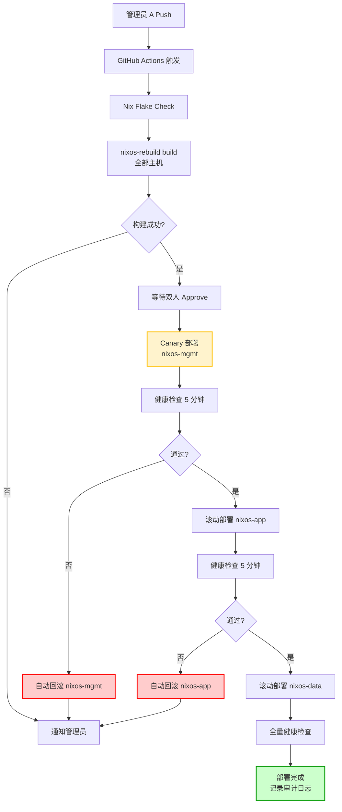

### 滚动部署详细流程（动画演示）

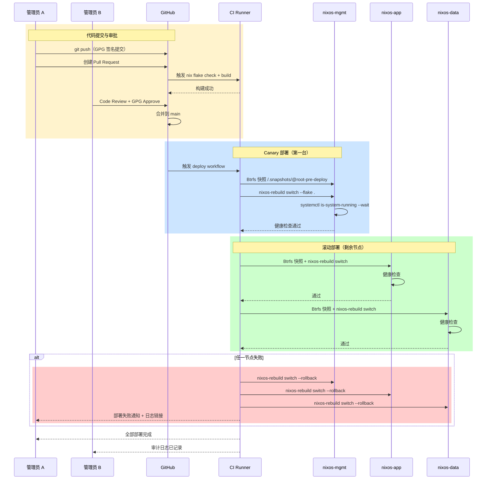

### GitHub Actions 配置

```yaml
# .github/workflows/deploy.yml
name: NixOS Deploy

on:
  push:
    branches: [ main ]

jobs:
  build:
    runs-on: self-hosted
    steps:
      - uses: actions/checkout@v4

      - name: Nix Flake Check
        run: nix flake check

      - name: Build all hosts
        run: |
          nix build .#nixosConfigurations.nixos-mgmt.config.system.build.toplevel
          nix build .#nixosConfigurations.nixos-app.config.system.build.toplevel
          nix build .#nixosConfigurations.nixos-data.config.system.build.toplevel

  deploy:
    needs: build
    runs-on: self-hosted
    environment: production  # 需要双人 Approve
    strategy:
      max-parallel: 1
    steps:
      - uses: actions/checkout@v4

      - name: Canary deploy to nixos-mgmt
        run: |
          nixos-rebuild switch --flake .#nixos-mgmt \
            --target-host root@nixos-mgmt \
            --build-host localhost

      - name: Health check nixos-mgmt
        run: |
          sleep 30
          ssh root@nixos-mgmt "systemctl is-system-running --wait" || \
            (ssh root@nixos-mgmt "nixos-rebuild switch --rollback" && exit 1)

      - name: Deploy to nixos-app
        run: |
          nixos-rebuild switch --flake .#nixos-app \
            --target-host root@nixos-app \
            --build-host localhost

      - name: Health check nixos-app
        run: |
          sleep 30
          ssh root@nixos-app "systemctl is-system-running --wait" || \
            (ssh root@nixos-app "nixos-rebuild switch --rollback" && exit 1)

      - name: Deploy to nixos-data
        run: |
          nixos-rebuild switch --flake .#nixos-data \
            --target-host root@nixos-data \
            --build-host localhost

      - name: Final health check
        run: |
          for host in nixos-mgmt nixos-app nixos-data; do
            ssh root@$host "systemctl is-system-running --wait"
          done
```

### 部署与回滚命令

```bash
# 手动部署（需在跳板机执行）
nixos-rebuild switch --flake .#nixos-mgmt --target-host root@nixos-mgmt

# 查看可用的历史配置
nix-env --list-generations --profile /nix/var/nix/profiles/system

# 回滚到上一个版本
nixos-rebuild switch --rollback --target-host root@nixos-mgmt

# 回滚到指定版本
nix-env --switch-generation 42 --profile /nix/var/nix/profiles/system
nixos-rebuild switch --target-host root@nixos-mgmt

# 查看两个版本的差异
nix store diff-closures /nix/var/nix/profiles/system-41-link /nix/var/nix/profiles/system-42-link
```

## 灾难恢复

### RTO/RPO 场景

| 场景 | RTO | RPO | 恢复策略 |
|------|-----|-----|----------|
| 单容器故障 | 5 分钟 | 0 | systemd 自动重启 |
| 单主机故障 | 30 分钟 | 0 | nixos-rebuild 重建 |
| 数据库损坏 | 1 小时 | 15 分钟 | WAL 归档 + Restic 恢复 |
| 全机房断电 | 2 小时 | 0 | UPS 保护 + 正常关机 + 上电恢复 |
| 硬盘故障 | 4 小时 | 1 小时 | Restic 恢复数据 + nixos-rebuild |
| 全机房灾难 | 24 小时 | 1 小时 | 异地 Restic 备份 + 新硬件 nixos-rebuild |

### Restic + Rclone 备份策略

```nix
# 备份服务配置
services.restic.backups = {
  # PostgreSQL 数据备份
  postgresql = {
    initialize = true;
    passwordFile = config.age.secrets.restic-password.path;
    repository = "/backup/restic/postgresql";
    paths = [ "/var/lib/postgresql" ];
    timerConfig = {
      OnCalendar = "hourly";
      Persistent = true;
    };
    pruneOpts = [
      "--keep-hourly 24"
      "--keep-daily 30"
      "--keep-weekly 12"
      "--keep-monthly 12"
    ];
    backupPrepareCommand = ''
      ${pkgs.sudo}/bin/sudo -u postgres ${pkgs.postgresql_16}/bin/pg_dumpall \
        > /var/lib/postgresql/full-dump.sql
    '';
  };

  # NixOS 配置备份
  nixos-config = {
    initialize = true;
    passwordFile = config.age.secrets.restic-password.path;
    repository = "rclone:s3remote:starslabs-backup/nixos-config";
    paths = [ "/etc/nixos" "/etc/secureboot" ];
    timerConfig = {
      OnCalendar = "daily";
      Persistent = true;
    };
    pruneOpts = [
      "--keep-daily 30"
      "--keep-weekly 12"
      "--keep-monthly 24"
    ];
  };
};
```

### 恢复演练计划

| 演练项目 | 频率 | 参与人员 | 验收标准 |
|----------|------|----------|----------|
| 单容器恢复 | 每月 | 1 名管理员 | 容器 5 分钟内恢复运行 |
| 数据库恢复 | 每季度 | 双人 | 从备份恢复且数据完整 |
| 单主机重建 | 每半年 | 双人 | nixos-rebuild 完成且服务正常 |
| 全量恢复演练 | 每年 | 全员 + 管理层 | 24 小时内全部服务恢复 |
| Shamir 密钥恢复 | 每年 | 三人 | 成功恢复 LUKS 密钥 |

## 验收标准

### 基础设施验收

- [ ] 3 台服务器 NixOS 安装完成，硬化内核启动正常
- [ ] LUKS 全盘加密启用，Secure Boot 验证通过
- [ ] Nix Flakes 构建成功，`nix flake check` 无错误
- [ ] 所有服务器可通过 `nixos-rebuild switch` 从零重建

### 双人审批验收

- [ ] Git Branch Protection 规则生效，单人无法直接 push main
- [ ] GPG 签名提交验证正常，未签名提交被拒绝
- [ ] CI/CD 部署需要 production environment 双人 Approve
- [ ] Shamir 分割密钥测试：任意 2 份可恢复，单份不可恢复
- [ ] 物理门禁双人刷卡流程验证通过

### 容器服务验收

- [ ] 所有 systemd-nspawn 容器正常启动（`machinectl list`）
- [ ] PostgreSQL 容器可正常连接，SSL 加密通信
- [ ] 容器资源限制生效（CPU/内存/IO）
- [ ] 容器重启后数据持久化正常

### 网络安全验收

- [ ] VLAN 隔离生效，跨 VLAN 未授权流量被阻断
- [ ] nftables 规则测试：仅允许策略内的端口和方向
- [ ] WireGuard Mesh 全互通，远程管理员可正常接入
- [ ] CoreDNS 内部解析正常，外部 DNS 转发正常

### 监控审计验收

- [ ] Prometheus 采集所有节点和容器指标
- [ ] Grafana Dashboard 展示正常，告警规则触发正确
- [ ] Loki 收集所有主机和容器日志
- [ ] 审计日志完整记录 SSH 登录、配置变更、部署操作

### 灾难恢复验收

- [ ] Restic 备份定时执行，备份数据完整性校验通过
- [ ] 单容器恢复演练：5 分钟内恢复
- [ ] 数据库恢复演练：从备份恢复且数据一致
- [ ] nixos-rebuild 从零重建单主机：30 分钟内完成
