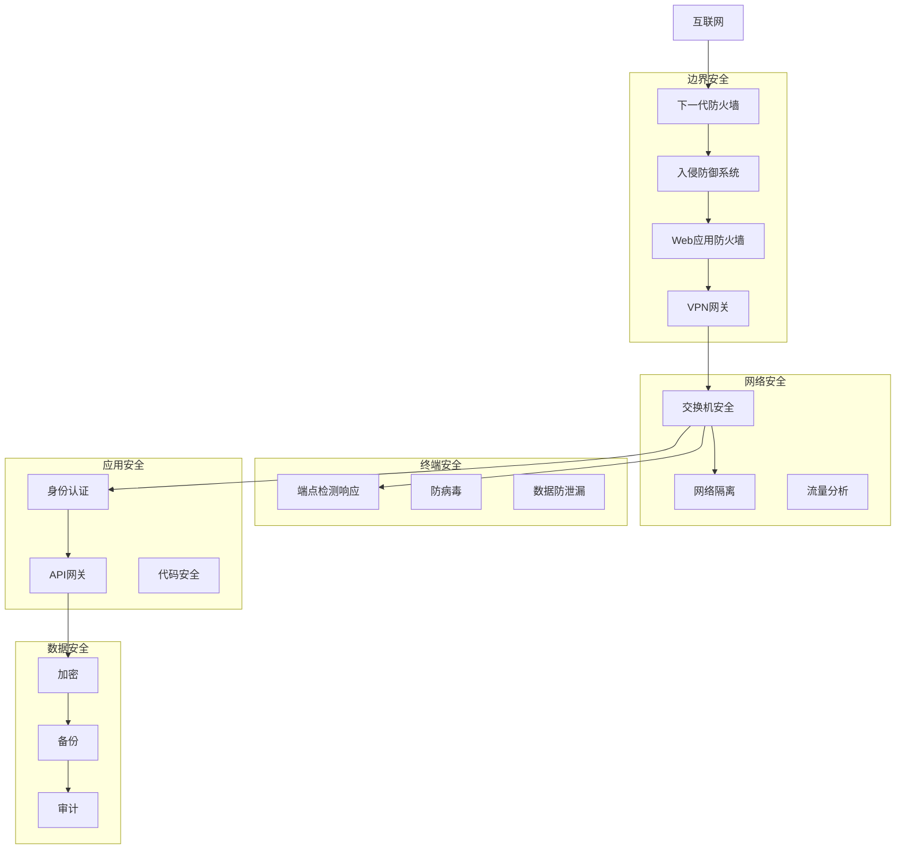
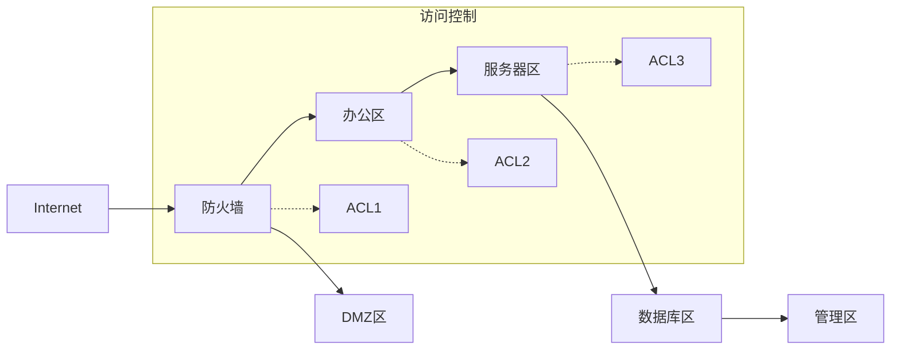
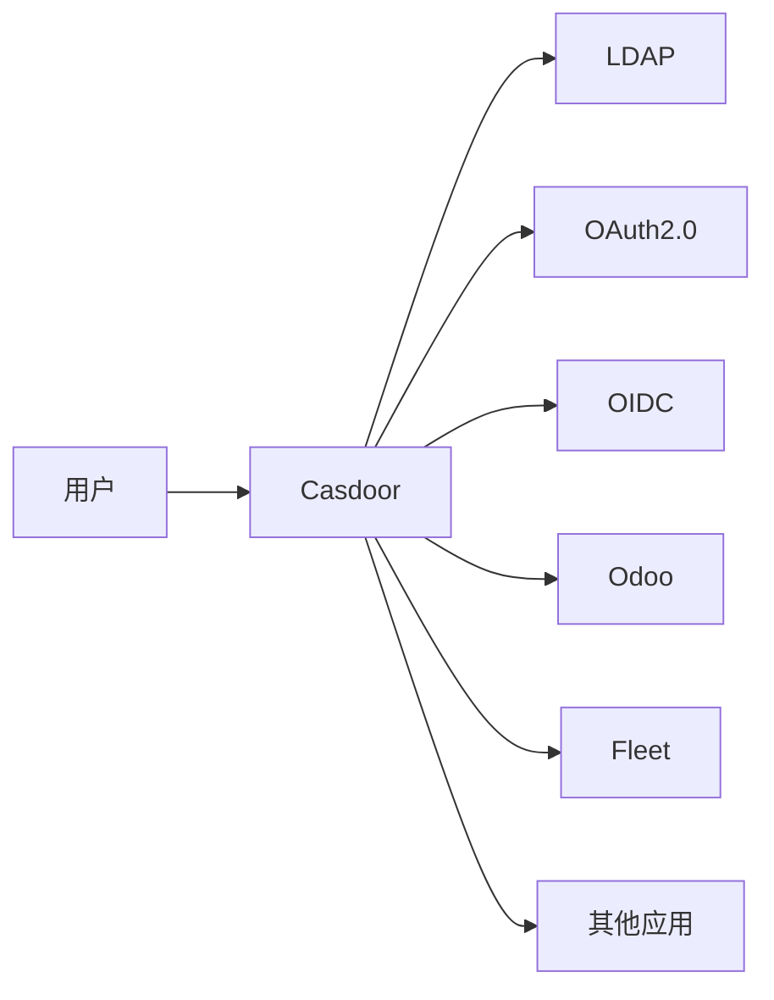
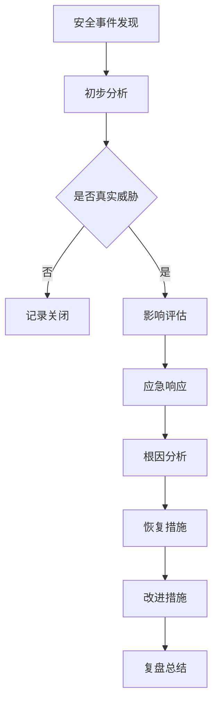

# 安全架构设计

## 设计原则

- **纵深防御**：多层安全防护，无单点突破
- **最小权限**：按需授权，减少攻击面
- **零信任架构**：持续验证，不信任任何请求
- **合规性**：满足等级保护、行业合规要求
- **可审计**：全流量记录，可追溯分析

## 安全架构总览



## 网络安全

### 防火墙策略

| 区域 | 安全级别 | 访问控制 |
|------|----------|----------|
| Internet | 低 | 严格限制入站 |
| DMZ | 中 | 仅开放必要服务 |
| 办公区 | 中 | 访问需认证 |
| 服务器区 | 高 | 严格访问控制 |
| 管理区 | 最高 | 仅限授权访问 |

### 防火墙规则示例

```bash
# 允许Web服务
allow tcp any host 192.168.100.10 port 80
allow tcp any host 192.168.100.10 port 443

# 允许数据库访问
allow tcp 192.168.1.0/24 host 192.168.1.100 port 3306
allow tcp 192.168.1.0/24 host 192.168.1.100 port 5432

# 拒绝所有其他流量
deny ip any any
```

### 入侵防御系统（IPS）

- **部署位置**：防火墙与核心交换机之间
- **检测能力**：
  - 已知攻击特征检测
  - 异常流量检测
  - 协议异常检测
  - 零日攻击防护
- **响应方式**：自动阻断、告警

### 网络隔离设计



## 终端安全

### 端点安全方案

| 组件 | 功能 | 部署方式 |
|------|------|----------|
| EDR | 端点检测与响应 | 所有终端 |
| 防病毒 | 恶意软件防护 | 所有终端 |
| DLP | 数据泄露防护 | 敏感终端 |
| 主机防火墙 | 网络访问控制 | 所有终端 |

### 终端准入控制

```bash
# 802.1X认证配置
dot1x authentication-method EAP

# 认证域配置
authentication domain default

# 授权VLAN
authorization vlan 30
```

### 补丁管理

| 类别 | 补丁周期 | 紧急补丁 |
|------|----------|----------|
| 操作系统 | 每月 | 24小时内 |
| 办公软件 | 每月 | 48小时内 |
| 应用程序 | 每季度 | 72小时内 |
| 浏览器 | 每月 | 48小时内 |

## 应用安全

### 身份认证体系



### 多因素认证

| 系统 | 认证方式 |
|------|----------|
| VPN | 密码 + OTP |
| 管理员账户 | 密码 + 证书 + OTP |
| 普通用户 | 密码 + 短信验证码 |
| API访问 | Access Token + API Key |

### Web应用防火墙（WAF）

- **部署模式**：反向代理模式
- **防护功能**：
  - SQL注入防护
  - XSS防护
  - CSRF防护
  - 文件上传防护
  - API防护

## 数据安全

### 数据分类分级

| 级别 | 定义 | 示例 | 保护要求 |
|------|------|------|----------|
| 公开 | 可对外公开 | 官网内容 | 无 |
| 内部 | 仅内部使用 | 内部通知 | 访问控制 |
| 敏感 | 泄露有影响 | 客户信息 | 加密+审计 |
| 机密 | 泄露有重大影响 | 财务数据 | 强加密+审计 |
| 绝密 | 泄露有严重后果 | 核心机密 | 最高保护 |

### 数据加密

```bash
# 磁盘加密（LUKS）
cryptsetup luksFormat /dev/sdb1
cryptsetup luksOpen /dev/sdb1 secure_data

# 数据库加密
# MySQL: innodb_file_per_table = 1
# MySQL: innodb_encrypt_tables = ON

# 传输加密
# TLS 1.3 for all services
```

### 数据库审计

```sql
-- 开启审计
audit_log_policy = 'ALL'
audit_log_connection_policy = 'ALL'
audit_log_statement_policy = 'ALL'

-- 审计日志保留
expire_logs_days = 90
```

## 安全运营

### 安全监控

| 监控项 | 采集频率 | 告警阈值 |
|--------|----------|----------|
| 防火墙阻断 | 实时 | 阻断>100次/分钟 |
| IPS告警 | 实时 | 告警>50次/分钟 |
| 异常登录 | 5分钟 | 失败>5次/分钟 |
| 敏感数据访问 | 5分钟 | 异常访问模式 |
| 病毒检测 | 实时 | 发现病毒 |
| 漏洞扫描 | 每日 | 发现高危漏洞 |

### 应急响应流程



### 定期安全评估

| 评估项 | 频率 | 执行方 |
|--------|------|--------|
| 漏洞扫描 | 每周 | 自动化 |
| 渗透测试 | 每季度 | 第三方 |
| 安全审计 | 每年 | 外部审计 |
| 红蓝对抗 | 每半年 | 内部/外部 |
| 合规检查 | 每季度 | 内部 |
