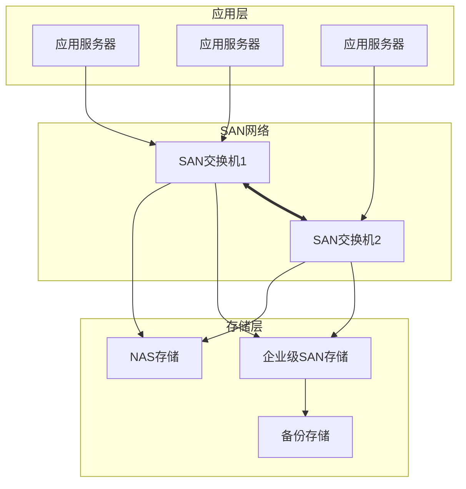
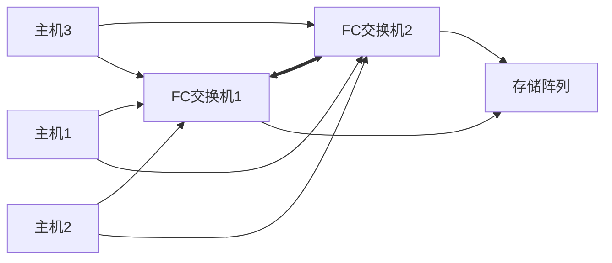

# 存储方案设计

## 设计原则

- **性能满足业务**：根据IOPS和吞吐量需求选择存储类型
- **容量规划合理**：预留增长空间，避免容量瓶颈
- **高可用保障**：消除单点故障，数据不丢失
- **可扩展性**：支持在线扩容，不影响业务
- **数据安全**：备份容灾完善，恢复能力可靠

## 存储架构设计



## 存储类型选择

### 块存储（SAN）

适用于：数据库、虚拟机、关键应用

| 性能等级 | IOPS | 吞吐量 | 适用场景 |
|----------|------|--------|----------|
| 入门级 | 10K-30K | 500MB/s | 开发测试环境 |
| 标准级 | 50K-100K | 1-2GB/s | 一般生产环境 |
| 高性能级 | 200K+ | 5GB/s+ | 核心数据库 |

### 文件存储（NAS）

适用于：文件共享、文档管理、非结构化数据

| 性能等级 | 容量 | 吞吐量 | 适用场景 |
|----------|------|--------|----------|
| 入门级 | 10-50TB | 200MB/s | 部门级文件共享 |
| 标准级 | 100-500TB | 500MB/s | 企业级文件服务 |
| 大容量级 | 1PB+ | 1GB/s+ | 数据归档/媒体存储 |

### 对象存储

适用于：备份、归档、大数据分析、云原生应用

| 类型 | 特点 | 适用场景 |
|------|------|----------|
| 本地对象存储 | 低延迟，高性能 | 备份、镜像仓库 |
| 云对象存储 | 弹性扩展 | 冷数据、灾备 |
| 混合云存储 | 冷热分层 | 分级存储 |

## 推荐存储方案

### 主存储（SAN）配置

| 参数 | 推荐配置 |
|------|----------|
| 型号 | Dell EMC PowerStore 500T / HPE Primera 650 |
| 控制器 | 双控 Active-Active |
| 缓存 | 256GB/控制器 |
| 硬盘 | 25× 3.84TB NVMe SSD |
| 容量 | 96TB 可用 (RAID5 4+1) |
| 性能 | 150K IOPS, 10GB/s |
| 接口 | 8× 32Gb FC, 8× 25GbE |
| 特性 | 精简配置、重删压缩、快照 |

### 次存储（NAS）配置

| 参数 | 推荐配置 |
|------|----------|
| 型号 | NetApp AFF A400 / Dell EMC Isilon H400 |
| 控制器 | 双控 HA |
| 缓存 | 128GB |
| 硬盘 | 12× 8TB SAS HDD |
| 容量 | 64TB 可用 |
| 性能 | 5GB/s 顺序读 |
| 接口 | 4× 10GbE, 2× 40GbE |
| 特性 | 重复数据删除、压缩、配额 |

### 备份存储配置

| 参数 | 推荐配置 |
|------|----------|
| 型号 | Dell EMC Data Domain 6500 / Veritas 5200 |
| 容量 | 200TB (压缩后) |
| 接口 | 10GbE |
| 备份软件 | Veeam / Veritas NetBackup |
| 特性 | 源端重删、加密、Air-Gap |

## LUN规划

| LUN名称 | 容量 | RAID类型 | 用途 |
|---------|------|----------|------|
| LUN-DB-01 | 10TB | RAID10 | 数据库数据 |
| LUN-DB-LOG | 2TB | RAID10 | 数据库日志 |
| LUN-VM-OS | 5TB | RAID5 | 虚拟机系统盘 |
| LUN-VM-DATA | 20TB | RAID6 | 虚拟机数据盘 |
| LUN-APP | 15TB | RAID5 | 应用数据 |

## 备份策略

### 备份方案设计

```bash
# 每日备份（增量）
- 时间: 每天 01:00
- 保留: 7天
- 类型: 增量备份

# 每周备份（全量）
- 时间: 每周日 02:00
- 保留: 4周
- 类型: 全量备份

# 每月备份（全量）
- 时间: 每月1日 03:00
- 保留: 12个月
- 类型: 全量备份

# 年度归档
- 时间: 每年1月1日 04:00
- 保留: 7年
- 类型: 全量归档
```

### 备份窗口规划

| 系统类型 | 备份窗口 | RPO | RTO |
|----------|----------|-----|-----|
| 核心数据库 | 01:00-06:00 | 1小时 | 4小时 |
| ERP系统 | 01:00-06:00 | 4小时 | 8小时 |
| 文件服务器 | 02:00-07:00 | 24小时 | 24小时 |
| 虚拟化平台 | 01:00-06:00 | 4小时 | 8小时 |

## 存储网络设计

### SAN网络架构



### Zoning规划

| Zone名称 | 成员 | 用途 |
|----------|------|------|
| Zone-DB | HBA1-P0, HBA2-P0, STG-P0 | 数据库服务器 |
| Zone-VM | HBA1-P1, HBA2-P1, STG-P1 | 虚拟化主机 |
| Zone-NAS | HBA1-P2, HBA2-P2, NAS-P0 | NAS连接 |

## 数据保护特性

### 快照策略

- **本地快照**：每小时自动快照，保留24小时
- **应用一致性快照**：每日业务低峰期
- **远程复制**：同步/异步复制到灾备站点

### 克隆与复制

- 数据库克隆用于测试环境
- 应用克隆用于开发环境
- 定期复制到灾备站点

## 监控与运维

### 监控指标

- [ ] 存储容量使用率（>80%告警）
- [ ] IOPS使用率（>70%告警）
- [ ] 吞吐量使用率
- [ ] 缓存命中率
- [ ] 磁盘健康状态
- [ ] 控制器状态
- [ ] 复制任务状态

### 日常巡检

- 每日：容量、性能检查
- 每周：磁盘SMART状态、备份成功率
- 每月：性能分析报告、容量规划
