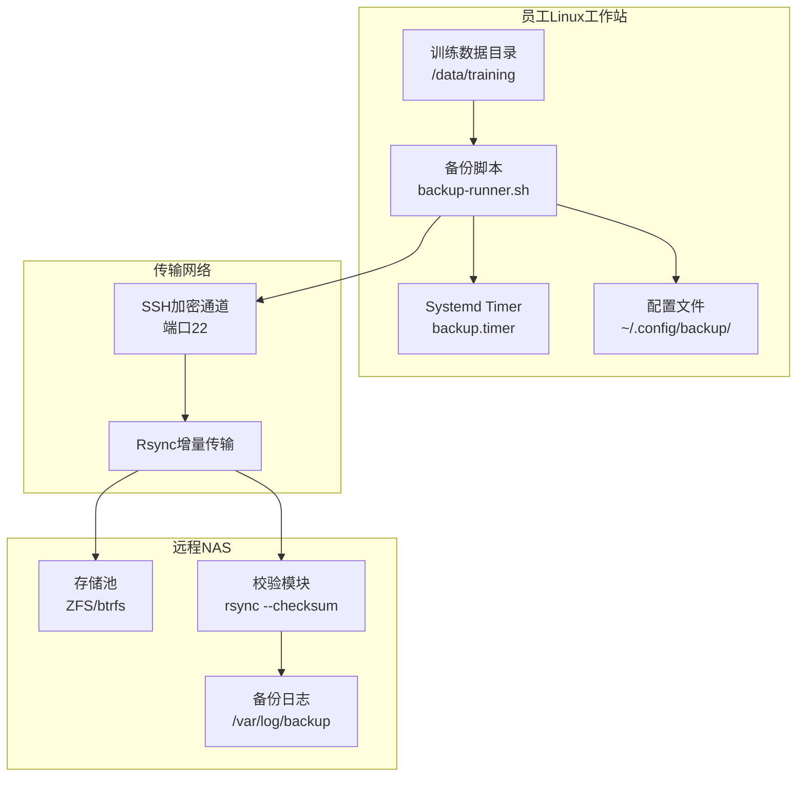
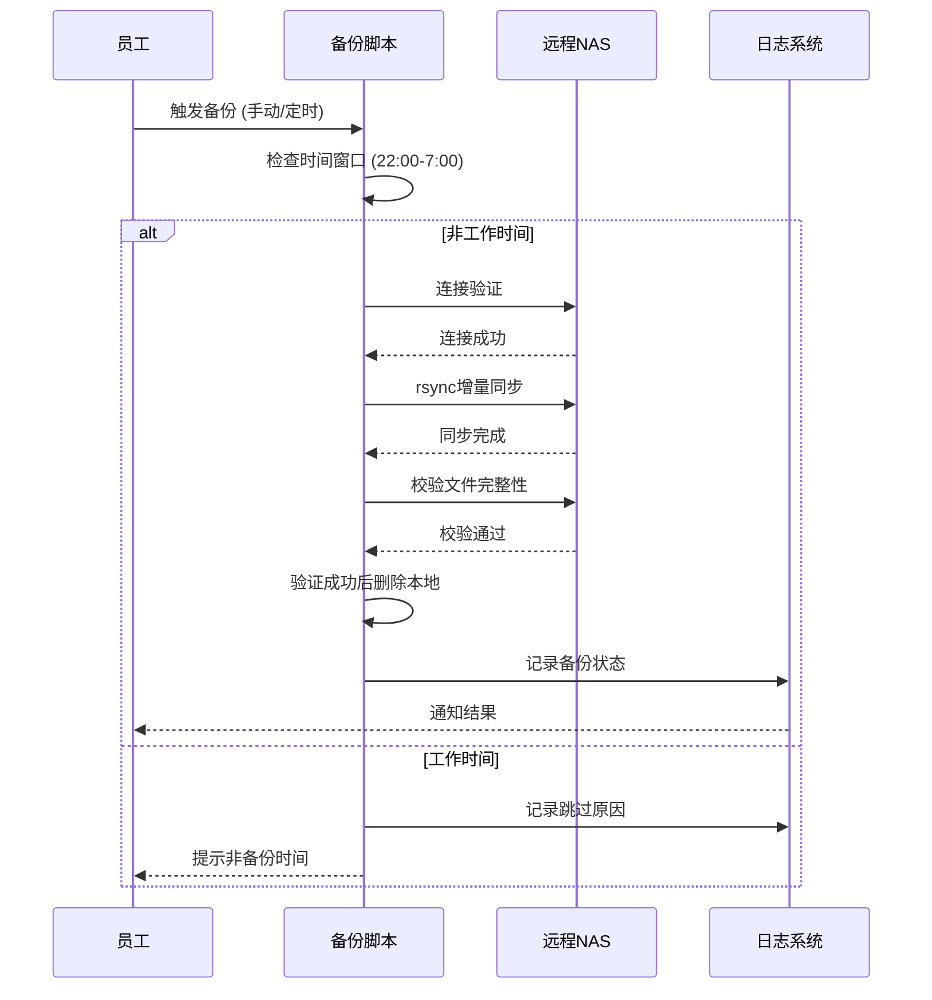

# 训练数据备份自动化方案

## 需求概述

### 业务背景

员工在工作过程中产生训练数据（机器学习训练集、模型权重文件、日志等），特点：

| 特征 | 说明 |
|------|------|
| 文件体积大 | 单个文件GB级别，总量TB级别 |
| 产生周期 | 按项目/实验批次产生 |
| 访问频率 | 训练完成后很少访问 |
| 重要性 | 需要长期保存，但可离线存储 |
| 时间敏感 | 非紧急，可异步备份 |

### 设计目标

- **员工可控**：员工主动触发备份，而非强制
- **智能调度**：仅在非工作时间执行（22:00-07:00）
- **带宽友好**：不影响正常办公网络
- **安全传输**：加密传输至远程NAS
- **可靠删除**：验证备份成功后删除本地数据
- **可追溯**：备份日志和状态可查询

## 架构设计

### 整体架构



### 备份流程



## 实施方案

### 1. 目录结构设计

```bash
# 员工工作站目录结构
~/backup/
├── config/
│   ├── backup.conf          # 主配置文件
│   ├── include.list         # 要备份的目录列表
│   └── exclude.list         # 排除规则
├── scripts/
│   ├── backup-runner.sh     # 主备份脚本
│   ├── verify.sh            # 校验脚本
│   └── restore.sh           # 恢复脚本
└── logs/
    └── backup.log           # 日志文件

# NAS端存储结构
/nas/backup/employee/
└── {username}/
    └── {project}/
        ├── data/
        │   ├── dataset_v1/
        │   └── dataset_v2/
        ├── models/
        │   ├── model_001/
        │   └── model_002/
        └── metadata/
            ├── checksum.json
            └── backup_manifest.json
```

### 2. 配置文件

```bash
# ~/.config/backup/backup.conf
#!/bin/bash

# NAS连接配置
NAS_HOST="backup.nas.stars-labs.com"
NAS_USER="${USER}"
NAS_PORT="22"
NAS_PATH="/nas/backup/${USER}"

# 备份源配置
BACKUP_PATHS=(
    "/data/training"
    "/data/models"
    "/data/experiments"
)

# 排除规则
EXCLUDE_PATTERNS=(
    "*.tmp"
    "*.log"
    "__pycache__"
    ".git"
    "node_modules"
    "*.pyc"
    "checkpoint_*"
)

# 时间窗口 (24小时制, 员工可自定义)
BACKUP_START_HOUR="22"   # 最早开始时间
BACKUP_END_HOUR="7"      # 最晚结束时间 (次日)

# 带宽限制 (KB/s, 0表示不限)
BANDWIDTH_LIMIT="50000"  # ~50MB/s, 留出带宽给办公

# 保留策略
KEEP_LOCAL="yes"         # 备份后是否保留本地副本 (可选)
DELETE_AFTER_VERIFY="yes"# 校验成功后是否删除本地

# 通知配置
NOTIFY_EMAIL="${USER}@stars-labs.com"
NOTIFY_SLACK="https://hooks.slack.com/xxx"

# 日志配置
LOG_DIR="${HOME}/.local/share/backup/logs"
LOG_FILE="${LOG_DIR}/backup_$(date +%Y%m%d).log"
```

### 3. 备份主脚本

```bash
#!/bin/bash
# ~/scripts/backup-runner.sh
# 训练数据备份脚本 - 员工可控版

set -euo pipefail

# 加载配置
source ~/.config/backup/backup.conf

# 初始化日志
mkdir -p "$(dirname "${LOG_FILE}")"
log() {
    echo "[$(date '+%Y-%m-%d %H:%M:%S')] $*" | tee -a "${LOG_FILE}"
}

# 检查是否在备份时间窗口内
check_time_window() {
    local current_hour=$(date +%H)
    
    if [ "${BACKUP_END_HOUR}" -gt "${BACKUP_START_HOUR}" ]; then
        # 跨天情况，如 22:00-07:00
        if [ "${current_hour}" -ge "${BACKUP_START_HOUR}" ] || \
           [ "${current_hour}" -lt "${BACKUP_END_HOUR}" ]; then
            return 0
        fi
    else
        # 同一天内
        if [ "${current_hour}" -ge "${BACKUP_START_HOUR}" ] && \
           [ "${current_hour}" -lt "${BACKUP_END_HOUR}" ]; then
            return 0
        fi
    fi
    return 1
}

# 检查NAS连接
check_nas_connection() {
    log "检查NAS连接..."
    if ssh -o ConnectTimeout=10 -o BatchMode=yes \
        -p "${NAS_PORT}" "${NAS_USER}@${NAS_HOST}" "echo 'OK'" 2>/dev/null; then
        log "NAS连接成功"
        return 0
    else
        log "错误: 无法连接NAS"
        return 1
    fi
}

# 创建备份清单
create_backup_manifest() {
    local manifest_file="${1}/backup_manifest.json"
    cat > "${manifest_file}" << EOF
{
    "backup_date": "$(date -Iseconds)",
    "backup_user": "${USER}",
    "source_host": "$(hostname)",
    "paths": [],
    "total_size": 0,
    "file_count": 0
}
EOF
    echo "${manifest_file}"
}

# 执行rsync备份
run_backup() {
    local source_path="$1"
    local relative_path="${source_path#/}"
    local target_path="${NAS_PATH}/${relative_path}"
    local checksum_file="${NAS_PATH}/${relative_path}.checksum"
    
    log "开始备份: ${source_path} -> ${target_path}"
    
    # rsync选项说明:
    # -a: 归档模式 (保持权限、时间等)
    # -v: 详细输出
    # -z: 压缩传输
    # --bwlimit: 带宽限制
    # --checksum: 基于校验和判断文件变化
    # --progress: 显示进度
    # --delete-after: 传输完成后删除源文件
    
    local rsync_opts=(
        -avz
        --bwlimit="${BANDWIDTH_LIMIT}"
        --checksum
        --progress
        --partial
        --log-file="${LOG_FILE}"
    )
    
    # 添加排除规则
    for pattern in "${EXCLUDE_PATTERNS[@]}"; do
        rsync_opts+=("--exclude=${pattern}")
    done
    
    # 执行rsync (ssh方式)
    rsync \
        -e "ssh -p ${NAS_PORT} -o Compression=yes" \
        "${rsync_opts[@]}" \
        "${source_path}/" \
        "${NAS_USER}@${NAS_HOST}:${target_path}/"
    
    local exit_code=$?
    
    if [ ${exit_code} -eq 0 ]; then
        log "备份完成: ${source_path}"
        return 0
    else
        log "错误: 备份失败，退出码 ${exit_code}"
        return ${exit_code}
    fi
}

# 校验备份完整性
verify_backup() {
    local source_path="$1"
    local relative_path="${source_path#/}"
    local target_path="${NAS_PATH}/${relative_path}"
    
    log "校验备份: ${relative_path}"
    
    # 在NAS端执行checksum验证
    ssh -p "${NAS_PORT}" "${NAS_USER}@${NAS_HOST}" << EOF
cd "${target_path}"
# 生成远程文件checksum
find . -type f -exec md5sum {} \; > /tmp/remote_checksum.txt 2>/dev/null
cat /tmp/remote_checksum.txt
EOF
    
    # 生成本地checksum对比
    find "${source_path}" -type f -exec md5sum {} \; > /tmp/local_checksum.txt 2>/dev/null
    
    # 对比
    if diff /tmp/local_checksum.txt /tmp/remote_checksum.txt > /dev/null 2>&1; then
        log "校验通过: ${relative_path}"
        return 0
    else
        log "警告: 校验发现差异，可能需要重新传输"
        return 1
    fi
}

# 删除已备份的本地文件
delete_source_after_backup() {
    local source_path="$1"
    
    if [ "${DELETE_AFTER_VERIFY}" != "yes" ]; then
        log "配置要求保留本地文件，跳过删除"
        return 0
    fi
    
    log "删除本地文件: ${source_path}"
    
    # 安全删除：先移动到.Trash而不是直接删除
    local trash_dir="${HOME}/.local/share/Trash/files"
    mkdir -p "${trash_dir}"
    
    local dest_dir="${trash_dir}/backup_$(date +%Y%m%d)/${source_path##*/}"
    mv "${source_path}" "${dest_dir}"
    
    if [ $? -eq 0 ]; then
        log "已移动到回收站: ${dest_dir}"
        return 0
    else
        log "错误: 删除失败"
        return 1
    fi
}

# 发送通知
send_notification() {
    local status="$1"
    local message="$2"
    
    # 邮件通知
    if command -v mail &> /dev/null; then
        echo "${message}" | mail -s "[备份${status}] ${USER} 备份任务" "${NOTIFY_EMAIL}"
    fi
    
    # Slack通知 (如果配置了webhook)
    if [ -n "${NOTIFY_SLACK}" ]; then
        curl -s -X POST -H 'Content-type: application/json' \
            --data "{\"text\":\"[备份${status}] ${USER}: ${message}\"}" \
            "${NOTIFY_SLACK}" > /dev/null 2>&1
    fi
    
    # 本地通知 (desktop notification)
    if command -v notify-send &> /dev/null; then
        notify-send "备份${status}" "${message}" 2>/dev/null || true
    fi
}

# 手动触发函数 (员工主动调用)
manual_trigger() {
    log "========== 手动备份触发 =========="
    log "用户: ${USER}"
    log "时间: $(date)"
    
    # 强制跳过时间检查
    FORCE_BACKUP=${FORCE_BACKUP:-false}
    
    if [ "${FORCE_BACKUP}" != "true" ] && ! check_time_window; then
        log "当前不在备份时间窗口内 (${BACKUP_START_HOUR}:00-${BACKUP_END_HOUR}:00)"
        log "如需立即备份，请运行: FORCE_BACKUP=true ~/scripts/backup-runner.sh"
        send_notification "跳过" "不在备份时间窗口内"
        exit 0
    fi
    
    check_nas_connection || exit 1
    
    for path in "${BACKUP_PATHS[@]}"; do
        if [ -d "${path}" ]; then
            log "处理路径: ${path}"
            run_backup "${path}" || log "备份失败: ${path}"
            verify_backup "${path}" || log "校验警告: ${path}"
            delete_source_after_backup "${path}" || log "删除失败: ${path}"
        else
            log "跳过不存在的目录: ${path}"
        fi
    done
    
    log "========== 备份任务完成 =========="
    send_notification "完成" "所有路径备份完成"
}

# 主入口
main() {
    case "${1:-auto}" in
        manual|trigger)
            manual_trigger
            ;;
        auto|timer)
            if check_time_window; then
                manual_trigger
            else
                log "跳过: 不在备份时间窗口内"
            fi
            ;;
        status)
            echo "=== 备份状态 ==="
            echo "用户: ${USER}"
            echo "NAS: ${NAS_HOST}:${NAS_PORT}"
            echo "备份路径: ${BACKUP_PATHS[*]}"
            echo "时间窗口: ${BACKUP_START_HOUR}:00 - ${BACKUP_END_HOUR}:00"
            echo "带宽限制: ${BANDWIDTH_LIMIT} KB/s"
            echo "自动删除: ${DELETE_AFTER_VERIFY}"
            ;;
        *)
            echo "用法: $0 {manual|auto|status}"
            echo "  manual - 手动触发备份"
            echo "  auto   - 按时间窗口自动执行"
            echo "  status - 查看当前配置"
            ;;
    esac
}

main "$@"
```

### 4. Systemd Timer配置（自动调度）

```bash
# ~/.config/systemd/user/backup.service
[Unit]
Description=训练数据备份到远程NAS
After=network-online.target
Wants=network-online.target

[Service]
Type=oneshot
ExecStart=%h/scripts/backup-runner.sh auto
Environment="FORCE_BACKUP=false"
StandardOutput=append:%h/.local/share/backup/logs/backup.log
StandardError=append:%h/.local/share/backup/logs/backup.error.log

[Install]
WantedBy=default.target
```

```bash
# ~/.config/systemd/user/backup.timer
[Unit]
Description=每天22:00自动备份训练数据

[Timer]
OnCalendar=*-*-* 22:00:00
Persistent=true
RandomizedDelaySec=30min  # 随机延迟30分钟，避免同时发起

[Install]
WantedBy=timers.target
```

```bash
# 安装和启用
systemctl --user daemon-reload
systemctl --user enable --now backup.timer
systemctl --user status backup.timer
```

### 5. SSH密钥配置（无密码登录NAS）

```bash
# 员工工作站执行
# 生成专用备份密钥（无密码）
ssh-keygen -t ed25519 -f ~/.ssh/id_backup -N "" -C "backup@${USER}"

# 将公钥添加到NAS的authorized_keys
ssh-copy-id -i ~/.ssh/id_backup.pub ${NAS_USER}@${NAS_HOST}

# 测试连接
ssh -i ~/.ssh/id_backup -p ${NAS_PORT} ${NAS_USER}@${NAS_HOST} "echo '连接成功'"

# 配置SSH客户端复用
cat >> ~/.ssh/config << EOF

Host backup.nas.stars-labs.com
    User ${NAS_USER}
    Port ${NAS_PORT}
    IdentityFile ~/.ssh/id_backup
    ControlMaster auto
    ControlPath ~/.ssh/sockets/%r@%h-%p
    ControlPersist 600
EOF

# 创建socket目录
mkdir -p ~/.ssh/sockets
```

### 6. 恢复脚本

```bash
#!/bin/bash
# ~/scripts/restore.sh
# 从NAS恢复训练数据

set -euo pipefail

NAS_HOST="backup.nas.stars-labs.com"
NAS_USER="${USER}"
NAS_PORT="22"
NAS_BASE_PATH="/nas/backup/${USER}"

usage() {
    echo "用法: $0 <项目目录> [本地目标路径]"
    echo "示例: $0 dataset_v1 ~/data/training"
    echo ""
    echo "可用项目:"
    ssh -p "${NAS_PORT}" "${NAS_USER}@${NAS_HOST}" "ls -la ${NAS_BASE_PATH}/" 2>/dev/null || echo "无法连接NAS"
}

if [ -z "${1:-}" ]; then
    usage
    exit 1
fi

PROJECT="$1"
TARGET="${2:-${HOME}/data/training/${PROJECT}}"

echo "从NAS恢复: ${PROJECT}"
echo "目标路径: ${TARGET}"
read -p "确认恢复? (y/n) " confirm

if [ "${confirm}" != "y" ]; then
    echo "已取消"
    exit 0
fi

mkdir -p "$(dirname "${TARGET}")"

# rsync恢复
rsync -avz \
    -e "ssh -p ${NAS_PORT}" \
    --progress \
    "${NAS_USER}@${NAS_HOST}:${NAS_BASE_PATH}/${PROJECT}/" \
    "${TARGET}/"

echo "恢复完成: ${TARGET}"
```

## 员工使用指南

### 首次配置（IT协助）

```bash
# 1. 克隆配置仓库或手动创建
git clone git@github.com:stars-labs/backup-config.git ~/.config/backup

# 2. 设置执行权限
chmod +x ~/scripts/*.sh

# 3. 配置SSH密钥
~/scripts/setup-ssh-key.sh

# 4. 启用Systemd定时器
systemctl --user daemon-reload
systemctl --user enable --now backup.timer

# 5. 验证配置
~/scripts/backup-runner.sh status
```

### 日常使用

```bash
# 查看备份状态
~/scripts/backup-runner.sh status

# 手动触发备份（会检查时间窗口）
~/scripts/backup-runner.sh manual

# 立即强制备份（不检查时间窗口）
FORCE_BACKUP=true ~/scripts/backup-runner.sh manual

# 查看最近日志
tail -50 ~/.local/share/backup/logs/backup.log

# 从NAS恢复数据
~/scripts/restore.sh dataset_v1
```

### 备份策略选择

| 场景 | 推荐操作 |
|------|----------|
| 日常自动备份 | 交给Timer自动执行 |
| 大实验完成后 | 手动触发 `manual` |
| 紧急下班 | `FORCE_BACKUP=true manual` |
| 需要恢复数据 | `restore.sh <项目名>` |
| 检查是否备份成功 | 查看日志或邮件通知 |

## NAS端配置

### NAS存储池配置（以群晖为例）

```bash
# 创建专用存储空间
# 1. 创建存储池: backup_pool (RAID1/RAID5)
# 2. 创建共享文件夹: backup
# 3. 配置用户权限

# NAS端SSH执行
# 创建用户备份目录结构
mkdir -p /volume1/backup/{employee,shared}
chown admin:users /volume1/backup

# 配置rsync服务 (如果使用rsyncd)
cat >> /etc/rsyncd/rsyncd.conf << EOF
[backup]
    path = /volume1/backup
    hosts allow = 192.168.1.0/24
    auth users = backup_user
    secrets file = /etc/rsyncd/rsyncd.secrets
    read only = no
    list = no
    uid = admin
    gid = users
EOF
```

### 存储配额

| 用户类型 | 配额 | 说明 |
|----------|------|------|
| 普通员工 | 500GB | 默认配额 |
| AI研究员 | 2TB | 训练数据较大 |
| 项目配额 | 按需调整 | 临时扩容 |

## 监控与告警

### 监控项

| 监控内容 | 阈值 | 动作 |
|----------|------|------|
| 备份成功率 | <95% | 告警 |
| 备份耗时 | >4小时 | 通知 |
| NAS空间 | <20% | 告警 |
| 连续失败 | 3次 | 紧急告警 |

### 监控脚本

```bash
#!/bin/bash
# ~/scripts/backup-monitor.sh

# 检查最近一次备份状态
LOG_FILE="${HOME}/.local/share/backup/logs/backup.log"
LAST_BACKUP=$(tail -20 "${LOG_FILE}" | grep "备份任务完成" | tail -1)

if [ -z "${LAST_BACKUP}" ]; then
    # 没有找到成功记录
    curl -s -X POST -H 'Content-type: application/json' \
        --data "{\"text\":\"[紧急] ${USER} 备份可能失败，请检查\"}" \
        "${NOTIFY_SLACK}"
fi
```

## 常见问题

| 问题 | 原因 | 解决方案 |
|------|------|----------|
| 备份失败 | NAS连接问题 | 检查网络，运行 `ssh backup.nas.stars-labs.com` |
| 校验不通过 | 网络传输损坏 | 重新触发备份 |
| 时间窗口外触发 | 员工主动触发 | 使用 `FORCE_BACKUP=true` |
| 带宽不足 | 网络拥堵 | 降低 `BANDWIDTH_LIMIT` |
| 恢复失败 | 路径错误 | 检查 `restore.sh` 参数 |
