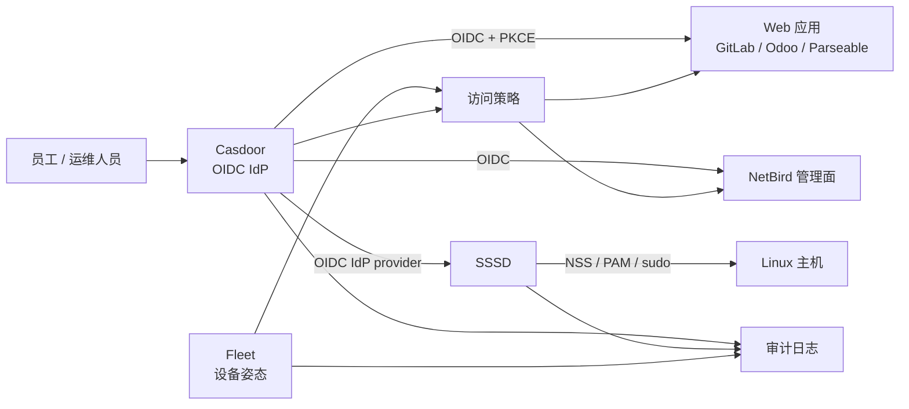

# 身份与访问管理：Casdoor OIDC + SSSD

本文定义 2026 年的统一身份与 Linux 主机登录方案。**Casdoor 是身份提供商（IdP），不是 Linux 目录数据库；SSSD 是 Linux 主机上的身份、认证、授权和缓存客户端。**

## 目标架构

- Web、API、Git、ERP、监控等应用统一使用 **OIDC Authorization Code + PKCE**。
- Linux 主机使用 **SSSD `id_provider = idp`** 直接连接 Casdoor；该组合已在当前目标环境完成实际登录、组解析和权限验证。
- 高权限操作必须使用硬件安全密钥（WebAuthn/FIDO2）或 TOTP；不再把短信作为管理员 MFA。
- 设备是否合规由 Fleet 提供，应用访问策略由 OIDC claims、VPN ACL 和应用 RBAC 共同决定。
- 身份、设备、访问和管理操作全部保留审计记录；服务账号使用短时 token 或 workload identity，不共享人工密码。



## 为什么选 Casdoor + SSSD

Casdoor 提供 OIDC、SAML、LDAP、SCIM、WebAuthn、TOTP、MFA、RADIUS 和 Kerberos 等协议能力，适合作为统一登录入口。在当前目标发行版和 Casdoor 配置下，SSSD IdP provider 已验证可以直接完成 Linux 用户登录、用户/组解析和主机授权。Wi-Fi/有线 802.1X 则统一由 FreeRADIUS 承担，FreeRADIUS 再按已验证的后端方式调用 Casdoor 身份源。

这两个组件的职责必须分开：

| 层 | 组件 | 负责 | 不负责 |
| --- | --- | --- | --- |
| 身份与登录 | Casdoor | 用户、组、MFA、OIDC token、应用 SSO、审计 | Linux 本地 NSS/PAM、主机 sudo 规则 |
| Linux 客户端 | SSSD | 用户/组解析、PAM 登录、离线缓存、主机访问控制 | 作为 IdP 签发 token |
| 设备姿态 | Fleet | 资产、加密、补丁、合规、远程锁定/擦除 | 目录服务、应用授权 |
| 网络访问 | NetBird | 节点注册、组网、ACL、OIDC 用户与组同步 | 用户主数据和应用 RBAC |

## Casdoor 配置约定

### OIDC application

每个应用单独创建 Casdoor application，不共享 client secret：

| 配置项 | 约定 |
| --- | --- |
| issuer | `https://id.example.com` |
| authorization endpoint | `/.well-known/openid-configuration` 中的 endpoint |
| grant | Authorization Code |
| PKCE | 公共客户端和所有支持的客户端均启用 S256 |
| scopes | `openid profile email groups`，按应用最小化 |
| redirect URI | 只允许生产域名的精确 URI，禁止通配符 |
| token | access token 短时有效；refresh token 按应用风险设置轮换 |
| claims | 使用稳定的 `sub`；组信息放在 `groups`，不要把显示名当权限标识 |

建议的组命名：

```text
org:engineering
org:it
org:finance
role:linux-admin
role:security-admin
```

### SSSD IdP provider：Casdoor 直连方式

当前环境采用 Casdoor 直连，不额外引入 Keycloak 或 LDAP bridge。SSSD 使用 Casdoor 提供的 OIDC endpoint 和用户/组 API 完成认证与身份解析。

```ini
# /etc/sssd/sssd.conf
[sssd]
services = nss, pam, sudo
config_file_version = 2
domains = casdoor

[domain/casdoor]
id_provider = idp
idp_type = casdoor
idp_client_id = linux-login
idp_client_secret = <0600 权限的本机 secret 文件>
idp_token_endpoint = <Casdoor token endpoint>
idp_userinfo_endpoint = <Casdoor userinfo endpoint>
idp_device_auth_endpoint = <Casdoor device authorization endpoint>
idp_id_scope = profile
idp_auth_scope = openid profile email
access_provider = simple
simple_allow_groups = org:it, role:linux-admin
```

以上 endpoint 使用你们已验证的 Casdoor 实际地址；不要直接复制占位符。实施时必须完成以下验证：

```bash
chmod 600 /etc/sssd/sssd.conf
sssctl config-check
systemctl enable --now sssd
getent passwd alice
id alice
sudo -l -U alice
journalctl -u sssd --since "-10 min"
```

### 登录和授权边界

- 日常 Linux 登录使用普通用户账号；管理员使用独立的 `admin` 身份，不复用办公账号。
- `simple_allow_groups` 或发行版支持的等价规则只允许必要组登录。
- sudo 规则优先使用集中管理的组和命令白名单；禁止给普通组 `ALL=(ALL) NOPASSWD: ALL`。
- 根账号只保留 break-glass 用途，并使用密码保险库托管、定期轮换和单独审计。
- 首次登录、密码修改、MFA 注册和离职禁用都要在 Casdoor 与主机日志中可追踪。

## 兼容性与回退

SSSD IdP provider 依赖发行版打包的 SSSD 版本、PAM 模块和浏览器/设备授权流程。上线前应在目标发行版上验证：

1. 首次登录和组解析。
2. 网络不可用时的缓存行为。
3. MFA、token 过期和撤销后的行为。
4. SSH、sudo、图形登录和无浏览器服务器的授权流程。

如果更换发行版后直连配置不可用，不要自行拼接 PAM 脚本。应先按目标发行版的 `sssd-idp` 手册重新验证 endpoint、用户/组 API 和 device authorization；确实不兼容时，再使用 **FreeIPA/389 Directory Server + SSSD IPA provider** 作为回退路线。

## 安全基线

- 全部 endpoint 使用 TLS 1.3 优先，证书自动续期并监控到期时间。
- 管理员强制 WebAuthn/FIDO2；普通用户至少启用 TOTP。
- client secret 只存放在 secret manager 或受限文件，禁止提交 Git。
- 禁止把 access token 写入 shell history、应用日志和工单附件。
- 每季度复核 client、redirect URI、组映射、sudo 规则和离职账号。
